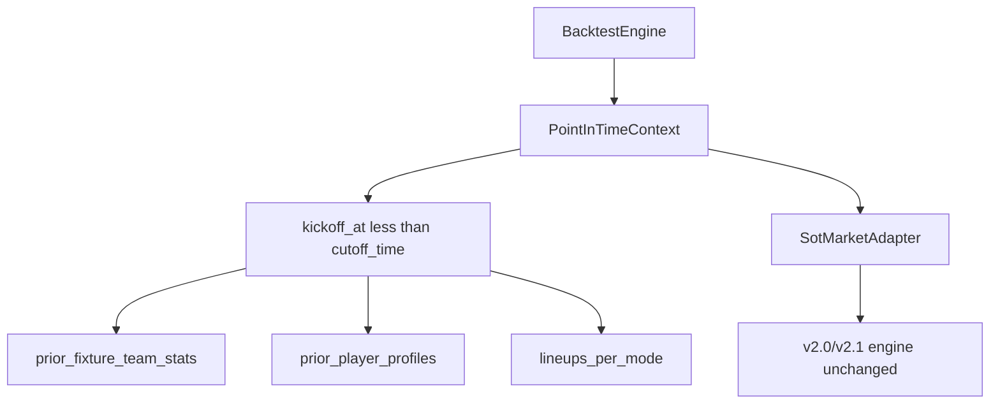
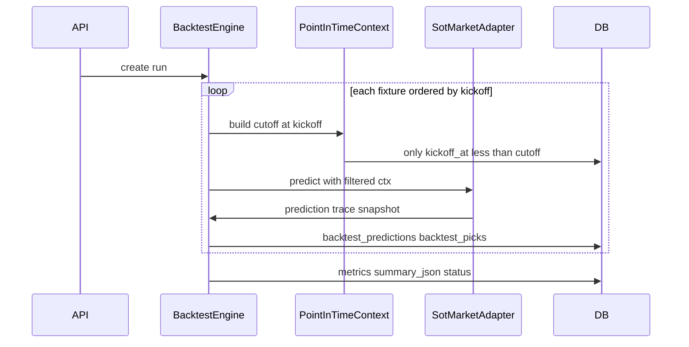

# Backtest Engine — architettura multi-mercato

Documento di progettazione per un motore di backtest **market-agnostic**, compatibile con l’ecosistema SOT Predictor attuale e pronto per mercati futuri (calci d’angolo, cartellini, gol, ecc.).

**Stato:** design / preparazione (Step A + **Step A.1** revisione anti-leakage). Nessuna migration DB in questa fase.

---

## 1. Obiettivo e principi

### Obiettivo

Permettere in futuro confronti del tipo:

- «Algoritmo SOT v2.1 ha previsto X e ha vinto N partite su Over 7.5»
- «Algoritmo Corner v1.0 ha previsto Y e ha vinto M partite»
- «Algoritmo Cartellini v1.0 ha previsto Z con win rate K»

Il backtest deve essere:

- **Multi-mercato** — identificato da `market_key` (es. `shots_on_target`, `corners`)
- **Multi-algoritmo** — identificato da `algorithm_version` (es. `baseline_v2_1_weighted_components`)
- **Multi-campionato** — `competition_id`, `season`, `fixture_id`
- **Anti-leakage** — ogni fixture usa solo dati disponibili **prima** del kickoff
- **Non-breaking** — Prossima giornata, Audit, Monitoraggio giocate restano su `team_sot_predictions` / `tracked_betting_picks`

### Principi

| Principio | Descrizione |
|-----------|-------------|
| Separazione mercato / algoritmo | `market_key` ≠ `algorithm_version` |
| Bridge SOT | Per il mercato attuale, `algorithm_version` = `model_version` esistente |
| Point-in-time | Rigenerazione (o simulazione) per fixture storica con cutoff al kickoff |
| No aggregate final sources | Il backtest **non** usa sorgenti aggregate finali (profili stagione intera, stats post-stagione, cache live) |
| PointInTimeContext obbligatorio | Gli engine v2.0/v2.1 sono invocati solo tramite adapter con context già filtrato |
| Registry-first | Mercati e algoritmi registrati in codice prima del wiring runtime |
| Legacy coexistence | `prediction_backtests` e `/backtest/sot/*` restano fino a deprecazione graduale |

---

## 2. Stato attuale e gap

### Dove vivono oggi i dati SOT

| Componente | Tabella / servizio | Campi chiave |
|------------|-------------------|--------------|
| Predizioni live | `team_sot_predictions` | `predicted_sot`, `actual_sot`, `model_version`, `raw_json` (trace in `applied_variable_trace`) |
| Feature pre-match | `team_sot_features` | medie SOT, `actual_sot`, `feature_set_version = "sot-v2"` |
| Ground truth | `fixture_team_stats` | `shots_on_target` |
| Monitoraggio giocate | `tracked_betting_picks` | `predicted_*_sot`, `result_*_sot`, mercato implicito `match_total_sot` |
| Backtest numerico | `prediction_backtests` | `predicted_sot`, `actual_sot`, FK a `team_sot_predictions` |
| Quick report | `next_round_quick_report_service` | legge `team_sot_predictions` |
| Model comparison | `next_round_model_comparison_service` | v2.0 vs v2.1, totale SOT |
| Audit | `sot_fixture_explanation_service` | spiegazione per `model_version` |

### Punti hardcoded SOT

**Database:** colonne `predicted_sot`, `actual_sot`, `shots_on_target`, naming tabelle `team_sot_*`.

**Backend:** route prefix `/predictions/sot`, `/backtest/sot`, `/debug/sot`; servizi `SotBacktestService`, `tracked_betting_pick_service.MARKET_MATCH_TOTAL = "match_total_sot"`.

**Frontend:** Dashboard con `sot_backtest_*`, Quick report «SOT Totale», ModelComparisonSection v2.0 vs v2.1.

### Gap principale del backtest attuale

`SotBacktestService` confronta predizioni **già salvate** in `team_sot_predictions` con `actual_sot`. Non garantisce:

1. Rigenerazione point-in-time per ogni fixture storica
2. Snapshot feature congelato al kickoff
3. Separazione `pre_lineup` / `post_lineup`
4. Backtest pick Over/Under su linee configurabili (il `BacktestService` legacy con linee O/U non è collegato alle route)

**Rischi leakage impliciti nel flusso attuale:**

| Sorgente | Rischio |
|----------|---------|
| `player_season_profiles` a fine stagione | performance future incluse nelle medie |
| Team stats aggregate su stagione intera | non limitate a fixture con `kickoff_at < cutoff` |
| Righe `team_sot_predictions` generate post-partita | predizione non simulata al kickoff |
| Lineups / missing players aggiornati dopo kickoff | informazione non disponibile al momento simulato |

Il nuovo engine risolve questi gap con tabelle `backtest_*`, un `PointInTimeContext` dedicato e un adapter che invoca gli engine esistenti in modalità simulata — **senza** riusare predizioni cached per backtest point-in-time.

---

## 3. Market Registry

Registro mercati in codice: `backend/app/markets/registry.py`.

```python
@dataclass(frozen=True)
class MarketSpec:
    market_key: str
    label: str
    unit: str
    supported_bet_types: tuple[str, ...]
    actual_stat_paths: dict[str, str]
    default_lines: tuple[float, ...]
    status: Literal["active", "planned", "deprecated"]
```

### Mercati previsti

| market_key | label | unit | bet_types | status |
|------------|-------|------|-----------|--------|
| `shots_on_target` | Tiri in porta | SOT | over_under_total, team_over_under | **active** |
| `corners` | Calci d'angolo | corners | over_under_total, team_over_under | planned |
| `cards` | Cartellini | cards | over_under_total, team_over_under | planned |
| `goals` | Gol | goals | over_under_total, team_over_under | planned |
| `fouls` | Falli | fouls | over_under_total | planned |
| `total_shots` | Tiri totali | shots | over_under_total, team_over_under | planned |

**Regola:** nessun servizio esistente importa il registry finché non si implementa Step B+.

---

## 4. Algorithm Registry

Registro algoritmi: `backend/app/algorithms/registry.py`.

```python
@dataclass(frozen=True)
class AlgorithmSpec:
    market_key: str
    algorithm_version: str
    label: str
    status: Literal["production", "experimental", "deprecated"]
    visible_in_frontend: bool
    input_requirements: dict[str, bool]
    output_schema: dict[str, str]
    trace_schema: dict[str, str]
    engine_entrypoint: str | None
```

### Mapping SOT (mercato attuale)

| market_key | algorithm_version | engine | Note |
|------------|-------------------|--------|------|
| `shots_on_target` | `baseline_v2_0_lineup_impact` | `app.services.predictions_v20.baseline_v2_0_lineup_impact_service` | produzione |
| `shots_on_target` | `baseline_v2_1_weighted_components` | `app.services.predictions_v21.baseline_v2_1_weighted_components_service` | produzione |

### Mercati futuri (solo registry, no engine)

| market_key | algorithm_version | status |
|------------|-------------------|--------|
| `corners` | `corners_v1_0` | planned |
| `cards` | `cards_v1_0` | planned |

**Bridge:** `team_sot_predictions.model_version` resta invariato; il backtest aggiunge `market_key` + `algorithm_version` (stesso valore stringa per SOT).

---

## 5. Schema tabelle (implementato Step B)

Migration Alembic: `backend/alembic/versions/20260605120000_create_backtest_tables.py`  
Modelli SQLAlchemy: `backend/app/models/backtest.py`  
Costanti: `backend/app/backtest/constants.py`

### 5.1 `backtest_runs`

```sql
-- Implementato Step B (migration 20260605120000)
CREATE TABLE backtest_runs (
    id BIGSERIAL PRIMARY KEY,
    competition_id BIGINT NOT NULL REFERENCES competitions(id),
    season_id BIGINT REFERENCES seasons(id),
    season_year INT,
    market_key VARCHAR(64) NOT NULL,
    algorithm_version VARCHAR(64) NOT NULL,
    mode VARCHAR(32) NOT NULL,           -- pre_lineup | post_lineup
    fixture_scope VARCHAR(32) NOT NULL,  -- full_season | round_range | custom_range
    date_from TIMESTAMPTZ,
    date_to TIMESTAMPTZ,
    status VARCHAR(32) NOT NULL DEFAULT 'pending',
    config_json JSONB NOT NULL DEFAULT '{}',
    summary_json JSONB,
    error_json JSONB,
    algorithm_config_hash VARCHAR(64) NOT NULL,
    model_manifest_version VARCHAR(64),
    git_commit_sha VARCHAR(64),
    created_at TIMESTAMPTZ NOT NULL DEFAULT now(),
    completed_at TIMESTAMPTZ
);
-- UNIQUE (competition_id, season_year, market_key, algorithm_version, mode, fixture_scope, algorithm_config_hash)
```

#### Status `backtest_runs`

| status | Significato |
|--------|-------------|
| `pending` | Run creata, non ancora avviata |
| `running` | Esecuzione in corso |
| `completed` | Tutte le fixture elaborate con successo |
| `partial_completed` | Alcune fixture fallite; metriche e picks parziali **utilizzabili** |
| `failed` | Run abortita; nessun risultato affidabile |
| `cancelled` | Run annullata manualmente |

**`partial_completed`:** popola `summary_json` con conteggi parziali e `error_json` con elenco fixture fallite (id, step, codice errore). Le metriche in `backtest_run_metrics` si calcolano **solo** sulle fixture succeeded.

#### Campi riproducibilità

| Campo | Scopo |
|-------|-------|
| `algorithm_config_hash` | Hash di `config_json` + linee O/U + parametri algoritmo; sostituisce il generico `config_hash` |
| `model_manifest_version` | Versione manifest pesi/micro (es. v2.1 weighted components) |
| `git_commit_sha` | Commit codice backend al momento del run |
| `error_json` | Dettaglio errori per fixture, stack trace, codici |

### 5.2 `backtest_predictions`

```sql
CREATE TABLE backtest_predictions (
    id BIGSERIAL PRIMARY KEY,
    backtest_run_id BIGINT NOT NULL REFERENCES backtest_runs(id) ON DELETE CASCADE,
    competition_id BIGINT NOT NULL,
    fixture_id BIGINT NOT NULL REFERENCES fixtures(id),
    market_key VARCHAR(64) NOT NULL,
    algorithm_version VARCHAR(64) NOT NULL,
    prediction_scope VARCHAR(32) NOT NULL,  -- match_total | home_team | away_team
    team_id BIGINT REFERENCES teams(id),
    side VARCHAR(16),                       -- home | away | match_total
    predicted_value DOUBLE PRECISION NOT NULL,
    actual_value DOUBLE PRECISION,
    error_value DOUBLE PRECISION,
    abs_error DOUBLE PRECISION,
    trace_json JSONB,
    feature_snapshot_json JSONB,
    created_at TIMESTAMPTZ NOT NULL DEFAULT now(),
    UNIQUE (backtest_run_id, fixture_id, prediction_scope)
);
```

#### Regole `team_id` e `side`

| prediction_scope | team_id | side |
|------------------|---------|------|
| `match_total` | NULL | `match_total` |
| `home_team` | home team id | `home` |
| `away_team` | away team id | `away` |

Per scope squadra, `team_id` è **obbligatorio**. Per `match_total`, `team_id` resta NULL.

### 5.3 `backtest_picks`

```sql
CREATE TABLE backtest_picks (
    id BIGSERIAL PRIMARY KEY,
    backtest_run_id BIGINT NOT NULL REFERENCES backtest_runs(id) ON DELETE CASCADE,
    fixture_id BIGINT NOT NULL REFERENCES fixtures(id),
    market_key VARCHAR(64) NOT NULL,
    algorithm_version VARCHAR(64) NOT NULL,
    prediction_scope VARCHAR(32) NOT NULL,  -- match_total | home_team | away_team
    team_id BIGINT REFERENCES teams(id),
    side VARCHAR(16),                       -- home | away | match_total
    bet_type VARCHAR(32) NOT NULL,          -- over_under_total | team_over_under
    line_value DOUBLE PRECISION NOT NULL,
    pick_side VARCHAR(16) NOT NULL,         -- over | under
    predicted_value DOUBLE PRECISION,
    actual_value DOUBLE PRECISION,
    result VARCHAR(16),                     -- won | lost | void | pending
    confidence_label VARCHAR(64),
    risk_label VARCHAR(64),
    odds DOUBLE PRECISION,
    profit_loss DOUBLE PRECISION,
    created_at TIMESTAMPTZ NOT NULL DEFAULT now()
);
```

#### Use case picks

| bet_type | prediction_scope | team_id | Esempio |
|----------|------------------|---------|---------|
| `over_under_total` | `match_total` | NULL | Over 7.5 SOT totali partita |
| `over_under_total` | `match_total` | NULL | Over 10.5 corner totali |
| `team_over_under` | `home_team` | home id | Over 4.5 SOT squadra casa |
| `team_over_under` | `away_team` | away id | Under 5.5 cartellini squadra ospite |

I campi `prediction_scope`, `team_id` e `side` permettono mercati futuri (corner team, cards team) **senza** cambiare schema.

### 5.4 `backtest_run_metrics`

```sql
CREATE TABLE backtest_run_metrics (
    id BIGSERIAL PRIMARY KEY,
    backtest_run_id BIGINT NOT NULL REFERENCES backtest_runs(id) ON DELETE CASCADE,
    metric_key VARCHAR(64) NOT NULL,
    metric_value DOUBLE PRECISION,
    metric_json JSONB,
    UNIQUE (backtest_run_id, metric_key)
);
```

### Metriche previste

- `fixtures_tested`, `fixtures_failed`, `mae`, `rmse`, `bias`
- `win_rate`, `picks_won`, `picks_lost`, `picks_void`
- `over_hit_rate`, `under_hit_rate`
- `performance_by_line`, `performance_by_round`, `performance_by_team` (in `metric_json`)

### Relazione con legacy

`prediction_backtests` resta per compatibilità. Opzionale: import adapter da run numerici esistenti.

---

## 6. PointInTimeContext — regola fondamentale

Il Backtest Engine **non può** richiamare gli engine v2.0/v2.1 passando sorgenti aggregate finali, cache live o righe da `team_sot_predictions`. Gli engine esistenti vanno invocati **solo** tramite un **adapter** (`SotMarketAdapter`, futuro `CornerMarketAdapter`, ecc.) che riceve un `PointInTimeContext` già costruito e filtrato.

### Regola unica

```
cutoff_time = fixture.kickoff_at   (oppure T - epsilon)
INCLUDE solo record con fixture.kickoff_at < cutoff_time
```

Ogni query stats, profili, lineups, xG, medie lega e fixture prior deve rispettare questo filtro.

### Rischi da evitare

| Rischio | Perché è leakage |
|---------|------------------|
| `player_season_profiles` calcolati a fine stagione | include performance future rispetto alla fixture testata |
| Team stats aggregate post-stagione | medie su tutta la stagione, non solo pre-kickoff |
| Lineups ufficiali in modalità `pre_lineup` | informazione non disponibile al momento simulato |
| Missing players noti dopo il kickoff | stato infortuni/squalifiche futuro |
| Dati di fixture successive | qualsiasi stat/evento con `kickoff_at >= cutoff_time` |
| Righe `team_sot_predictions` pre-calcolate | non garantiscono cutoff al kickoff storico |

### Responsabilità del context

1. **Sostituire/limitare** tutte le sorgenti dati (stats, profili, lineups, xG, medie lega)
2. Esporre solo viste «as-of» all’adapter; l’engine **non** accede al DB direttamente in backtest
3. Popolare `feature_snapshot_json` con evidenza del filtro (`leakage_guard`, `latest_fixture_used_at`, `cutoff_time`)
4. Selezionare lineups in base a `mode` (`pre_lineup` vs `post_lineup`) — vedi §8



Building blocks esistenti (da riusare nel context, **senza modificare** i modelli):

- `fixture_key_before()` — `v21_xg_league_features.py`
- `build_xg_leakage_trace()` — metadata trace xG
- `latest_fixture_used_at` — già in audit v2.1

---

## 7. Feature snapshot point-in-time

Ogni riga in `backtest_predictions.feature_snapshot_json` documenta **cosa** l’algoritmo ha visto al momento simulato.

### Schema JSON

```json
{
  "cutoff_time": "2026-03-15T18:59:00Z",
  "fixture_kickoff_at": "2026-03-15T19:00:00Z",
  "latest_fixture_used_at": "2026-03-10T20:45:00Z",
  "team_stats_sample_count": 12,
  "xg_sample_count": 10,
  "player_profiles_sample_count": 12,
  "lineup_mode": "pre_lineup_probable",
  "leakage_guard": true,
  "missing_variables": ["sportapi_lineups.confirmed_starters"],
  "fallback_variables": ["lineup_impact.player_layer_top_shooter_absence"],
  "source_paths": [
    "fixture_team_stats.shots_on_target",
    "team_stats.season_avg_sot_for"
  ]
}
```

Valori ammessi per `lineup_mode`:

- `pre_lineup_probable` — probabili/storico pre-match, nessuna formazione ufficiale
- `post_lineup_official` — formazione ufficiale storica con timestamp ≤ cutoff
- `none` — nessun dato lineup disponibile; fallback controllato

### Regola anti-leakage (snapshot)

1. `cutoff_time` = kickoff della fixture testata (o `T - epsilon`)
2. `latest_fixture_used_at` < `cutoff_time` sempre
3. `player_profiles_sample_count` conta solo profili derivati da fixture prior
4. `leakage_guard: true` obbligatorio quando il guard è attivo

---

## 8. Modalità backtest: pre_lineup / post_lineup

| mode | Lineups | Use case |
|------|---------|----------|
| `pre_lineup` | Probabili / storico pre-match / assenti | Simula ~30 min prima del kickoff |
| `post_lineup` | Ufficiali storiche SportAPI (timestamp ≤ cutoff) | Simula dopo pubblicazione formazioni |

### Regole vincolanti — `pre_lineup`

- **Non** usa formazioni ufficiali storiche (`confirmed=true` post-kickoff)
- Usa **solo** dati disponibili prima del kickoff: probabili, storico lineups pre-match, fallback neutro
- Se probabili assenti → fallback controllato documentato in snapshot (`lineup_mode`, `fallback_variables`)
- `config_json.lineup_source` ammessi: `none`, `probable_historical`
- **Escluso:** `sportapi_official`

### Regole vincolanti — `post_lineup`

- Può usare formazioni ufficiali storiche SportAPI
- Timestamp pubblicazione lineup deve essere **≤ cutoff_time**
- Deve essere una **run separata**: stesso algoritmo/mercato in `pre_lineup` e `post_lineup` = **due** `backtest_runs` distinti
- **Mai mischiare** predizioni pre e post nella stessa run o nelle stesse metriche aggregate

### Tabella comparativa

| Aspetto | pre_lineup | post_lineup |
|---------|------------|-------------|
| Formazioni ufficiali | No | Sì (se timestamp ≤ cutoff) |
| lineup_mode snapshot | `pre_lineup_probable` | `post_lineup_official` |
| lineup_source config | `none`, `probable_historical` | `sportapi_official` |
| Run con stesso algoritmo | Run separata | Run separata |
| Confronto metriche | Solo vs altre run pre_lineup | Solo vs altre run post_lineup |

### `config_json` esempio

```json
{
  "lineup_source": "probable_historical",
  "require_official_lineup": false,
  "default_ou_lines": [5.5, 6.5, 7.5, 8.5, 9.5],
  "pick_strategy": "model_recommendation",
  "round_filter": null
}
```

Per `post_lineup`, `"lineup_source": "sportapi_official"` e `"require_official_lineup": true` quando richiesto.

---

## 9. Flusso backtest point-in-time

```
1. Admin/API crea backtest_run (competition, season, market, algorithm, mode, scope)
2. BacktestEngine seleziona fixture nel scope (es. stagione conclusa, status FT)
3. Per ogni fixture F (ordinata per kickoff):
   a. PointInTimeContext.build(F, cutoff=F.kickoff_at, mode)  ← OBBLIGATORIO
   b. AlgorithmAdapter.predict(ctx, market_key, algorithm_version)
      (NON riusa team_sot_predictions cached)
   c. Salva backtest_predictions (+ team_id, side, trace_json, feature_snapshot_json)
   d. Deriva backtest_picks (+ prediction_scope, team_id, side) per linee O/U
   e. Valuta result vs actual_value da fixture_team_stats (post-match, solo per scoring)
4. Aggrega metriche → backtest_run_metrics, summary_json
5. status = completed | partial_completed (se alcune fixture falliscono)
   error_json popolato in caso di partial_completed o failed
```



---

## 10. Compatibilità SOT

Per `market_key = shots_on_target`:

| Campo backtest | Origine SOT |
|----------------|-------------|
| `predicted_value` (home_team) | `predicted_sot` home; `team_id` = home, `side` = home |
| `predicted_value` (away_team) | `predicted_sot` away; `team_id` = away, `side` = away |
| `predicted_value` (match_total) | somma home + away; `team_id` NULL, `side` = match_total |
| `actual_value` | `fixture_team_stats.shots_on_target` |
| `bet_type` | `over_under_total` o `team_over_under` |
| `line_value` | 5.5, 6.5, 7.5, 8.5, 9.5 (registry default_lines) |
| `result` | won/lost vs actual vs line |

Confronto v2.0 vs v2.1 = **due run** con stesso `market_key`, stesso `mode`, diversi `algorithm_version`.

**Adapter (Step E):** `SotMarketAdapter` invoca `baseline_v2_*_service` con `PointInTimeContext` senza alterare formule o pesi.

---

## 11. Report e API futuri (Backtest Dashboard)

### Frontend (Step I)

Route proposta: `/backtest-dashboard` (non sostituisce `/dashboard` legacy).

**Filtri:** competition, season, market, algorithm_version, mode, date range, run.

**Card:** Mercato, Algoritmo, Partite testate, MAE, Win rate, Picks vinte/perse, Bias.

**Insight esempio:**

- «Il mercato SOT è affidabile su Over 7.5, meno su Over 9.5»
- «Corner: win rate maggiore ma copertura minore»
- «Cartellini: alta varianza»

### API proposta (Step C)

| Metodo | Path | Descrizione |
|--------|------|-------------|
| POST | `/api/backtest/runs` | Crea ed avvia run |
| GET | `/api/backtest/runs` | Lista run (filtri) |
| GET | `/api/backtest/runs/{id}` | Dettaglio + summary + error_json |
| GET | `/api/backtest/runs/{id}/predictions` | Paginato |
| GET | `/api/backtest/runs/{id}/picks` | Paginato |
| GET | `/api/backtest/runs/compare` | Confronto multi-algoritmo / multi-mercato |

Prefix generico `/api/backtest/` per il nuovo engine. Route legacy `/backtest/sot/serie-a/*` restano attive.

---

## 12. Piano implementazione

| Step | Deliverable | Modifica v2.0/v2.1? |
|------|-------------|---------------------|
| **A** | Design architettura (doc + registry stub) | No — **completato** |
| **A.1** | Revisione anti-leakage + campi schema (questo documento) | No — **completato** |
| **B** | Migration tabelle `backtest_*` (4 tabelle + costanti) | No — **completato** |
| **C** | API base: create / list / detail run | No — **completato** |
| **D** | `PointInTimeContext` SOT preview/debug | Sì (preview read-only) |
| **E** | Preview SOT v2.1 PIT singola fixture | Sì (preview read-only) |
| **F** | Mini-run preview SOT v2.1 PIT (metriche aggregate read-only) | No — **completato** |
| **G** | Picks Over/Under → `backtest_picks` | No |
| **H** | Confronto v2.0 vs v2.1 (due run, stesso market) | No |
| **I** | Frontend Backtest Dashboard | No |

**Principio:** Prossima giornata, Audit, Monitoraggio giocate continuano su `team_sot_predictions` e `tracked_betting_picks`.

---

## 13. Cosa NON viene modificato

- Modelli SOT v2.0 e v2.1 (codice, formule, pesi)
- `team_sot_predictions`, quick report, audit, monitoraggio (comportamento)
- Route `/backtest/sot/*` esistenti
- Nessun algoritmo corners / cartellini / gol implementato
- **Nessun runtime backtest** collegato (Step B = DB foundation; Step C = CRUD run pending)
- Modelli SOT v2.0/v2.1 **non** modificati in Step B/C

---

## 14. Step B — DB foundation

**Completato.** Deliverable additivi, nessun breaking change.

| Artefatto | Path |
|-----------|------|
| Migration Alembic | `backend/alembic/versions/20260605120000_create_backtest_tables.py` |
| Modelli SQLAlchemy | `backend/app/models/backtest.py` (`BacktestRun`, `BacktestPrediction`, `BacktestPick`, `BacktestRunMetric`) |
| Costanti | `backend/app/backtest/constants.py` |
| Registry stub (Step A) | `backend/app/markets/registry.py`, `backend/app/algorithms/registry.py` |
| Test import | `backend/tests/test_backtest_models_import.py` |
| Changelog tecnico | `docs/BACKTEST_ENGINE_CHANGELOG.md` |

**Tabelle create:** `backtest_runs`, `backtest_predictions`, `backtest_picks`, `backtest_run_metrics`.

**Constraint principali:**
- `uq_backtest_predictions_run_fixture_scope` — unique su `(backtest_run_id, fixture_id, prediction_scope)`
- `uq_backtest_picks_run_fixture_scope_bet` — unique su `(backtest_run_id, fixture_id, prediction_scope, bet_type, line_value, pick_side)`
- `uq_backtest_run_metrics_run_key` — unique su `(backtest_run_id, metric_key)`
- Indice composito non-unique su `backtest_runs(competition_id, market_key, algorithm_version)` (no unique composito per `season_year` nullable)

**Esplicitamente NON incluso in Step B:**
- Nessun backtest eseguito
- Nessun `PointInTimeContext`
- Nessun adapter v2.0/v2.1
- Nessun endpoint operativo `/api/backtest/runs` (Step B)
- Nessuna modifica a `prediction_backtests` legacy, `team_sot_predictions`, `tracked_betting_picks`
- Nessuna modifica a Prossima giornata, Audit, Monitoraggio giocate, quick report, model comparison

---

## 15. Step C — API base run management

**Completato.** Endpoint additivi per gestione run in stato `pending`. Nessun motore di calcolo collegato.

| Endpoint | Metodo | Descrizione |
|----------|--------|-------------|
| `/api/backtest/runs` | POST | Crea run `pending` (validazione market/algorithm via registry) |
| `/api/backtest/runs` | GET | Lista run con filtri e paginazione |
| `/api/backtest/runs/{run_id}` | GET | Dettaglio run + conteggi predictions/picks/metrics |

| Artefatto | Path |
|-----------|------|
| Router | `backend/app/routes/backtest_runs.py` |
| Service | `backend/app/services/backtest_run_service.py` |
| Schemas | `backend/app/schemas/backtest_runs.py` |
| Errori HTTP | `backend/app/backtest/errors.py` |
| Git commit env | `backend/app/backtest/git_info.py` |
| Test | `backend/tests/test_backtest_runs_api.py` |
| Changelog | `docs/BACKTEST_ENGINE_CHANGELOG.md` (entry `backtest-step-c`) |

**Cosa fanno:**
- Validano `competition_id`, `market_key` (solo `active`), `algorithm_version` coerente col market
- Calcolano `algorithm_config_hash` deterministico (SHA-256 su payload JSON ordinato)
- Persistono run con `status=pending`, `summary_json=null`, `error_json=null`

**Cosa NON fanno:**
- Nessuna elaborazione fixture
- Nessuna prediction, pick o metrica generata (`predictions_count/picks_count/metrics_count = 0` su run nuova)
- Nessun collegamento a v2.0/v2.1 runtime, `PointInTimeContext`, adapter SOT
- Market `planned` (corners, cards, …) rifiutati con 422 `market_not_active`

**Route legacy intatte:** `/api/backtest/sot/serie-a/*` (SotBacktestService) non modificate.

---

## 16. Step C.1 — Debug Backtest Panel (Admin)

**Completato.** Pannello Admin read-only + CRUD run pending per test UI e validazione registry. Nessun engine runtime.

| Endpoint | Metodo | Descrizione |
|----------|--------|-------------|
| `/api/backtest/debug/health` | GET | Health registry, tabelle `backtest_*`, conteggi righe |
| `/api/backtest/runs` | POST/GET | (Step C) usati dal pannello per creare/listare run |
| `/api/backtest/runs/{run_id}` | GET | (Step C) dettaglio run selezionata |

| Artefatto | Path |
|-----------|------|
| Health service | `backend/app/services/backtest_health_service.py` |
| Router debug | `backend/app/routes/backtest_debug.py` |
| Test health | `backend/tests/test_backtest_debug_health.py` |
| Client API frontend | `frontend/src/lib/api.ts` (sezione Backtest Engine) |
| Pannello Admin | `frontend/src/components/admin/BacktestDebugPanel.tsx` |
| Integrazione Admin | `frontend/src/pages/Admin.tsx` (Section "Debug Backtest") |
| Changelog | `docs/BACKTEST_ENGINE_CHANGELOG.md` (entry `backtest-step-c1`) |

**Pulsanti pannello (6):**

| Pulsante | Azione | Esito atteso |
|----------|--------|--------------|
| Health Backtest | GET health | `status=ok` (o `degraded` su SQLite senza migration) |
| Crea run debug v2.1 | POST run SOT + v2.1 | HTTP 200, `status=pending`; messaggio esplicito: nessun backtest eseguito |
| Lista ultime run | GET lista filtrata per `competition_id` | Popola tabella ultime 10 run |
| Leggi ultima run | GET dettaglio | Run selezionata / ultima creata / prima in lista; conteggi 0 evidenziati |
| Test market planned | POST corners | 422 `market_not_active` → badge "Test OK" |
| Test algorithm errato | POST SOT + corners_v1_0 | 422 `invalid_algorithm_for_market` → badge "Test OK" |

**Cosa NON fa Step C.1:**
- Nessun DELETE run, nessun engine runtime, PointInTimeContext, adapter
- Nessuna modifica v2.0/v2.1, formule, Monitoraggio, Audit, Prossima giornata
- Nessun backtest reale: run restano `pending` con predictions/picks/metrics = 0

---

## 17. Step D — PointInTimeContext SOT preview/debug

**Completato (preview).** Builder read-only del contesto point-in-time per mercato SOT, con endpoint debug e sezione Admin. Nessun engine runtime, nessuna prediction persistita.

| Endpoint | Metodo | Descrizione |
|----------|--------|-------------|
| `/api/backtest/debug/point-in-time-context` | GET | Context SOT as-of prima del kickoff (`competition_id`, `fixture_id`, `mode`, `market_key`) |
| `/api/backtest/debug/fixtures` | GET | Lista fixture storiche candidate per debug PIT |

| Artefatto | Path |
|-----------|------|
| PointInTimeContextService | `backend/app/services/backtest/point_in_time_context_service.py` |
| BacktestFixtureDebugService | `backend/app/services/backtest/backtest_fixture_debug_service.py` |
| Schemas PIT | `backend/app/schemas/backtest_point_in_time.py` |
| Test | `backend/tests/test_backtest_point_in_time_context.py` |
| Admin UI (sezione PIT) | `frontend/src/components/admin/BacktestDebugPanel.tsx` |
| Changelog | `docs/BACKTEST_ENGINE_CHANGELOG.md` (entry `backtest-step-d`) |

**Cosa calcola:**
- Cutoff = `fixture.kickoff_at`; solo fixture prior con `fixture_key_before()` e `FINISHED_STATUSES`
- Medie squadra SOT/xG/tiri (for/against) da prior home/away (casa+trasferta)
- Baseline lega point-in-time (via `compute_v21_xg_league_baselines` + `compute_league_offensive_baselines`)
- Forma last5 per squadra
- Diagnostica player match stats prior (conteggi, no profili rolling v2.1)
- Diagnostica lineups per `pre_lineup` / `post_lineup`
- `actuals_for_scoring` separati — **`actuals_used_as_input = false`**
- `feature_snapshot_json` in response (non persistito in `backtest_predictions`)

**Cosa NON fa Step D:**
- Nessuna chiamata a v2.0/v2.1, nessun `SotMarketAdapter`
- Nessuna riga in `backtest_predictions`, `backtest_picks`, `backtest_run_metrics`
- Nessun cambio status `backtest_runs`
- Nessuna modifica formule, pesi, Prossima giornata, Audit, Monitoraggio

**Building block riusati (non modificati):** `build_prior_context`, `compute_v21_xg_league_baselines`, `fixture_key_before`.

**Pannello debug fixture selector (Step D UI):**
- Paginazione fixture storiche: `offset` / `limit` (10/20/50), pulsanti prev/next, indicazione "Mostrate X–Y di Z"
- Filtro opzionale `round_contains` (es. `Regular Season - 5` / `- 20` / `- 36`) per test early/mid/late season
- Input **fixture_id manuale** per Preview context fuori dalla pagina corrente
- Reset automatico stato PIT al cambio `competition_id` (lista non ricaricata finché l'utente non clicca)
- Card sintesi fixture selezionata (match, kickoff, round, SOT, has_team_stats)

---

## 18. Step E — SOT v2.1 point-in-time preview (singola fixture)

**Completato (preview).** Calcolo read-only di una previsione SOT v2.1-compatible su singola fixture storica, usando solo `PointInTimeContext` come fonte dati.

| Endpoint | Metodo | Descrizione |
|----------|--------|-------------|
| `/api/backtest/debug/sot-v21-preview` | GET | Preview prediction home/away/total + trace macro + errori scoring |

| Artefatto | Path |
|-----------|------|
| Preview service | `backend/app/services/backtest/sot_v21_preview_service.py` |
| Macro builder PIT | `backend/app/services/backtest/sot_v21_pit_macro_builder.py` |
| Schemas preview | `backend/app/schemas/backtest_sot_v21_preview.py` |
| Test | `backend/tests/test_backtest_sot_v21_preview.py` |
| Admin UI | pulsante "Preview prediction v2.1 PIT" in `BacktestDebugPanel.tsx` |
| Changelog | `docs/BACKTEST_ENGINE_CHANGELOG.md` (entry `backtest-step-e`) |

**Cosa fa:**
- Chiama `PointInTimeContextService.build_sot_context()` (Step D)
- Calcola `base_anchor_sot = 0.55×avg_sot_for + 0.45×opponent_avg_sot_against`
- Calcola macro indices da stats PIT (offensive, defensive, form, xG, pace) con pesi manifest v2.1 (96 punti predittivi)
- Macro non ancora PIT-complete → index 1.00 + warning esplicito (player, lineups, injuries, split)
- `expected_sot = base_anchor × weighted_macro_multiplier`
- Actuals solo per errori scoring; **`actuals_used_as_input = false`**
- Solo `mode=pre_lineup`

**Cosa NON fa:**
- Nessuna chiamata a `baseline_v2_1_weighted_components_service` / `v21_prediction_engine`
- Nessuna riga in `backtest_predictions`, `backtest_picks`, `backtest_run_metrics`
- Nessun full backtest, nessun cambio status run
- Nessuna modifica formule/pesi ufficiali v2.1

**Step successivo:** mini-run multi-fixture con metriche aggregate (Step F).

---

## 19. Step F — Mini-run preview SOT v2.1 point-in-time

**Completato (preview multi-fixture).** Applica la preview Step E a un gruppo limitato di fixture storiche e calcola metriche aggregate in memoria, senza persistenza.

| Endpoint | Metodo | Descrizione |
|----------|--------|-------------|
| `/api/backtest/debug/sot-v21-mini-run` | POST | Mini-run read-only su N fixture + MAE/RMSE/bias + breakdown |

| Artefatto | Path |
|-----------|------|
| Mini-run service | `backend/app/services/backtest/sot_v21_mini_run_preview_service.py` |
| Schemas mini-run | `backend/app/schemas/backtest_sot_v21_mini_run.py` |
| Fixture selection | `BacktestFixtureDebugService.select_fixtures_for_mini_run()` |
| Test | `backend/tests/test_backtest_sot_v21_mini_run.py` |
| Admin UI | sezione "Mini-run preview v2.1 PIT" in `BacktestDebugPanel.tsx` |
| Changelog | `docs/BACKTEST_ENGINE_CHANGELOG.md` (entry `backtest-step-f`) |

**Cosa fa:**
- Seleziona fixture finite con team stats (`competition_id` obbligatorio; `fixture_ids` espliciti o query con `limit`/`offset`/`round_number`, max 50)
- Filtro giornata esatto: `round_number` (es. `3` → solo `"Regular Season - 3"`, esclude `"Regular Season - 13"`)
- `round_contains` resta filtro testuale legacy/avanzato (`ILIKE`); se `round_number` è valorizzato ha priorità
- Per ogni fixture chiama `SotV21PointInTimePreviewService.build_preview()` (Step E)
- Calcola summary: MAE home/away/total, RMSE, bias, avg predicted/actual, over/under/exact_near/high_error counts
- Le metriche `total_*` (es. `total_mae`) misurano l'errore sul **SOT totale della singola partita** (SOT casa + SOT trasferta), poi aggregate su N fixture — non un "totalone" usato come input al modello
- Breakdown per campione storico: `early_low_sample` (<5), `medium_sample` (5–14), `stable_sample` (≥15 prior matches)
- Breakdown per totale SOT reale: `low_total` (≤6), `medium_total` (7–10), `high_total` (≥11)
- Worst/best top 5 per `total_abs_error`; `failed_fixtures` per errori singola fixture (status `partial_ok`)
- Opzionale `include_trace=true` (trace su max 10 fixture)

**Cosa NON fa:**
- Nessuna riga in `backtest_predictions`, `backtest_picks`, `backtest_run_metrics`
- Nessuna creazione/modifica/completamento `backtest_runs`
- Nessuna chiamata API esterne; nessun uso di `team_sot_predictions` o actuals come input
- Nessuna modifica v2.0/v2.1 runtime, formule o pesi ufficiali

**Read-only:** `preview_only=true`, `db_writes=false`. Dopo mini-run, Health Backtest deve restare con predictions/picks/metrics = 0.

**Step successivo:** run persistita su `backtest_runs` con scrittura `backtest_predictions` (Step G+).

---

## 20. Step G1 — Split casa/trasferta point-in-time

**Obiettivo:** ricostruire la macro predittiva `home_away_split` (peso v2.1 = **10**) nella preview singola e nella mini-run SOT v2.1 PIT, usando solo fixture **strict** anteriori al kickoff target.

**Implementazione:**

| Componente | Path |
|------------|------|
| Builder split PIT | `backend/app/services/backtest/pit_split_stats_builder.py` |
| Estensione context | `PointInTimeContextResponse.home_split_stats` / `away_split_stats` |
| Macro PIT | `backend/app/services/backtest/sot_v21_pit_macro_builder.py` (`_compute_home_away_split_macro`) |
| Mini-run aggregato | `split_summary` in `SotV21MiniRunResponse` |

**Formula prudenziale PIT (non live v2.1):**

- HOME: `0.60 × (SOT for casa / SOT for overall) + 0.40 × (SOT against avversario in trasferta / SOT against overall avversario)`
- AWAY: simmetrico con split trasferta e difesa avversario in casa
- Cap indice: **0.70 – 1.30**; fallback neutro **1.00** se sample assente o ratio non calcolabile

**Status qualità:**

| Sample split (min team/opponent) | Status | Warning |
|----------------------------------|--------|---------|
| ≥ 5 | `available` | — |
| 1–4 | `partial_low_sample` | `split_home_away_partial_low_sample` (+ `home_split_low_sample` / `away_split_low_sample` a livello context) |
| 0 | `neutral_fallback` | `split_home_away_missing`, fallback `split_home_away` |

**Invarianti:**

- `kickoff_at < cutoff_time` (strict, no fixture target/contemporanee)
- `actuals_used_as_input=false`, `db_writes=false`
- Nessuna modifica v2.0, v2.1 live runtime, manifest o pesi ufficiali
- Peso macro split invariato a **10**; totale predittivo **96**
- Trace macro con `components` e `source_paths`

**Changelog:** `docs/BACKTEST_ENGINE_CHANGELOG.md` (entry `backtest-step-g1`).

---

## 21. Step G2A — Historical Official XI Audit

**Obiettivo:** audit read-only per verificare copertura formazioni ufficiali storiche, mapping giocatori e statistiche player prior strict PIT **prima** di implementare il rolling player layer.

**Cosa controlla:**

- XI ufficiale (titolari), panchina, indisponibili/infortunati/squalificati
- Mapping `provider_player_id` ↔ `players.id` via `player_provider_mappings`
- Rolling diagnostico stats giocatore da `fixture_player_stats` con `kickoff_at < cutoff_time`

**Fonti DB (solo lettura):**

| Fonte | Uso |
|-------|-----|
| `fixture_lineups` + `fixture_lineup_players` | XI ufficiale API-Football (priorità) |
| `fixture_provider_lineups` + players (`confirmed=true`) | Fallback SportAPI ufficiale |
| `fixture_missing_players` | Indisponibili SportAPI |
| `player_provider_mappings` | Mapping cross-provider |
| `fixture_player_stats` | Prior stats rolling PIT |

**Endpoint:**

- `GET /api/backtest/debug/historical-lineup-audit/fixture`
- `GET /api/backtest/debug/historical-lineup-audit/round`

**Modalità future (naming only, non prediction):**

| Mode | Descrizione |
|------|-------------|
| `pre_lineup` | Preview PIT attuale — no XI ufficiale storica |
| `historical_official_xi` | XI reale storico + stats player prior — audit G2A e player layer G2B in preview PIT |

**Regole:**

- `competition_id` obbligatorio
- Player stats: strict `< cutoff`, no fixture target
- Timestamp lineup mancante → warning, audit non bloccato
- `latest_player_stat_fixture_used_at >= cutoff` → `possible_player_stats_leakage`
- `db_writes=false`, nessuna prediction/pick/metrica

**Changelog:** `docs/BACKTEST_ENGINE_CHANGELOG.md` (entry `backtest-step-g2a`).

---

## 22. Step G2B — Rolling Player Layer Historical Official XI

**Obiettivo:** calcolare la macro predittiva **Player layer** (peso manifest **9**) in preview e mini-run PIT usando XI ufficiale storico + prior stats giocatore strict PIT, in modalità `historical_official_xi`. La modalità `pre_lineup` resta invariata (macro neutra, warning `player_layer_point_in_time_not_built_yet`).

**Componenti:**

| Modulo | Ruolo |
|--------|-------|
| `pit_player_rolling_stats.py` | Helper condivisi G2A/G2B: resolve lineup, mapping, prior stats |
| `rolling_player_layer_service.py` | Formula prudenziale offensive XI / top shooter / bench depth |
| `sot_v21_pit_macro_builder.py` | `_compute_player_layer_macro` con branch esplicito per mode |

**Formula player_layer_index:**

```
0.55 * offensive_xi_strength_index
+ 0.30 * top_shooter_presence_index
+ 0.15 * replacement_depth_index
cap 0.70–1.30
```

**Status qualità:** `available` | `partial_low_sample` | `neutral_fallback`

**Endpoint invariati (mode esteso):**

- `GET /api/backtest/debug/sot-v21-preview?mode=historical_official_xi`
- `POST /api/backtest/debug/sot-v21-mini-run` con `mode: historical_official_xi`

**Mini-run:** nuovo aggregato `player_layer_summary` (analogo a `split_summary` G1).

**Regole:**

- `db_writes=false`, `actuals_used_as_input=false`, `leakage_guard=true`
- Prior stats: strict `kickoff_at < cutoff_time`
- Nessuna modifica v2.0/v2.1 live runtime, manifest o persistenza `backtest_*`

**Changelog:** `docs/BACKTEST_ENGINE_CHANGELOG.md` (entry `backtest-step-g2b`).

---

## 23. Step H — Betting Pick Evaluation read-only (Over-only)

**Obiettivo:** valutare se le giocate **Over SOT** proposte dal modello PIT avrebbero vinto o perso rispetto al reale — complemento alla mini-run (MAE/RMSE).

**Differenza chiave:**

| Mini-run (F) | Pick evaluation (H) |
|--------------|----------------------|
| Errore numerico (MAE, bias) | Esito scommessa WIN/LOSS |
| Nessuna linea O/U | Linee 4.5–11.5 + soglia discesa cauta |
| Nessun pick | Due pick Over per fixture: **aggressiva** + **cauta** |

**Logica (solo Over):**

- **Linea aggressiva:** `max(line where line < predicted_total)` — es. pred 7.98 → Over 7.5
- **Linea cauta:** se `aggressive_edge <= cautious_drop_threshold` (default 0.75), scende di una linea; altrimenti uguale all’aggressiva — es. pred 9.32 → agg 8.5, caut 8.5 (edge > 0.75)
- Outcome: WIN se `actual > line`, altrimenti LOSS (linee `.5`, no void)
- Confidence aggressiva: edge ≤0.25 low; ≤0.75 medium; >0.75 high
- Confidence cauta: edge ≤0.75 medium; >0.75 high
- Cap: prior min <5 o warnings ≥8 → max low; player layer fallback → max medium
- Hit rate separato per strategia aggressive/cautious
- **Nessun Under**, nessun `recommended_pick` unico, nessun ROI reale

**Endpoint:**

- `POST /api/backtest/debug/sot-pick-evaluation-preview`

**Mode supportati:** `pre_lineup`, `historical_official_xi`

**Regole:** `db_writes=false`, fixture con `leakage_guard=false` o actual mancante → `failed_fixtures`. Step successivo: full-season pick evaluation o run persistita.

**Changelog:** `docs/BACKTEST_ENGINE_CHANGELOG.md` (entry `backtest-step-h-over-only-aggressive-cautious`).

---

## 24. Step H.1 — Consiglio giocata pre-match

**Obiettivo:** aggiungere un livello di **eligibility / consiglio giocata** indipendente dall’outcome finale. Il sistema mostra sempre linee aggressive/caute calcolate e esiti WIN/LOSS, ma indica se **prima del match** avrebbe consigliato o escluso la giocata.

**Separazione pre-match vs post-match:**

| Pre-match (consiglio) | Post-match (validazione) |
|-----------------------|---------------------------|
| edge, confidence, sample_bucket, prior matches, warnings | actual_total_sot, outcome WIN/LOSS |
| player layer / split fallback | actual_total_bucket (solo breakdown analitico) |
| play_advice, playability_score | hit rate su pick consigliate |

**Consiglio:** `GIOCA` / `NON GIOCARE` / `BORDERLINE` con motivi sintetici (`LOW_EDGE`, `EARLY_SAMPLE`, ecc.) e `playability_score` 0–100.

**Parametri filtro (default):** min prior 10, min edge agg 0.25, min edge caut 1.00, max warnings 6, no early sample, no low confidence.

**Summary:**

- `calculated_summary` — tutte le linee calcolate (come Step H)
- `advised_summary` — solo pick con consiglio giocabile; hit rate valuta outcome solo sulle consigliate

**Linee default:** 4.5, 5.5, 6.5, 7.5, 8.5, 9.5, 10.5, 11.5

**Regole:** `db_writes=false`, nessun Under, nessuna persistenza. Breakdown `*_by_actual_total_bucket` = analisi post-match, non usati nel consiglio.

**Changelog:** `docs/BACKTEST_ENGINE_CHANGELOG.md` (entry `backtest-step-h1-advice-layer`).

---

## 25. Step J/K — Historical Fixture Snapshot, Lineup e Indisponibili

**Regola fondamentale:** per ogni fixture target, **XI, panchina e indisponibili** provengono **solo** da quella fixture (`fixture_id` esatto). Le statistiche giocatore/squadra restano rolling point-in-time con `kickoff_at < cutoff_time` (mai la fixture target né fixture future).

**Obiettivo:** valorizzare in `historical_official_xi` le macro **Lineups / formazioni** (key `"lineups"`, peso **5**) e **Infortuni / indisponibili** (key `"injuries_unavailable"`, peso **5**). `pre_lineup` invariato (macro neutre + warning esistenti).

**Componenti:**

| Modulo | Ruolo |
|--------|-------|
| `historical_fixture_snapshot_service.py` | Snapshot unificato target: starters, bench, injured/suspended/unavailable |
| `historical_lineup_macro_service.py` | Formula lineup a 7 indici; continuità XI da fixture **precedenti** strict PIT |
| `historical_unavailable_macro_service.py` | Penalità assenze offensive + boost prudente difensori avversari assenti |
| `rolling_player_layer_service.py` | Consuma lo stesso snapshot side (no query lineup duplicate) |
| `sot_v21_preview_service.py` | Orchestrazione snapshot → layer + macro J/K |
| `sot_v21_pit_macro_builder.py` | Trace con `source_fixture_id`, branch injuries in historical mode |

**Formula lineup_macro_index:** (cap 0.85–1.15)

```
0.15 * official_xi_presence + 0.15 * starter_completeness + 0.15 * formation_structure
+ 0.25 * xi_continuity + 0.15 * formation_change + 0.10 * offensive_starter + 0.05 * bench
```

**Formula unavailable_macro_index:** (cap 0.80–1.15)

```
1.00 - offensive_absence_penalty (cap 0.18) + opponent_defensive_absence_boost (cap 0.08)
```

**Status qualità:** `available` | `partial_low_sample` | `neutral_fallback`

**Mini-run:** `lineup_macro_summary` + `unavailable_macro_summary`

**Pick evaluation:** campi lineup/unavailable index + `unavailable_important_absences_count` (JSON; consiglio H.1 invariato)

**Warning cleanup in historical mode:** rimossi `lineups_point_in_time_*`, `no_historical_probable_lineups`, `injuries_point_in_time_not_built_yet` quando macro costruite. Warning specifici: `target_fixture_lineup_missing`, `unavailable_players_mapping_incomplete`, ecc.

**Regole:** `db_writes=false`, nessun actual post-match in input macro, nessuna modifica v2.0/v2.1 live o persistenza `backtest_*`.

**Changelog:** `docs/BACKTEST_ENGINE_CHANGELOG.md` (entry `backtest-step-jk-historical-lineup-unavailable`).

---

## 26. Step JK.1 — Validation snapshot target e audit indisponibili

**Scopo:** layer read-only di validazione per `historical_official_xi`: sintesi compatta nel PIT context, `source_fixture_id` esplicito su preview/mini-run/pick eval, audit indisponibili su storage fixture target. Nessuna modifica a formule, pesi o persistenza.

### HistoricalPitExtensionsBuilder

Builder condiviso (`historical_pit_extensions_builder.py`) usato da:

- `PointInTimeContextService.build_sot_context_with_historical` — popola `fixture_snapshot`, macro lineup/unavailable/player layer e `historical_summary`
- `SotV21PointInTimePreviewService` — elimina duplicazione del blocco historical

`pre_lineup`: `historical_summary = null`, campi macro/snapshot restano `null`.

### PointInTimeHistoricalSummary

Campo `historical_summary` su `PointInTimeContextResponse`: status/index macro, conteggi snapshot, quattro `source_fixture_id_*`.

### source_fixture_id esplicito

Helper `extract_source_fixture_ids` da trace macro `lineups` e `injuries_unavailable`. Esposto top-level su:

- `SotV21PreviewResponse`
- `SotV21MiniRunFixtureResult` (sempre, anche senza trace)
- `SotPickEvaluationFixtureResult`

Invariante: fixture target 146/359 in `historical_official_xi` → tutti e 4 i campi = `fixture_id` target.

### Audit indisponibili

`GET /api/backtest/debug/historical-unavailable-audit` — `HistoricalUnavailableAuditService` scansiona per fixture:

1. `fixture_missing_players` (classify injured/suspended)
2. `fixture_lineups.raw_json` (parser condiviso `pit_unavailable_parsing.py`)
3. `fixture_provider_lineups.raw_payload`

Solo fixture corrente, nessun fallback su fixture vicine.

**Verdict:**

- `unavailable_found_in_storage` se righe in `fixture_missing_players`
- `unavailable_found_in_raw_not_normalized` se chiavi raw ma nessuna riga normalizzata
- `unavailable_not_found_in_current_storage` se zero (non errore HTTP)

Response: `db_writes=false`, `preview_only=true`, `storage_checked`, sample top 10, `raw_json_keys_detected`.

**Changelog:** `docs/BACKTEST_ENGINE_CHANGELOG.md` (entry `backtest-step-jk1-validation-audit`).

---

## 27. Step K.2 — SportAPI unavailable import/backfill

**Problema:** SportAPI espone indisponibili storici nel payload `/lineups`, ma l’ingest esistente (`CompetitionSportApiLineupService`, refresh prossimo turno) opera solo su fixture **non** finished. Le fixture storiche (es. round 37) non venivano fetchate → `fixture_missing_players` vuoto → audit JK.1 con `unavailable_not_found_in_current_storage`.

**Soluzione:** layer admin di debug/backfill per fixture target esatte + parser/persist condivisi integrati in `fetch_and_persist_lineups`.

### Endpoint admin

| Metodo | Path | Ruolo |
|--------|------|--------|
| GET | `/api/admin/sportapi/debug/fixture/{fixture_id}/lineup-unavailable` | Debug live/cached, `dry_run=true` default |
| POST | `/api/admin/sportapi/competitions/{competition_id}/backfill-unavailable` | Backfill round/fixture finished |

### Parser e persistenza

- `sportapi_unavailable_parser.py` — multi-path (`missingPlayers`, `injured`, `suspended`, …), `source_fixture_id = fixture_id`
- `sportapi_unavailable_persist_service.py` — scrive in `fixture_missing_players` (schema esistente, metadati in `raw_payload._source_path`)
- `fetch_and_persist_lineups` refactorato per usare parser+persist condivisi

### Macro K e audit

- `HistoricalFixtureSnapshotService` legge `fixture_missing_players` (SportAPI), poi fallback `raw_payload` provider, poi `fixture_lineups.raw_json`
- Audit JK.1: verdict aggiuntivo `unavailable_found_in_raw_not_normalized` se chiavi raw presenti ma nessuna riga in `fixture_missing_players`

### Regole

- Solo fixture target esatta (no fallback temporali)
- `dry_run=true` prima del salvataggio
- Nessuna scrittura tabelle `backtest_*`
- Indisponibili usati solo in `historical_official_xi`, non in `pre_lineup`

**Changelog:** `docs/BACKTEST_ENGINE_CHANGELOG.md` (entry `backtest-step-k2-sportapi-unavailable-backfill`).

> **Nota K.3:** il debug unavailable (K.2) richiede un mapping in `fixture_provider_mappings` per fixture storiche. Usare Step K.3 prima del backfill unavailable.

---

## 28. Step K.3 — SportAPI fixture mapping

**Problema:** K.2 si ferma su `mapping_missing` se la fixture storica non ha mai popolato `fixture_provider_mappings` (refresh SportAPI esistente mappa solo upcoming/non-finished).

**Soluzione:** discovery via `scheduled-events/{date}` + scoring K.3 dedicato + salvataggio sicuro in `fixture_provider_mappings` tramite `confirm_mapping`.

### Endpoint admin

| Metodo | Path | Ruolo |
|--------|------|--------|
| GET | `/api/admin/sportapi/debug/fixture/{fixture_id}/mapping` | Debug discovery/scoring, `dry_run=true` default |
| POST | `/api/admin/sportapi/competitions/{competition_id}/backfill-fixture-mappings` | Backfill mapping round/fixture finished |

### Scoring K.3

- Stesso giorno UTC kickoff **obbligatorio** (altrimenti score=0)
- Home +35, Away +35, kickoff ≤15min +20, ≤120min +10, round +10
- `high` ≥85, `medium` 70–84, `low` 50–69, `none` <50
- ≥2 candidate high con delta <5 → `ambiguous_high_matches`, no write
- Solo `high` + non ambiguo + `dry_run=false` → `confirm_mapping` con `matched_by=sportapi_fixture_discovery`

### Selezione backfill

Riutilo `BacktestFixtureDebugService.select_fixtures_for_mini_run` (finished + SOT stats, stesso criterio K.2).

### Flusso operativo

1. Debug mapping fixture (`dry_run=true`)
2. Backfill mapping round (`dry_run=true` → `false` se high)
3. Debug unavailable K.2 / backfill unavailable
4. Audit JK.1

**Changelog:** `docs/BACKTEST_ENGINE_CHANGELOG.md` (entry `backtest-step-k3-sportapi-fixture-mapping`).

---

## 29. Step K.4 — Bulk SportAPI mapping + unavailable import

**Obiettivo:** estendere K.2/K.3 a backfill bulk per stagione con paginazione, dry-run obbligatorio e strict mapping→unavailable.

### Endpoint admin

| Metodo | Path | Ruolo |
|--------|------|--------|
| POST | `/api/admin/sportapi/competitions/{id}/backfill-fixture-mappings` | Giornata (finished + SOT, max 50) |
| POST | `/api/admin/sportapi/competitions/{id}/backfill-fixture-mappings-season` | Stagione (finished, max 400/batch) |
| POST | `/api/admin/sportapi/competitions/{id}/backfill-unavailable` | Giornata (richiede mapping esistente) |
| POST | `/api/admin/sportapi/competitions/{id}/backfill-unavailable-season` | Stagione (solo fixture mappate) |

### Flusso operativo

1. Mapping dry-run (giornata o stagione)
2. Mapping write (solo high confidence)
3. Unavailable dry-run
4. Unavailable write → `fixture_missing_players`
5. Audit JK.1 (`verdict=unavailable_found_normalized`)
6. Mini-run / pick evaluation (`historical_official_xi`, read-only backtest)

### Regole

- `source_fixture_id` = fixture interna target (mai fallback temporale)
- Unavailable solo da `provider_event_id` mappato
- Mapping high confidence only; medium/low skip
- `scheduled-events` raggruppato per data UTC (cache per batch stagione)
- Scritture solo su `fixture_provider_mappings` + `fixture_missing_players`
- Nessuna scrittura tabelle `backtest_*`

**Changelog:** `docs/BACKTEST_ENGINE_CHANGELOG.md` (entry `backtest-step-k4-bulk-sportapi-mapping-unavailable`).

---

## Riferimenti codice

| Area | Path |
|------|------|
| API Backtest Runs (Step C) | `backend/app/routes/backtest_runs.py` |
| Health debug (Step C.1) | `backend/app/routes/backtest_debug.py` |
| BacktestHealthService (Step C.1) | `backend/app/services/backtest_health_service.py` |
| BacktestDebugPanel (Step C.1) | `frontend/src/components/admin/BacktestDebugPanel.tsx` |
| PointInTimeContextService (Step D) | `backend/app/services/backtest/point_in_time_context_service.py` |
| BacktestFixtureDebugService (Step D) | `backend/app/services/backtest/backtest_fixture_debug_service.py` |
| Schemas PIT (Step D) | `backend/app/schemas/backtest_point_in_time.py` |
| SotV21PointInTimePreviewService (Step E) | `backend/app/services/backtest/sot_v21_preview_service.py` |
| SOT v2.1 PIT macro builder (Step E) | `backend/app/services/backtest/sot_v21_pit_macro_builder.py` |
| Schemas preview Step E | `backend/app/schemas/backtest_sot_v21_preview.py` |
| SotV21MiniRunPreviewService (Step F) | `backend/app/services/backtest/sot_v21_mini_run_preview_service.py` |
| Schemas mini-run Step F | `backend/app/schemas/backtest_sot_v21_mini_run.py` |
| Pit split stats builder (Step G1) | `backend/app/services/backtest/pit_split_stats_builder.py` |
| HistoricalLineupAuditService (Step G2A) | `backend/app/services/backtest/historical_lineup_audit_service.py` |
| Pit player rolling stats (Step G2B) | `backend/app/services/backtest/pit_player_rolling_stats.py` |
| RollingPlayerLayerService (Step G2B) | `backend/app/services/backtest/rolling_player_layer_service.py` |
| HistoricalLineupMacroService (Step J) | `backend/app/services/backtest/historical_lineup_macro_service.py` |
| HistoricalFixtureSnapshotService (Step J/K) | `backend/app/services/backtest/historical_fixture_snapshot_service.py` |
| HistoricalUnavailableMacroService (Step K) | `backend/app/services/backtest/historical_unavailable_macro_service.py` |
| HistoricalPitExtensionsBuilder (Step JK.1) | `backend/app/services/backtest/historical_pit_extensions_builder.py` |
| HistoricalUnavailableAuditService (Step JK.1) | `backend/app/services/backtest/historical_unavailable_audit_service.py` |
| pit_unavailable_parsing (Step JK.1) | `backend/app/services/backtest/pit_unavailable_parsing.py` |
| Schemas historical summary JK.1 | `backend/app/schemas/backtest_point_in_time_historical_summary.py` |
| Schemas unavailable audit JK.1 | `backend/app/schemas/backtest_historical_unavailable_audit.py` |
| SportApiUnavailableParser (Step K.2) | `backend/app/services/sportapi/sportapi_unavailable_parser.py` |
| SportApiUnavailableBackfillService (Step K.2) | `backend/app/services/sportapi/sportapi_unavailable_backfill_service.py` |
| SportApiFixtureMappingDiscovery (Step K.3) | `backend/app/services/sportapi/sportapi_fixture_mapping_discovery.py` |
| SportApiFixtureMappingScoring (Step K.3) | `backend/app/services/sportapi/sportapi_fixture_mapping_scoring.py` |
| SportApiFixtureMappingDebugService (Step K.3) | `backend/app/services/sportapi/sportapi_fixture_mapping_debug_service.py` |
| SportApiFixtureMappingBackfillService (Step K.3) | `backend/app/services/sportapi/sportapi_fixture_mapping_backfill_service.py` |
| SportApiFixtureMappingSeasonBackfillService (Step K.4) | `backend/app/services/sportapi/sportapi_fixture_mapping_season_backfill_service.py` |
| SportApiUnavailableSeasonBackfillService (Step K.4) | `backend/app/services/sportapi/sportapi_unavailable_season_backfill_service.py` |
| Admin SportAPI routes (Step K.2/K.3/K.4) | `backend/app/routes/admin_sportapi.py` |
| SotPickEvaluationPreviewService (Step H) | `backend/app/services/backtest/sot_pick_evaluation_preview_service.py` |
| Pick play advice logic (Step H.1) | `backend/app/services/backtest/sot_pick_play_advice_logic.py` |
| Pick evaluation logic (Step H) | `backend/app/services/backtest/sot_pick_evaluation_logic.py` |
| Schemas pick evaluation H | `backend/app/schemas/backtest_sot_pick_evaluation.py` |
| Schemas lineup audit G2A | `backend/app/schemas/backtest_historical_lineup_audit.py` |
| BacktestRunService (Step C) | `backend/app/services/backtest_run_service.py` |
| Schemas Backtest Runs (Step C) | `backend/app/schemas/backtest_runs.py` |
| Modelli Backtest (Step B) | `backend/app/models/backtest.py` |
| Costanti Backtest (Step B) | `backend/app/backtest/constants.py` |
| Market Registry (stub) | `backend/app/markets/registry.py` |
| Algorithm Registry (stub) | `backend/app/algorithms/registry.py` |
| Backtest attuale | `backend/app/services/sot_backtest_service.py` |
| Backtest O/U legacy | `backend/app/services/backtest_service.py` |
| Anti-leakage xG v2.1 | `backend/app/services/predictions_v21/v21_xg_league_features.py` |
| Tracked picks | `backend/app/services/tracked_betting_pick_service.py` |
