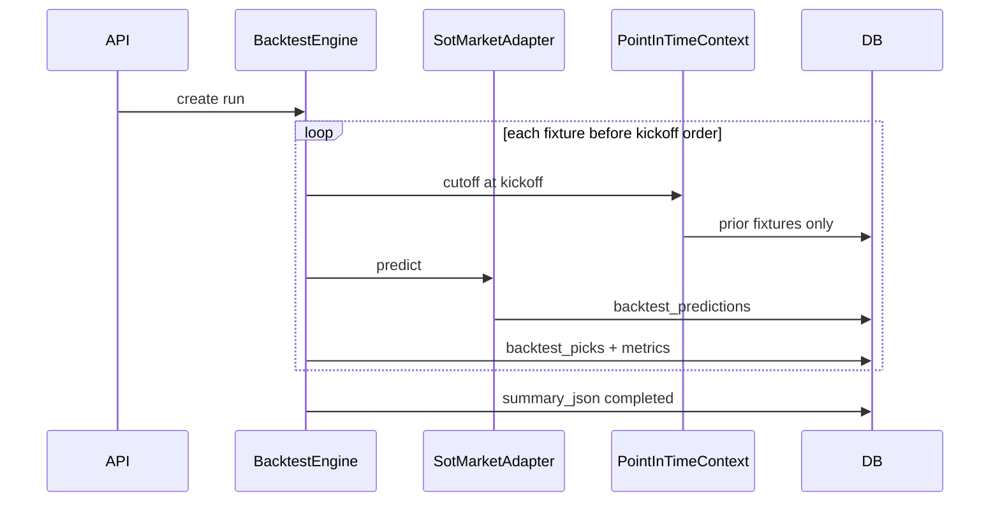

# Backtest Engine — architettura multi-mercato

Documento di progettazione per un motore di backtest **market-agnostic**, compatibile con l’ecosistema SOT Predictor attuale e pronto per mercati futuri (calci d’angolo, cartellini, gol, ecc.).

**Stato:** design / preparazione (Step A). Nessuna migration DB in questa fase.

---

## 1. Obiettivo e principi

### Obiettivo

Permettere in futuro confronti del tipo:

- «Algoritmo SOT v2.1 ha previsto X e ha vinto N partite su Over 7.5»
- «Algoritmo Corner v1.0 ha previsto Y e ha vinto M partite»
- «Algoritmo Cartellini v1.0 ha previsto Z con win rate K»

Il backtest deve essere:

- **Multi-mercato** — identificato da `market_key` (es. `shots_on_target`, `corners`)
- **Multi-algoritmo** — identificato da `algorithm_version` (es. `baseline_v2_1_weighted_components`)
- **Multi-campionato** — `competition_id`, `season`, `fixture_id`
- **Anti-leakage** — ogni fixture usa solo dati disponibili **prima** del kickoff
- **Non-breaking** — Prossima giornata, Audit, Monitoraggio giocate restano su `team_sot_predictions` / `tracked_betting_picks`

### Principi

| Principio | Descrizione |
|-----------|-------------|
| Separazione mercato / algoritmo | `market_key` ≠ `algorithm_version` |
| Bridge SOT | Per il mercato attuale, `algorithm_version` = `model_version` esistente |
| Point-in-time | Rigenerazione (o simulazione) per fixture storica con cutoff al kickoff |
| Registry-first | Mercati e algoritmi registrati in codice prima del wiring runtime |
| Legacy coexistence | `prediction_backtests` e `/backtest/sot/*` restano fino a deprecazione graduale |

---

## 2. Stato attuale e gap

### Dove vivono oggi i dati SOT

| Componente | Tabella / servizio | Campi chiave |
|------------|-------------------|--------------|
| Predizioni live | `team_sot_predictions` | `predicted_sot`, `actual_sot`, `model_version`, `raw_json` (trace in `applied_variable_trace`) |
| Feature pre-match | `team_sot_features` | medie SOT, `actual_sot`, `feature_set_version = "sot-v2"` |
| Ground truth | `fixture_team_stats` | `shots_on_target` |
| Monitoraggio giocate | `tracked_betting_picks` | `predicted_*_sot`, `result_*_sot`, mercato implicito `match_total_sot` |
| Backtest numerico | `prediction_backtests` | `predicted_sot`, `actual_sot`, FK a `team_sot_predictions` |
| Quick report | `next_round_quick_report_service` | legge `team_sot_predictions` |
| Model comparison | `next_round_model_comparison_service` | v2.0 vs v2.1, totale SOT |
| Audit | `sot_fixture_explanation_service` | spiegazione per `model_version` |

### Punti hardcoded SOT

**Database:** colonne `predicted_sot`, `actual_sot`, `shots_on_target`, naming tabelle `team_sot_*`.

**Backend:** route prefix `/predictions/sot`, `/backtest/sot`, `/debug/sot`; servizi `SotBacktestService`, `tracked_betting_pick_service.MARKET_MATCH_TOTAL = "match_total_sot"`.

**Frontend:** Dashboard con `sot_backtest_*`, Quick report «SOT Totale», ModelComparisonSection v2.0 vs v2.1.

### Gap principale del backtest attuale

`SotBacktestService` confronta predizioni **già salvate** in `team_sot_predictions` con `actual_sot`. Non garantisce:

1. Rigenerazione point-in-time per ogni fixture storica
2. Snapshot feature congelato al kickoff
3. Separazione `pre_lineup` / `post_lineup`
4. Backtest pick Over/Under su linee configurabili (il `BacktestService` legacy con linee O/U non è collegato alle route)

Il nuovo engine risolve questi gap con tabelle `backtest_*` e un adapter che invoca gli engine esistenti in modalità simulata.

---

## 3. Market Registry

Registro mercati in codice: `backend/app/markets/registry.py`.

```python
@dataclass(frozen=True)
class MarketSpec:
    market_key: str
    label: str
    unit: str
    supported_bet_types: tuple[str, ...]
    actual_stat_paths: dict[str, str]
    default_lines: tuple[float, ...]
    status: Literal["active", "planned", "deprecated"]
```

### Mercati previsti

| market_key | label | unit | bet_types | status |
|------------|-------|------|-----------|--------|
| `shots_on_target` | Tiri in porta | SOT | over_under_total, team_over_under | **active** |
| `corners` | Calci d'angolo | corners | over_under_total, team_over_under | planned |
| `cards` | Cartellini | cards | over_under_total, team_over_under | planned |
| `goals` | Gol | goals | over_under_total, team_over_under | planned |
| `fouls` | Falli | fouls | over_under_total | planned |
| `total_shots` | Tiri totali | shots | over_under_total, team_over_under | planned |

**Regola:** nessun servizio esistente importa il registry finché non si implementa Step B+.

---

## 4. Algorithm Registry

Registro algoritmi: `backend/app/algorithms/registry.py`.

```python
@dataclass(frozen=True)
class AlgorithmSpec:
    market_key: str
    algorithm_version: str
    label: str
    status: Literal["production", "experimental", "deprecated"]
    visible_in_frontend: bool
    input_requirements: dict[str, bool]
    output_schema: dict[str, str]
    trace_schema: dict[str, str]
    engine_entrypoint: str | None
```

### Mapping SOT (mercato attuale)

| market_key | algorithm_version | engine | Note |
|------------|-------------------|--------|------|
| `shots_on_target` | `baseline_v2_0_lineup_impact` | `app.services.predictions_v20.baseline_v2_0_lineup_impact_service` | produzione |
| `shots_on_target` | `baseline_v2_1_weighted_components` | `app.services.predictions_v21.baseline_v2_1_weighted_components_service` | produzione |

### Mercati futuri (solo registry, no engine)

| market_key | algorithm_version | status |
|------------|-------------------|--------|
| `corners` | `corners_v1_0` | planned |
| `cards` | `cards_v1_0` | planned |

**Bridge:** `team_sot_predictions.model_version` resta invariato; il backtest aggiunge `market_key` + `algorithm_version` (stesso valore stringa per SOT).

---

## 5. Schema tabelle proposte

Nessuna migration in Step A. DDL di riferimento per Step B.

### 5.1 `backtest_runs`

```sql
-- Proposta Step B (commento, non applicata)
CREATE TABLE backtest_runs (
    id BIGSERIAL PRIMARY KEY,
    competition_id BIGINT NOT NULL REFERENCES competitions(id),
    season_id BIGINT REFERENCES seasons(id),
    season_year INT,
    market_key VARCHAR(64) NOT NULL,
    algorithm_version VARCHAR(64) NOT NULL,
    mode VARCHAR(32) NOT NULL,           -- pre_lineup | post_lineup
    fixture_scope VARCHAR(32) NOT NULL,  -- full_season | round_range | custom_range
    date_from TIMESTAMPTZ,
    date_to TIMESTAMPTZ,
    status VARCHAR(32) NOT NULL DEFAULT 'pending',
    config_json JSONB NOT NULL DEFAULT '{}',
    summary_json JSONB,
    config_hash VARCHAR(64),
    created_at TIMESTAMPTZ NOT NULL DEFAULT now(),
    completed_at TIMESTAMPTZ
);
-- UNIQUE (competition_id, season_year, market_key, algorithm_version, mode, fixture_scope, config_hash)
```

### 5.2 `backtest_predictions`

```sql
CREATE TABLE backtest_predictions (
    id BIGSERIAL PRIMARY KEY,
    backtest_run_id BIGINT NOT NULL REFERENCES backtest_runs(id) ON DELETE CASCADE,
    competition_id BIGINT NOT NULL,
    fixture_id BIGINT NOT NULL REFERENCES fixtures(id),
    market_key VARCHAR(64) NOT NULL,
    algorithm_version VARCHAR(64) NOT NULL,
    prediction_scope VARCHAR(32) NOT NULL,  -- match_total | home_team | away_team
    predicted_value DOUBLE PRECISION NOT NULL,
    actual_value DOUBLE PRECISION,
    error_value DOUBLE PRECISION,
    abs_error DOUBLE PRECISION,
    trace_json JSONB,
    feature_snapshot_json JSONB,
    created_at TIMESTAMPTZ NOT NULL DEFAULT now(),
    UNIQUE (backtest_run_id, fixture_id, prediction_scope)
);
```

### 5.3 `backtest_picks`

```sql
CREATE TABLE backtest_picks (
    id BIGSERIAL PRIMARY KEY,
    backtest_run_id BIGINT NOT NULL REFERENCES backtest_runs(id) ON DELETE CASCADE,
    fixture_id BIGINT NOT NULL REFERENCES fixtures(id),
    market_key VARCHAR(64) NOT NULL,
    algorithm_version VARCHAR(64) NOT NULL,
    bet_type VARCHAR(32) NOT NULL,       -- over_under_total | team_over_under
    line_value DOUBLE PRECISION NOT NULL,
    pick_side VARCHAR(16) NOT NULL,      -- over | under
    predicted_value DOUBLE PRECISION,
    actual_value DOUBLE PRECISION,
    result VARCHAR(16),                  -- won | lost | void | pending
    confidence_label VARCHAR(64),
    risk_label VARCHAR(64),
    odds DOUBLE PRECISION,
    profit_loss DOUBLE PRECISION,
    created_at TIMESTAMPTZ NOT NULL DEFAULT now()
);
```

### 5.4 `backtest_run_metrics`

```sql
CREATE TABLE backtest_run_metrics (
    id BIGSERIAL PRIMARY KEY,
    backtest_run_id BIGINT NOT NULL REFERENCES backtest_runs(id) ON DELETE CASCADE,
    metric_key VARCHAR(64) NOT NULL,
    metric_value DOUBLE PRECISION,
    metric_json JSONB,
    UNIQUE (backtest_run_id, metric_key)
);
```

### Metriche previste

- `fixtures_tested`, `mae`, `rmse`, `bias`
- `win_rate`, `picks_won`, `picks_lost`, `picks_void`
- `over_hit_rate`, `under_hit_rate`
- `performance_by_line`, `performance_by_round`, `performance_by_team` (in `metric_json`)

### Relazione con legacy

`prediction_backtests` resta per compatibilità. Opzionale: import adapter da run numerici esistenti.

---

## 6. Feature snapshot point-in-time

Ogni riga in `backtest_predictions.feature_snapshot_json` documenta **cosa** l’algoritmo ha visto al momento simulato.

### Schema JSON

```json
{
  "cutoff_time": "2026-03-15T18:59:00Z",
  "fixture_kickoff_at": "2026-03-15T19:00:00Z",
  "latest_fixture_used_at": "2026-03-10T20:45:00Z",
  "team_stats_sample_count": 12,
  "xg_sample_count": 10,
  "player_profiles_sample_count": 597,
  "lineup_mode": "pre_lineup_probable",
  "leakage_guard": true,
  "missing_variables": ["sportapi_lineups.confirmed_starters"],
  "fallback_variables": ["lineup_impact.player_layer_top_shooter_absence"],
  "source_paths": [
    "fixture_team_stats.shots_on_target",
    "team_stats.season_avg_sot_for"
  ]
}
```

### Regola anti-leakage

Per ogni fixture `F` con kickoff `T`:

1. `cutoff_time` = `T` (o `T - epsilon`)
2. Feature e medie calcolate solo su fixture con `kickoff_at < T` (o `fixture_key_before` come in v2.1 xG)
3. Nessun dato post-match di `F` entra nel contesto
4. `leakage_guard: true` obbligatorio nel snapshot se il guard è attivo

Building blocks esistenti (da riusare, non modificare):

- `fixture_key_before()` — `v21_xg_league_features.py`
- `build_xg_leakage_trace()` — metadata trace xG
- `latest_fixture_used_at` — già in audit v2.1

---

## 7. Modalità backtest

| mode | Lineups | Use case |
|------|---------|----------|
| `pre_lineup` | Probabili / storico / assenti | Simula ~30 min prima del kickoff, senza formazioni ufficiali reali |
| `post_lineup` | Ufficiali storiche SportAPI | Simula dopo pubblicazione formazioni, se disponibili in storico |

### `config_json` esempio

```json
{
  "lineup_source": "sportapi_historical",
  "require_official_lineup": false,
  "default_ou_lines": [5.5, 6.5, 7.5, 8.5, 9.5],
  "pick_strategy": "model_recommendation",
  "round_filter": null
}
```

---

## 8. Flusso backtest point-in-time

```
1. Admin/API crea backtest_run (competition, season, market, algorithm, mode, scope)
2. BacktestEngine seleziona fixture nel scope (es. stagione conclusa, status FT)
3. Per ogni fixture F (ordinata per kickoff):
   a. PointInTimeContext.build(F.kickoff_at, mode)
   b. AlgorithmAdapter.predict(ctx, market_key, algorithm_version)
   c. Salva backtest_predictions (+ trace_json + feature_snapshot_json)
   d. Deriva backtest_picks per linee O/U configurate
   e. Valuta result vs actual_value da fixture_team_stats
4. Aggrega metriche → backtest_run_metrics, summary_json
5. status = completed
```



---

## 9. Compatibilità SOT

Per `market_key = shots_on_target`:

| Campo backtest | Origine SOT |
|----------------|-------------|
| `predicted_value` (home/away) | `predicted_sot` da engine v2.0/v2.1 |
| `predicted_value` (match_total) | somma home + away |
| `actual_value` | `fixture_team_stats.shots_on_target` |
| `bet_type` | `over_under_total` |
| `line_value` | 5.5, 6.5, 7.5, 8.5, 9.5 (registry default_lines) |
| `result` | won/lost vs actual vs line |

Confronto v2.0 vs v2.1 = **due run** con stesso `market_key`, diversi `algorithm_version`.

**Adapter futuro (Step C):** `SotMarketAdapter` invoca `baseline_v2_*_service` con contesto point-in-time senza alterare formule o pesi.

---

## 10. Report e API futuri (Backtest Dashboard)

### Frontend (Step F+)

Route proposta: `/backtest-dashboard` (non sostituisce `/dashboard` legacy).

**Filtri:** competition, season, market, algorithm_version, mode, date range, run.

**Card:** Mercato, Algoritmo, Partite testate, MAE, Win rate, Picks vinte/perse, Bias.

**Insight esempio:**

- «Il mercato SOT è affidabile su Over 7.5, meno su Over 9.5»
- «Corner: win rate maggiore ma copertura minore»
- «Cartellini: alta varianza»

### API proposta (Step B)

| Metodo | Path | Descrizione |
|--------|------|-------------|
| POST | `/api/backtest/runs` | Crea ed avvia run |
| GET | `/api/backtest/runs/{id}` | Dettaglio + summary |
| GET | `/api/backtest/runs/{id}/predictions` | Paginato |
| GET | `/api/backtest/runs/{id}/picks` | Paginato |
| GET | `/api/backtest/runs/compare` | Confronto multi-algoritmo / multi-mercato |

Prefix generico `/api/backtest/` per il nuovo engine. Route legacy `/backtest/sot/serie-a/*` restano attive.

---

## 11. Piano implementazione

| Step | Deliverable | Modifica v2.0/v2.1? |
|------|-------------|---------------------|
| **A** (questo doc + registry stub) | Design, nessuna migration | No |
| **B** | Migration 4 tabelle + modelli SQLAlchemy | No |
| **C** | BacktestEngine + SotMarketAdapter, run pre_lineup Serie A v2.1 | No (adapter) |
| **D** | MAE, RMSE, bias, breakdown round/team | No |
| **E** | backtest_picks Over/Under, win rate per linea | No |
| **F** | Confronto v2.0 vs v2.1 API/UI | No |
| **G** | corners/cards nel registry + nuovi engine | Solo nuovi mercati |

**Principio:** Prossima giornata, Audit, Monitoraggio giocate continuano su `team_sot_predictions` e `tracked_betting_picks`.

---

## 12. Cosa NON viene modificato (Step A)

- Modelli SOT v2.0 e v2.1 (codice, formule, pesi)
- `team_sot_predictions`, quick report, audit, monitoraggio (comportamento)
- Route `/backtest/sot/*` esistenti
- Nessun algoritmo corners / cartellini / gol implementato
- Nessuna migration Alembic in Step A

---

## Riferimenti codice

| Area | Path |
|------|------|
| Market Registry (stub) | `backend/app/markets/registry.py` |
| Algorithm Registry (stub) | `backend/app/algorithms/registry.py` |
| Backtest attuale | `backend/app/services/sot_backtest_service.py` |
| Backtest O/U legacy | `backend/app/services/backtest_service.py` |
| Anti-leakage xG v2.1 | `backend/app/services/predictions_v21/v21_xg_league_features.py` |
| Tracked picks | `backend/app/services/tracked_betting_pick_service.py` |
