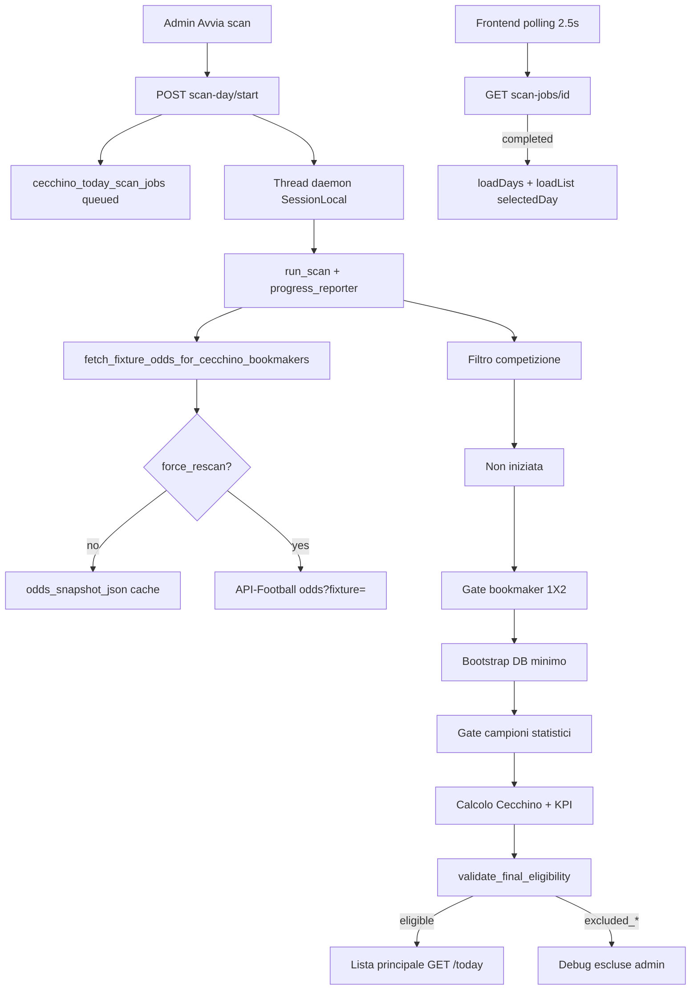
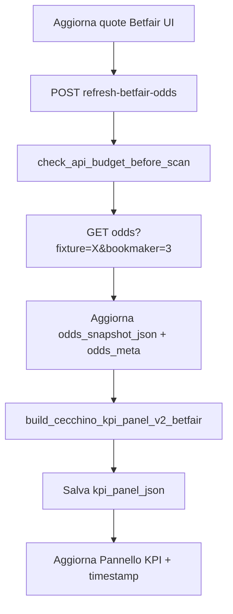
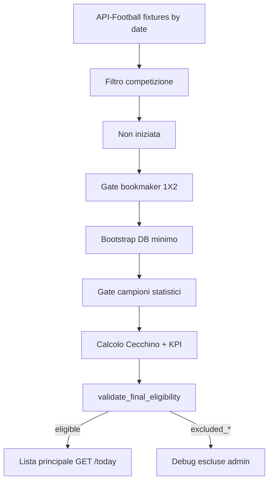

# SOT Predictor — Pipeline operativa Cecchino Today

## Flusso scan giornaliero (Fase 16 — async)

## Fix Fase 17 — selectedDay e job lifecycle

- **selectedDay:** init eseguito una sola volta al mount; `loadDays()` non sovrascrive la data scelta dall'utente.
- **Polling:** attach per `(job_id, scan_date)`; stop al cambio giorno; retry x3 senza reset data.
- **Stale:** `recover_stale_scan_jobs` su start/latest/status/days; job `queued`/`running` bloccati → `failed`.
- **Runner:** eccezione non gestita → `failed` + `errors_json`; progress aggiorna `updated_at` ad ogni commit.

## Fase 23 — Refresh quote Betfair singola fixture

- **odds_meta:** impostato allo scan (`is_cached=true`) e al refresh live (`odds_source=api_live_refresh`).
- **Refresh:** `_fetch_betfair_only` — una sola chiamata API; opzionale `sync_today_bookmaker_odds` se `local_fixture_id`.
- **Export:** `betfair-markets-json` con `force=false` da snapshot o `force=true` con fetch live.
- **Confronto manuale:** `manual_comparison_note` nella risposta refresh/export per audit vs app Betfair.

## Fase 22 — Cleanup dettaglio e debug JSON KPI

- **UI dettaglio:** solo Header, KPI, Segnali, Note; niente card quote finali né dettaglio Betfair separato.
- **Card eleggibili:** layout 2 righe con PT/FT; colonna lista 35%.
- **Score:** `score_halftime_*` persistiti; payload list con `halftime`/`fulltime`.
- **Mapping strict:** `Match Winner` + `Double Chance` + provenance; validazione `validate_betfair_kpi_odds_mapping`.
- **Debug:** `GET /cecchino/today/{id}/kpi-debug-json` per audit quote Betfair usate nel KPI.

## Fase 21 — Fix KPI Betfair rows e quote book

- **Payload odds:** `build_betfair_payload_from_raw` su `odds_by_bookmaker[3]` durante scan; fallback snapshot → DB.
- **DC derivata:** `derive_double_chance_from_1x2` con prob `1/quota`; `book_source=derived_from_betfair_1x2`.
- **KPI righe:** `segno` + `label` su tutte le righe; normalize/rebuild in `get_today_fixture_detail`.
- **Layout UI:** griglia 32%/68%; SEGNO 12%; nessuno scroll orizzontale desktop.

## Fase 20 — KPI Betfair-only

- **Bookmaker gate:** solo Betfair (id 3) con 1X2 HOME/DRAW/AWAY; `bookmaker_mode=betfair_only` nel job summary.
- **Odds fetch:** `GET /odds?fixture=` + filtro id 3; fallback `bookmaker=3`; cache/negative cache solo su Betfair.
- **KPI v2:** `build_cecchino_kpi_panel_v2_betfair` — 9 colonne, 13 righe, rating 0-100; nessuna media bookmaker.
- **Dettaglio quote:** tabella Betfair-only con source `raw_betfair` / `derived_from_1x2` / `not_available`.
- **Debug link:** `/bookmakers?provider_fixture_id=…&bookmaker_ids=3`.

## Fix Fase 19 — gate progressivi e consumo API

- **Censimento:** tutte le fixture salvate come `discovered` dopo `GET fixtures?date=`.
- **Gate order:** competition → negative/positive odds cache → bookmaker 1X2 → league stats cache → stats → Cecchino.
- **API tracking:** `api_usage_events` su ogni `ApiFootballClient.get`; summary giornaliero admin.
- **Budget guard:** `API_FOOTBALL_DAILY_BUDGET=7500`, stop job se budget residuo < 500 o job > 1000 chiamate.
- **update-results:** date-level fetch; fallback per-id solo se assente nel payload giornaliero.

## Fix Fase 18 — progress_pct e finalizzazione

- **`progress_pct`:** `round(progress_current / progress_total * 100, 1)` ad ogni update; merge con stato job se step-only.
- **Fixture:** `finally` garantisce progress; log `CecchinoTodayJob job_id=... fixture=N/M`.
- **Completed:** thread imposta `status=completed`, `progress_pct=100`, contatori finali.
- **Stale aggressivo:** running senza progresso >5 min (`updated_at`) o job >30 min → `failed`.
- **Frontend:** `computeScanJobProgressPct` + barra width `${pct}%`.

## Flusso scan sincrono legacy (pre-Fase 16)

## Post-scan: rivalidazione

`POST /api/admin/cecchino/today/revalidate-day` rilegge gli snapshot JSON già salvati (`odds_snapshot`, `stats_snapshot`, `cecchino_output`, `kpi_panel`) e aggiorna `eligibility_status` senza chiamate API-Football.

Utile per riclassificare record marcati `eligible` prima dell’introduzione del gate finale.

## Bootstrap idempotente (Fase 12)

Durante scan-day, se lega/squadra/fixture esistono già nel DB:

- **League** — `get_or_create_league_by_api_id` riusa per `api_league_id`; INSERT solo in savepoint con recovery su race condition
- **Season / Competition / Team** — stesso pattern via `league_ingest_helpers.py`
- **Errore mapping** — fixture esclusa con `excluded_mapping_error`; scan non interrotto
- **Sessione DB** — savepoint per fixture + `recover_session_if_inactive()` evita PendingRollbackError

## Quote Over/Under (Fase 13–15)

- **Full time:** Over/Under 1.5/2.5/3.5 solo da `Goals Over/Under` bet_id=5 (Betfair in pipeline Today).
- **Primo tempo:** Over PT 0.5/1.5 solo da `Goals Over/Under First Half` (variante con trattino accettata).
- **Esclusi dal feed principale:** Goal Line, Result/Total Goals, Total Home/Away, RTG_H1 e mercati combo.
- **Scan-day** persiste 1X2/DC/OU/OU_FH; gate eleggibilità resta solo su 1X2.
- **Fase 20:** nessuna media bookmaker nel KPI Today; quote singole Betfair.

## Strategia fetch odds (Fase 16)

| Strategia | Quando |
|-----------|--------|
| `cached` | `force_rescan=false` e `odds_snapshot_json.raw_by_bookmaker_id` completo (Betfair 1X2) |
| `fixture_single_call` | `GET /odds?fixture=` con filtro bookmaker_id=3 |
| `fixture_single_call_with_bookmaker_fallback` | Single-call parziale → fallback `bookmaker=3` |
| `bookmaker_per_fixture` | Response vuota → `GET /odds?fixture=&bookmaker=3` |

Metriche in `result_summary_json`: `api_calls`, `odds_from_cache`, `odds_from_api`, `duration_seconds`.

## Fixture ID e debug JSON (Fase 14–15)

- Dettaglio Today espone `fixture_ids` e link a `/bookmakers?provider_fixture_id=...&bookmaker_ids=3`.
- Export JSON raw filtrato via `fixture-raw-odds` (copy/download in UI admin).
- Debug Over separato FT/FH con mercati scartati (`rejected_from_markets`).

## Lista vs debug

| Endpoint | Contenuto |
|----------|-----------|
| `GET /api/cecchino/today?date=` | Solo `eligibility_status=eligible` |
| `GET /api/admin/cecchino/today/excluded?date=` | Tutte le escluse con diagnostica |

## Garanzie out-of-scope

- Formule SOT v2.0/v2.1 non modificate
- `team_sot_predictions` non utilizzata da Cecchino Today
- Engine Cecchino (`cecchino_engine.py`) invariato — il gate consuma solo l’output
