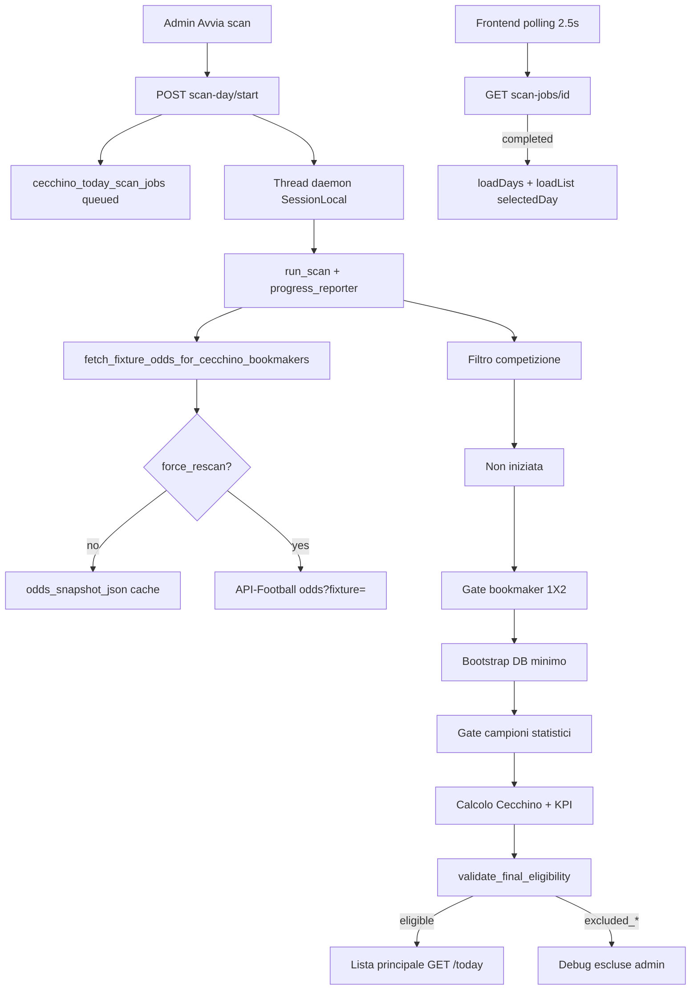
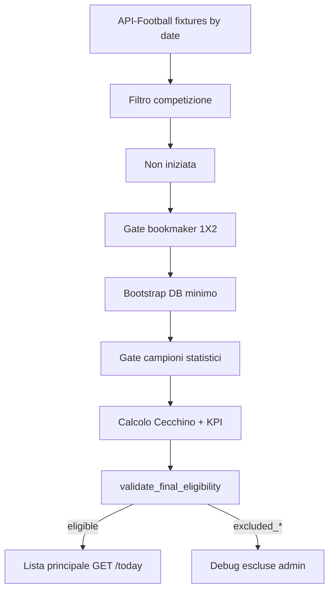

# SOT Predictor — Pipeline operativa Cecchino Today

## Flusso scan giornaliero (Fase 16 — async)

## Fix Fase 17 — selectedDay e job lifecycle

- **selectedDay:** init eseguito una sola volta al mount; `loadDays()` non sovrascrive la data scelta dall'utente.
- **Polling:** attach per `(job_id, scan_date)`; stop al cambio giorno; retry x3 senza reset data.
- **Stale:** `recover_stale_scan_jobs` su start/latest/status/days; job `queued`/`running` bloccati → `failed`.
- **Runner:** eccezione non gestita → `failed` + `errors_json`; progress aggiorna `updated_at` ad ogni commit.

## Fix Fase 18 — progress_pct e finalizzazione

- **`progress_pct`:** `round(progress_current / progress_total * 100, 1)` ad ogni update; merge con stato job se step-only.
- **Fixture:** `finally` garantisce progress; log `CecchinoTodayJob job_id=... fixture=N/M`.
- **Completed:** thread imposta `status=completed`, `progress_pct=100`, contatori finali.
- **Stale aggressivo:** running senza progresso >5 min (`updated_at`) o job >30 min → `failed`.
- **Frontend:** `computeScanJobProgressPct` + barra width `${pct}%`.

## Flusso scan sincrono legacy (pre-Fase 16)

## Post-scan: rivalidazione

`POST /api/admin/cecchino/today/revalidate-day` rilegge gli snapshot JSON già salvati (`odds_snapshot`, `stats_snapshot`, `cecchino_output`, `kpi_panel`) e aggiorna `eligibility_status` senza chiamate API-Football.

Utile per riclassificare record marcati `eligible` prima dell’introduzione del gate finale.

## Bootstrap idempotente (Fase 12)

Durante scan-day, se lega/squadra/fixture esistono già nel DB:

- **League** — `get_or_create_league_by_api_id` riusa per `api_league_id`; INSERT solo in savepoint con recovery su race condition
- **Season / Competition / Team** — stesso pattern via `league_ingest_helpers.py`
- **Errore mapping** — fixture esclusa con `excluded_mapping_error`; scan non interrotto
- **Sessione DB** — savepoint per fixture + `recover_session_if_inactive()` evita PendingRollbackError

## Quote Over/Under (Fase 13–15)

- **Full time:** Over 1.5/2.5 solo da `Goals Over/Under` bet_id=5 (Bet365/Betfair/Pinnacle).
- **Primo tempo:** Over PT 0.5/1.5 solo da `Goals Over/Under First Half` (variante con trattino accettata).
- **Esclusi dal feed principale:** Goal Line, Result/Total Goals, Total Home/Away, RTG_H1 e mercati combo.
- **Scan-day** persiste 1X2/DC/OU/OU_FH; gate eleggibilità resta solo su 1X2.
- **Media Over** calcolata solo da book whitelist con quote presenti; mai media orphan senza dettaglio.

## Strategia fetch odds (Fase 16)

| Strategia | Quando |
|-----------|--------|
| `cached` | `force_rescan=false` e `odds_snapshot_json.raw_by_bookmaker_id` completo (3 book + 1X2) |
| `fixture_single_call` | `GET /odds?fixture=` con filtro book 8/3/4 |
| `fixture_single_call_with_bookmaker_fallback` | Single-call parziale → fallback solo book mancanti |
| `bookmaker_per_fixture` | Response vuota → 3× `GET /odds?fixture=&bookmaker=` (legacy) |

Metriche in `result_summary_json`: `api_calls`, `odds_from_cache`, `odds_from_api`, `duration_seconds`.

## Fixture ID e debug JSON (Fase 14–15)

- Dettaglio Today espone `fixture_ids` e link a `/bookmakers?provider_fixture_id=...`.
- Export JSON raw filtrato via `fixture-raw-odds` (copy/download in UI admin).
- Debug Over separato FT/FH con mercati scartati (`rejected_from_markets`).

## Lista vs debug

| Endpoint | Contenuto |
|----------|-----------|
| `GET /api/cecchino/today?date=` | Solo `eligibility_status=eligible` |
| `GET /api/admin/cecchino/today/excluded?date=` | Tutte le escluse con diagnostica |

## Garanzie out-of-scope

- Formule SOT v2.0/v2.1 non modificate
- `team_sot_predictions` non utilizzata da Cecchino Today
- Engine Cecchino (`cecchino_engine.py`) invariato — il gate consuma solo l’output
