# SOT Predictor — Pipeline operativa Cecchino Today

## Backend — Merge Alembic heads dopo Segnali KPI (2026-07-04)

- Risolto errore Railway «Multiple head revisions are present» dopo migration tabella `cecchino_kpi_signal_activations`.
- Merge migration `dd07defcb335_merge_alembic_heads_after_kpi_signals.py`: raccordo `20260704120000` + `5e0e69b60bde`, senza DDL.
- Deploy: `alembic upgrade head` (singola head); nessun downgrade/reset DB.
- Invariato: formule Cecchino, Segnali KPI, Monitoraggio Segnali, pipeline operativa.

## Cecchino — Segnali KPI (2026-07-04)

- Modulo separato da Monitoraggio Segnali / Segnali Lab.
- Sync offline da `kpi_panel_json` eleggibili → `cecchino_kpi_signal_activations`.
- Valutazione won/lost/pending da score FT/HT su `cecchino_today_fixtures`.
- Backfill admin: `POST /api/admin/cecchino/kpi-signals/backfill`; UI `/segnali-kpi`.

## Cecchino Today — Gate locale data fixture (2026-07-03)

- Subito dopo `get_fixtures_by_date`, `run_scan` partiziona le fixture con `fixture_belongs_to_scan_date`.
- Solo le fixture in-scope passano al census `discovered` e alla pipeline (competition → Betfair → stats → KPI).
- Fuori data: nessun upsert su `cecchino_today_fixtures`; conteggio in `provider_out_of_scan_date_skipped`.
- Progress job basato su fixture in-scope, non sul totale grezzo API.
- Timezone scansione: parametro `timezone` (default `Europe/Rome`).

## Backend — Fix circular import helper datetime Cecchino (2026-07-03)

- Helper datetime in `backend/app/services/datetime_utils.py` (fuori dal package `cecchino`) per evitare circular import con `v10_prior_context`.
- `cecchino.__init__` senza re-export: import diretti dai sotto-moduli (`cecchino_today_service`, `cecchino_fixture_history`, ecc.).
- Startup verificato: `app.main`, `v10_prior_context`, `cecchino_today_service`, `datetime_utils`.

## Cecchino — Robustezza datetime (2026-07-03)

- Helper unico: `backend/app/services/datetime_utils.py`.
- Parsing kickoff API (`fixture.date`) normalizzato a UTC in ingest, filtri Today e bootstrap.
- Confronti PIT (`fixture_key_before`, leakage, prior xG) usano wrapper safe; kickoff stringa non crasha la pipeline.
- Debug partite escluse: `datetime_debug` + KPI non etichettato `kpi_panel_missing` se l'errore è solo datetime.
- Fix shadowing: in `run_scan` usare `utc_now()` invece di `datetime.now(timezone.utc)` quando il parametro si chiama `timezone`.

## Cecchino — Disabilitazione cleanup automatico storico

- `run_scan` e scan-job **non** invocano più `cleanup_cecchino_today_snapshots`.
- Storico snapshot e signal activations preservati dopo ogni scan/rescan.
- Cleanup distruttivo solo via `POST /api/admin/cecchino/today/cleanup` con guardie:
  - `dry_run` default `true` (body opzionale);
  - env `CECCHINO_ALLOW_DESTRUCTIVE_CLEANUP=true`;
  - `confirm: "DELETE_CECCHINO_HISTORY"`.
- `DEFAULT_RETENTION_DAYS=7` usato solo per calcolo cutoff nel cleanup manuale.
- CASCADE su `cecchino_signal_activations` documentato — motivo della disabilitazione automatica.

## Timeline Cecchino Today — finestra ±30 giorni

- Costante backend: `CECCHINO_TODAY_TIMELINE_WINDOW_DAYS = 30` in `cecchino_today_constants.py`.
- Endpoint: `GET /api/cecchino/today/days` restituisce 61 giorni (oggi ±30) con conteggi scan/eleggibili.
- UI: frecce e card visibili 3/5/7 invariati; scorrimento nel range esteso.
- **Non modifica:** Monitoraggio Segnali/Lab, backtest A–F; non esegue DELETE su fixture.

## Flusso scan giornaliero (Fase 16 — async)

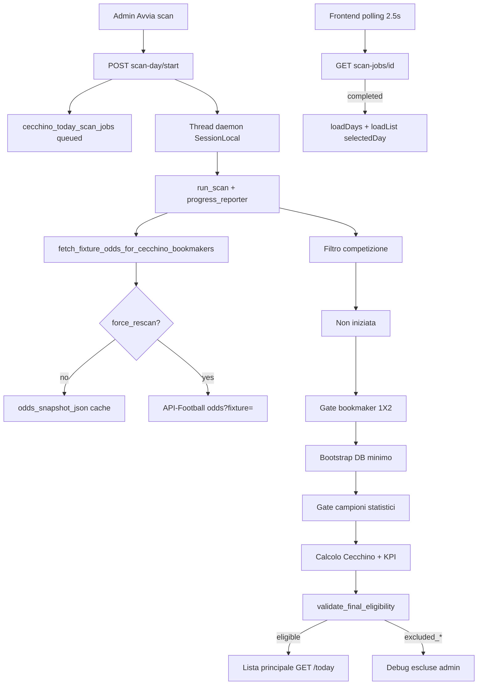

## Fix Fase 17 — selectedDay e job lifecycle

- **selectedDay:** init eseguito una sola volta al mount; `loadDays()` non sovrascrive la data scelta dall'utente.
- **Polling:** attach per `(job_id, scan_date)`; stop al cambio giorno; retry x3 senza reset data.
- **Stale:** `recover_stale_scan_jobs` su start/latest/status/days; job `queued`/`running` bloccati → `failed`.
- **Runner:** eccezione non gestita → `failed` + `errors_json`; progress aggiorna `updated_at` ad ogni commit.

## Fase 39 — Legenda formule Monitoraggio Segnali

- **UI:** accordion sotto Heatmap Segnale × Colonna in `/monitoraggio-segnali`.
- **Dati:** legenda statica frontend — nessuna chiamata API aggiuntiva.
- **Contenuto:** celle D39–G57, G48/G54, D60/E60 con formule Excel, testo parlante, target FT e regole W/L.
- **Verifica:** confronto diretto con tab CECCHINO di AutomazioneCecchino.xlsm.

## Fase 38 — Fix definitivo Scala 1X/X2

- **Root cause heatmap errata:** activation legacy `HOME+SCALA` / `AWAY+SCALA` ancora `is_current=true` + matrici DB non ricostruite da `force_remap`.
- **force_rebuild:** con `force_remap=true`, `_ensure_signals_matrix_on_row` sovrascrive sempre la matrice da quote finali.
- **Guardrail:** sync salta SCALA su HOME/AWAY; summary/list/export le escludono dalla query.
- **Diagnostics:** `legacy_wrong_scala_mapping_count` — se > 0, eseguire «Ricalcola mapping segnali».

## Fase 37 — Correzione mapping Scala segnali

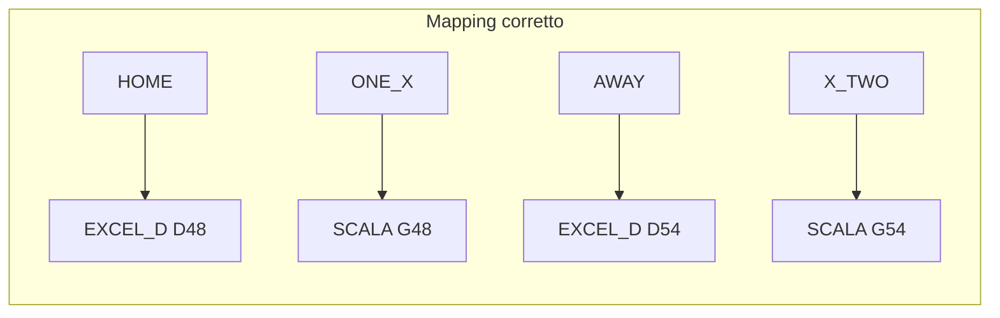

- **Fix matrice:** `build_signals_matrix` sposta `scala_1x`/`scala_x2` da righe `one`/`two` a `one_x`/`x_two`.
- **Legacy:** `remap_legacy_scala_activations_in_range` disattiva `HOME+SCALA` e `AWAY+SCALA` con reason dedicato.
- **Backfill:** `POST /admin/cecchino/signals/backfill` con `force_remap=true` — offline, zero API-Football.
- **UI:** pulsante «Ricalcola mapping segnali» su Monitoraggio Segnali.

## Fase 53 — xG storico automatico per fixture eleggibili

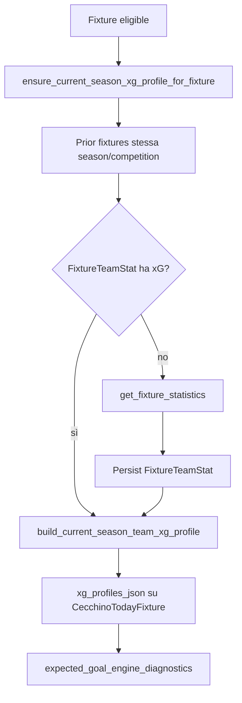

- **Hook automatici:** scan (`_persist_post_calc_snapshot`), recompute offline, revalidate-day, apertura dettaglio (lazy via diagnostics).
- **Idempotenza:** skip refetch se `profile_version`, `local_fixture_id` e `fixtures_checked` invariati.
- **Non blocca eleggibilità:** try/except su errori provider → warning `xg_provider_error` / `xg_api_rate_limited`.
- **Backfill manuale opzionale:** stesso endpoint Fase 52 con `force_refresh=true`.

## Fase 52 — xG storico current season per Expected Goal Engine

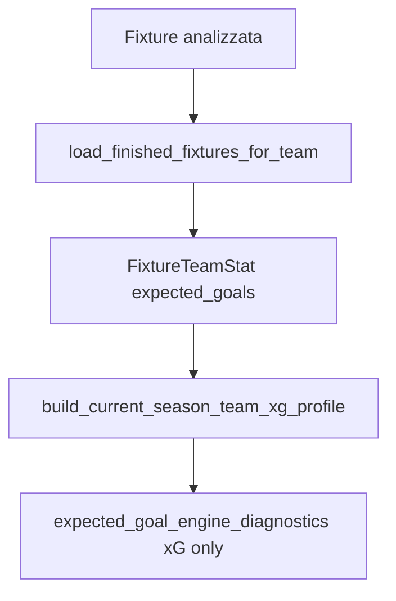

- **Anti-leakage:** media xG solo su partite prior stesso campionato/stagione; esclusa fixture corrente.
- **Path:** `statistics[type=expected_goals].value` da cache DB.
- **Backfill manuale:** `POST /admin/cecchino/fixtures/id/backfill-current-season-xg`.

## Fase 51 — API Raw Inspector per Expected Goal Engine

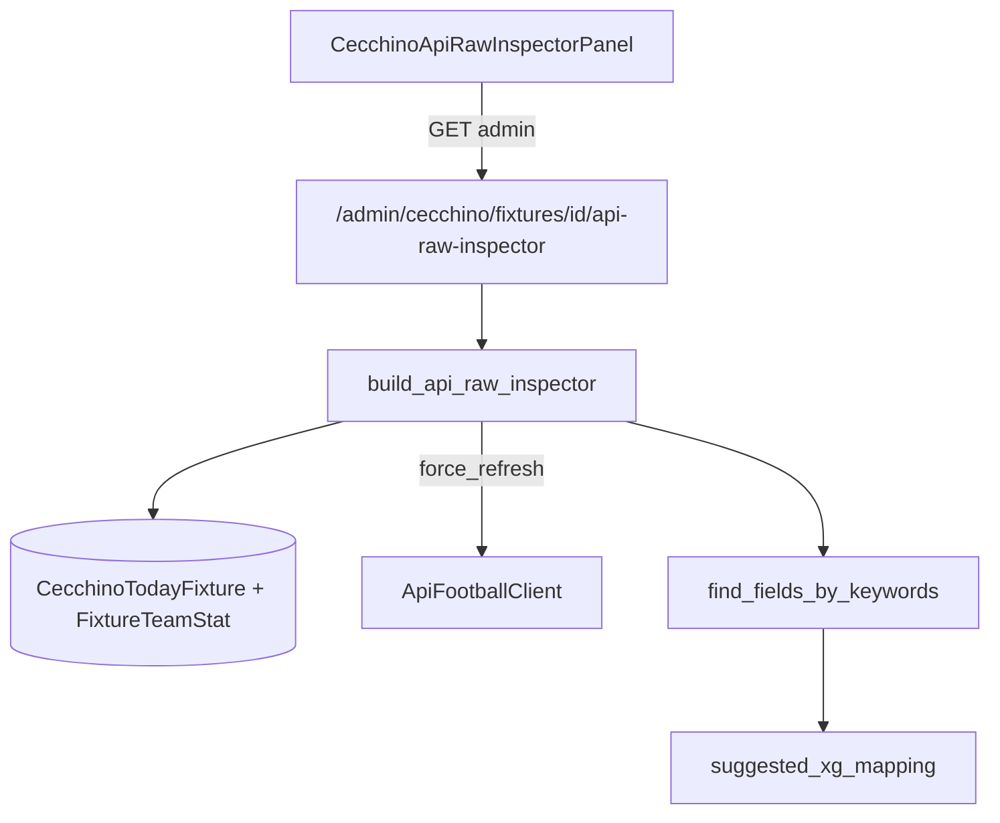

- **Manuale only:** non collegato a scan-day, recompute, revaluate, backtest.
- **Cache mode:** `force_refresh=false` legge solo DB/cache salvati.
- **Live mode:** `force_refresh=true` chiama endpoint provider selezionati (statistics, events, lineups, players, fixture details).
- **Output:** fonti controllate, match keyword, suggested xG mapping, JSON raw opzionale.

## Fase 50 — Expected Goal Engine Diagnostica Variabili

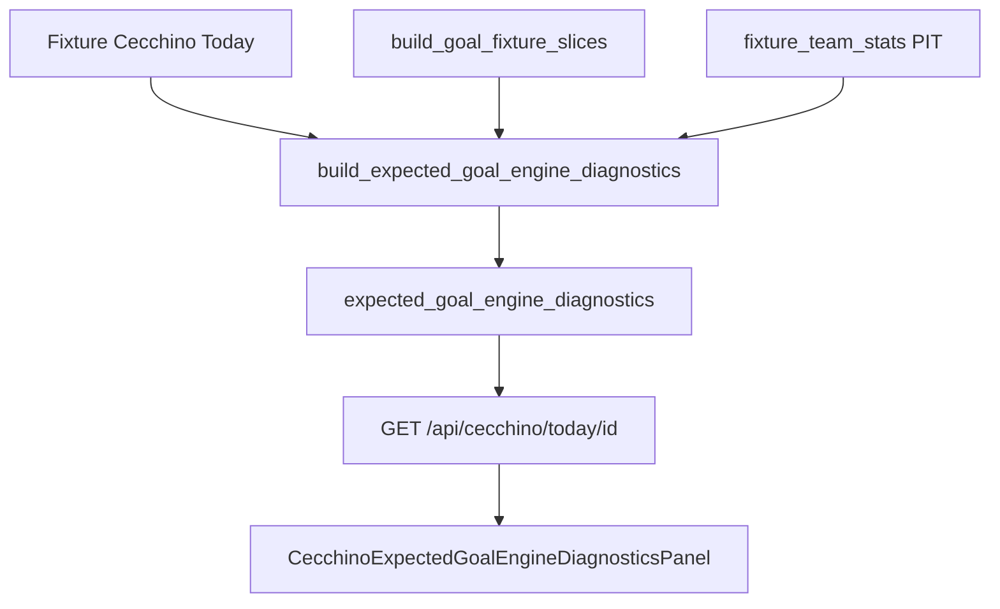

- **Audit only:** mappa 20 variabili, coverage e readiness; nessun output goal attesi.
- **Posizione UI:** dopo Intensità Goal, prima di ICM.

## Fase 49 — Intensità Goal v4 Goal Attesi

```mermaid
flowchart TD
  fixture[Fixture Cecchino Today] --> ctx[build_goal_market_contexts]
  ctx --> wl[weighted_lambda FT]
  wl --> eg[expected_goals_total]
  eg --> thr[soglie Over 0.5/1.5/2.5/3.5]
  eg --> pois[prob Over Poisson]
  thr --> class[final_class_key / final_label]
  class --> ui[CecchinoGoalIntensityAnalysisPanel v4]
```

- **v4:** classificazione su Goal Attesi Cecchino interni; soglie Over progressive.
- **Fonte:** `lambda_total` motore goal Poisson v2 (non xG API-Football).
- **UI:** badge v4 Goal Attesi, scala soglie Over, scala intensità goal.

## Fase 48 — Intensità Goal v3 OVER-only (sostituita da Fase 49)

```mermaid
flowchart TD
  slices[build_goal_fixture_slices] --> rawOver[raw_over_q44 OVER Q44]
  hist[fixtures PIT] --> dist[get_goal_intensity_over_baseline]
  dist --> pct[over_percentile rank]
  rawOver --> pct
  dist --> idx[over_index_vs_median]
  rawOver --> idx
  pct --> class[final_class_key / final_label]
  class --> ui[CecchinoGoalIntensityAnalysisPanel v3]
```

- **v3:** classificazione solo su percentile storico OVER Q44; UNDER deprecato.
- **Baseline:** distribuzione OVER-only (mediana + P20/P40/P60/P80); fallback league → country → global.
- **UI:** badge v3 OVER-only, scala percentile 20/40/60/80.

## Fase 47 — Intensità Goal v2 calibrata (sostituita da Fase 48)

```mermaid
flowchart TD
  raw[OVER/UNDER Q44 grezzi] --> norm[normalizzazione baseline mediana]
  hist[fixtures storiche PIT] --> baseline[get_goal_intensity_baselines]
  baseline --> norm
  norm --> ratio[Rapporto calibrato]
  norm --> delta[Delta calibrato]
  ratio --> class[classificazione finale]
```

- **v2:** classificazione su rapporto calibrato, non grezzo OVER/UNDER.
- **Baseline:** mediana con fallback league → country → global; cache in-process.
- **UI:** badge v2 calibrata, sezione grezzi + baseline.

## Fase 46 — Intensità Goal (Cecchino Today)

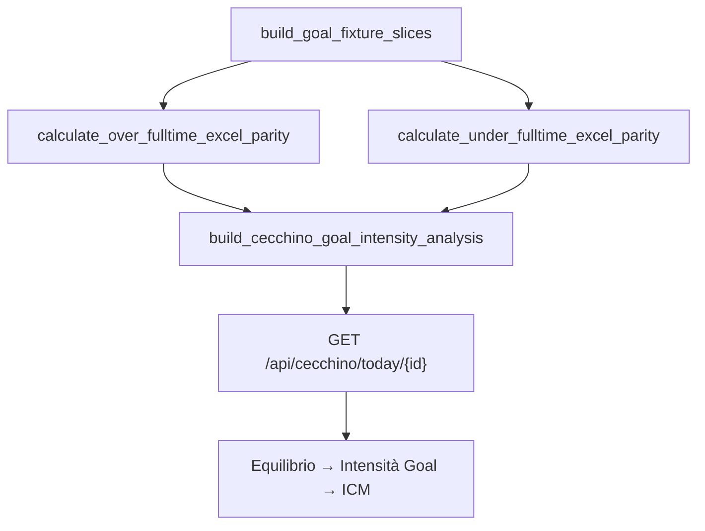

- **Modulo:** `cecchino_goal_intensity_analysis.py` — indipendente da Equilibrio e ICM.
- **Q44:** somma blocchi `home_away` + `totals` (non `final_odd` KPI Poisson v2).
- **Detail:** `goal_intensity_analysis` inserito tra `balance_analysis` e `icm_analysis`.

## Fase 45 — Aggiornamento formule segnali Cecchino

```mermaid
flowchart TD
  final[quote finali + prob Cecchino] --> dominance[compute_dominance_pp]
  dominance --> matrix[build_signals_matrix]
  matrix --> engine[cecchino_engine]
  matrix --> backfill[signal_backfill]
  matrix --> backtest[signal_model_backtest A-F]
  backfill --> sync[sync_cecchino_signal_activations]
  sync --> stable[/monitoraggio-segnali]
  sync --> lab[/monitoraggio-segnali-lab]
```

- **Formule aggiornate:** D48, D54, E51, G57, D60, E60 in `cecchino_signals_matrix.py`.
- **Dominanza:** da `cecchino_balance_analysis.compute_dominance_pp` (stessa scala Equilibrio); prob mancanti → NO sulle formule che la richiedono.
- **Rigenerazione storico:** «Rivaluta segnali», backfill `force_rebuild`/`force_remap`, «Ricalcola modelli A–F» — offline, zero API esterne.
- **UI:** legenda formule condivisa stabile + Lab (`cecchinoSignalFormulaLegend.ts`, `SignalsFormulaLegendAccordion`).

## Fase 44 — Monitoraggio Segnali Lab

```mermaid
flowchart LR
  api[cecchinoSignalsApi.ts] --> stable[/monitoraggio-segnali]
  api --> lab[/monitoraggio-segnali-lab]
  lab --> hook[useCecchinoSignalsLab]
  lab --> ui[components/cecchino-lab]
```

- **Route:** `/monitoraggio-segnali-lab`; sidebar **Segnali Lab** (icona flask).
- **Frontend only:** nessuna modifica backend; pagina stabile invariata.
- **UI Lab:** card modelli A–F, ribbon metriche, ECharts, heatmap con drawer, top ranking, tabella partite, toast Sonner.
- **Dipendenze:** `framer-motion`, `echarts`, `echarts-for-react`, `sonner`.

## Fase 43 — Backtest modelli pesi A-F

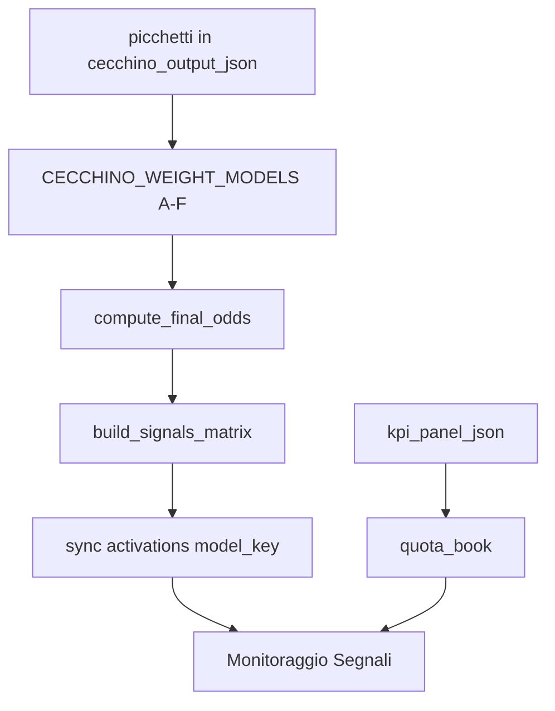

- **Modelli A–F:** backtest comparativo offline; ogni modello persiste activations con `model_key` distinto.
- **Endpoints:** `POST /signals/backtest-models`, `GET /signals/models-summary`; filtro `model_key` su summary/activations/export.
- **UI:** card cliccabili Confronto modelli pesi; pulsante «Ricalcola modelli A–F» (zero API-Football).
- **Live:** sync storico/live tagga modello F; Cecchino Today non cambia modello automaticamente.

## Fase 42 — Quota media prese e Quota Void

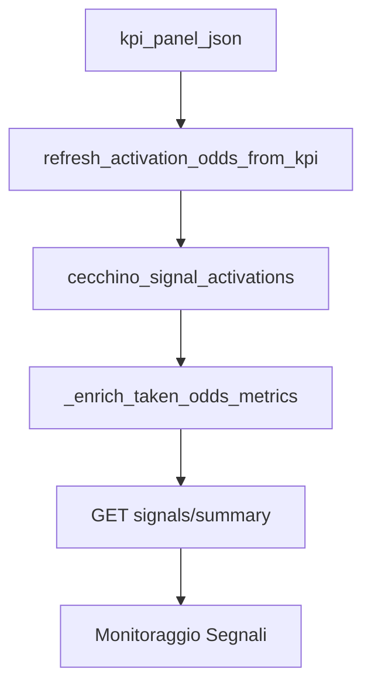

- **Quota media prese:** media quote book solo WON con quota; LOST esclusi.
- **Quota Void:** `1 / win_rate`; **Margine Void:** differenza vs quota prese; **Rendimento prese:** WR × quota prese − 1.
- **Revaluate:** `refresh_signal_odds=true` ripopola quote offline da KPI salvato.

## Fase 41 — Indice di Convergenza Match (ICM)

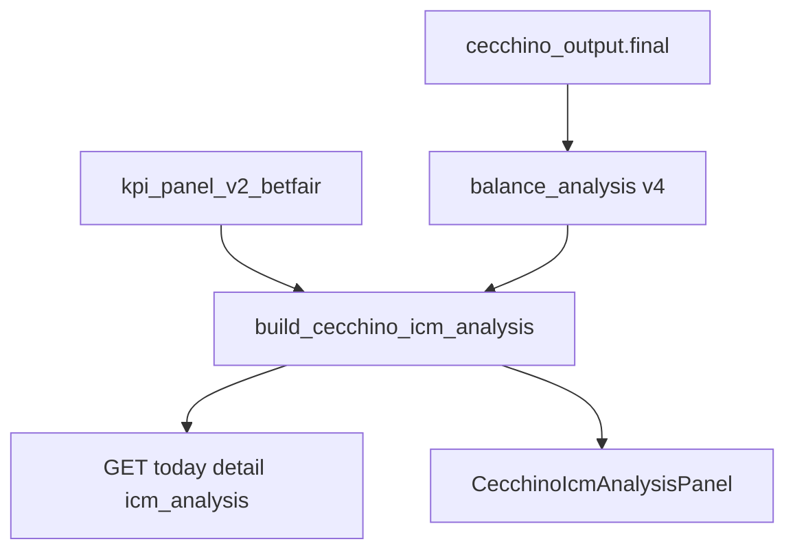

- **Formula:** narrative scoring su 5 pilastri (F36 20%, Dominanza 20%, Quota X 20%, Rating 25%, Vantaggio Prob. 15%).
- **Classificazione:** 0–100 con penalità ambiguità (gap tra narrativa 1ª e 2ª).
- **API:** `icm_analysis` in GET `/api/cecchino/today/{id}` e `kpi-debug-json`.
- **Ricalcolo:** derivato a read-time; `recompute_kpi=true` aggiorna ICM implicitamente.
- **Deprecato:** Delta Forza Match (Fase 36) rimosso da Today UI/API.

## Fase 36 — Delta Forza e Linearità Match (deprecata)

Sostituita da ICM (Fase 41). Modulo `cecchino_delta_force_analysis.py` mantenuto per legacy.

## Fase 35 — Sidebar Cecchino e metriche Monitoraggio Segnali

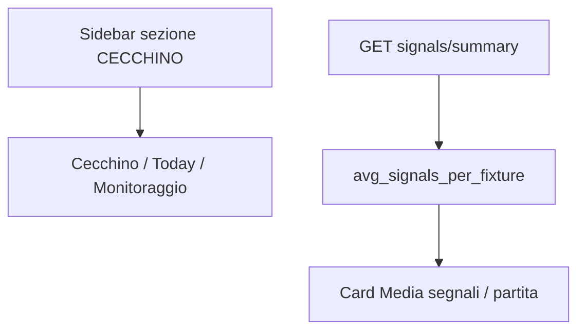

- **Sidebar:** `NAV_CECCHINO` in cima, voci rimosse da `NAV_MAIN`.
- **UI heatmap:** label `UNDER 2.5` / `OVER 2.5`; `signal_group` backend invariato.
- **Metrica:** `avg = activations / eligible_fixtures_count` (fallback `fixtures_with_signals_count`).

## Fase 34 — Mapping Under/Over su 2.5 FT

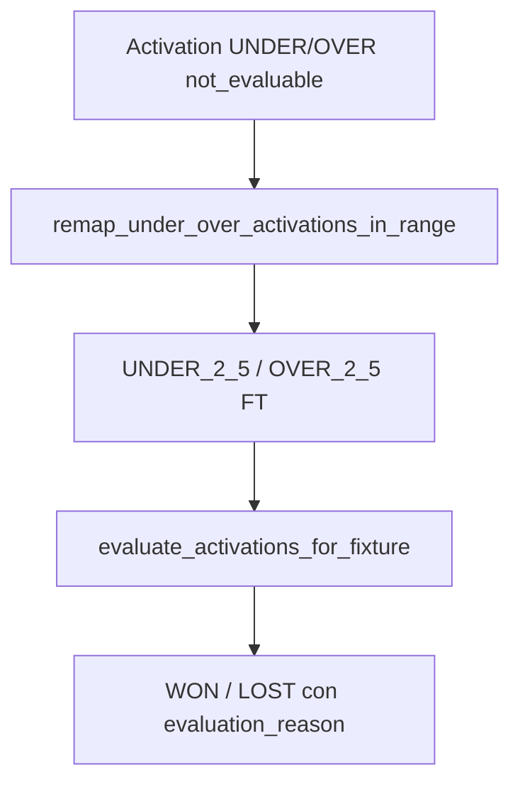

- **Mapping:** `UNDER_UNDER_PT` → Under 2.5 FT; `OVER_OVER_PT` → Over 2.5 FT.
- **Remap:** backfill e `POST revaluate` applicano target corretto prima della valutazione.
- **Sync:** aggiorna target su activation esistenti; valuta se `target_market_key` presente.

## Fase 33 — Backfill Monitoraggio Segnali

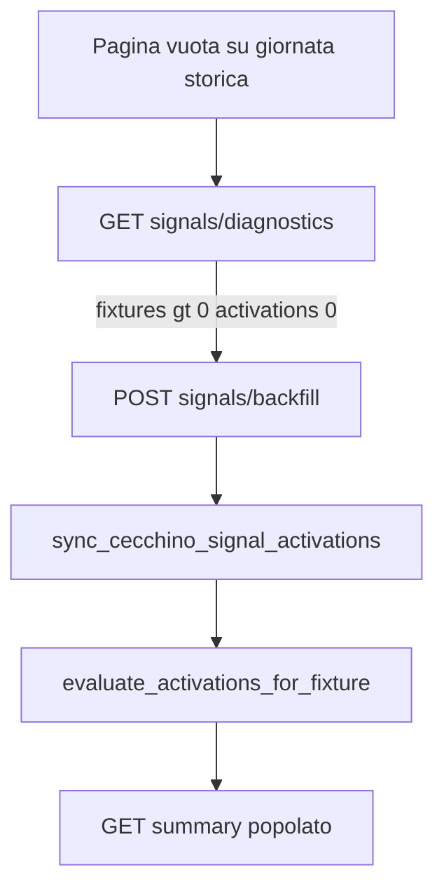

- **Backfill:** legge `cecchino_output_json.signals_matrix`; fallback ricalcolo offline da quote finali.
- **UI:** «Sincronizza segnali» + alert con CTA inline.
- **Scan:** `sync_signals_for_scan_date` post-commit.

## Fase 32 — Monitoraggio Segnali Cecchino

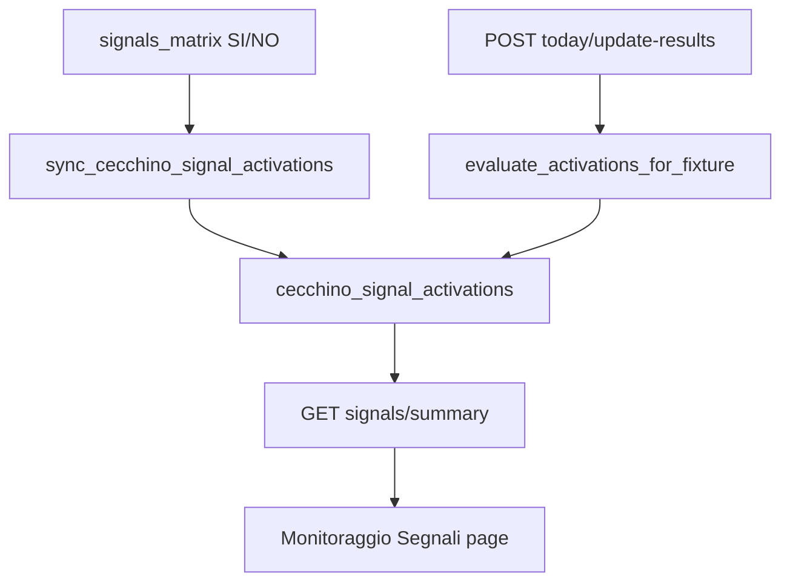

- **Sync hook:** upsert scan eleggibile + `get_today_fixture_detail`.
- **Idempotenza:** unique `(today_fixture_id, signal_group, source_column, COALESCE(target_market_key,''))`.
- **Success rate:** `won / (won + lost)` — esclude pending e not_evaluable.
- **Revaluate:** `POST /admin/cecchino/signals/revaluate` — solo DB.

## Fase 31 — Legenda operativa equilibrio

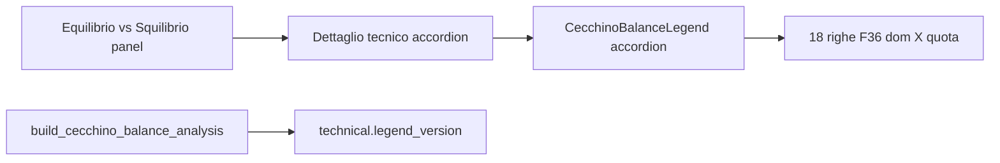

- **UI:** legenda statica frontend (`balanceOperationalLegend.ts`); non duplicata in API.
- **Label backend:** solo allineamento testi operativi; logica regole invariata.
- **legend_version:** `balance_operational_legend_v2_contextual_dominance`.

## Fase 30 — Dominanza contestualizzata

```mermaid
flowchart TD
  probs[prob_1 X prob_2] --> domCalc[dominanza invariata]
  probs --> bestSide[best_side HOME DRAW AWAY]
  bestSide -->|DRAW| reinforce[reinforces_balance]
  bestSide -->|HOME AWAY| lateral[weakens or confirms imbalance]
  domCalc --> domCtx[dominance_context]
  reinforce --> operational[operational reading]
  lateral --> operational
```

- **Falso equilibrio:** solo laterale (HOME/AWAY) con F36<0.75 e dom>10.
- **X dominante:** operational X forte / X molto forte, mai false_balance.
- **Gap 1/2 Prob:** `abs(prob_1 - prob_2)` in p.p.
- **Payload:** `cecchino_balance_analysis_v2`.

## Fase 29 — Equilibrio vs Squilibrio

```mermaid
flowchart LR
  final[cecchino_output.final] --> builder[build_cecchino_balance_analysis]
  builder --> detail[GET today detail balance_analysis]
  builder --> kpiJson[kpi-debug-json balance_analysis]
  detail --> ui[Equilibrio vs Squilibrio panel]
```

- **Input:** `quota_1/x/2` e `prob_1/x/2` da `cecchino_output.final` (solo Cecchino).
- **F36:** `abs(quota_2 - quota_1)` — score e classificazione equilibrio/squilibrio.
- **Dominanza:** max(prob) − seconda(prob) in punti percentuali.
- **Output:** lettura operativa, sintesi modello, dettaglio tecnico.
- **UI:** sezione sotto Debug Picchetti; 3 card + box operativo + accordion.

## Fase 40 — Nuovi pesi globali 1X2 e Under/Over

```mermaid
flowchart LR
  weights1X2[CECCHINO_1X2_WEIGHTS 30/30/20/20] --> engine[cecchino_engine 1X2]
  weightsGoal[CECCHINO_GOAL_MARKET_WEIGHTS 20/30/20/30] --> v2[goal_market_poisson_empirical_v2]
  engine --> output[cecchino_output_json]
  v2 --> output
  output --> kpi[cecchino_kpi_panel_v2_betfair]
  output --> signals[signals_matrix]
  recompute[POST admin/cecchino/recompute] --> engine
  recompute --> v2
```

- **Pesi 1X2:** totals 30%, home_away 30%, last6_totals 20%, last5_home_away 20%.
- **Pesi goal:** totals 20%, home_away 30%, last6_totals 20%, last5_home_away 30%.
- **Ricalcolo offline:** `POST /api/admin/cecchino/recompute` — no API-Football se `refresh_bookmaker_odds=false`.
- **UI:** pulsante «Ricalcola Cecchino con nuovi pesi» su Cecchino Today e Monitoraggio Segnali.
- **Invariato:** SOT v2.0/v2.1, Betfair-only, struttura KPI.

## Fase 28 — Nuovi pesi goal market (storico)

```mermaid
flowchart LR
  weights1X2[CECCHINO_1X2_WEIGHTS 25/20/35/20] --> engine[cecchino_engine 1X2]
  weightsGoal[CECCHINO_GOAL_MARKET_WEIGHTS 10/20/35/35] --> v2[goal_market_poisson_empirical_v2]
  v2 --> goalMarkets[goal_markets.final_odd]
  goalMarkets --> kpi[cecchino_kpi_panel_v2_betfair]
  v2 --> debug[Debug Picchetti goal tab]
```

- **Pesi goal (obsoleti post-Fase 40):** totals 10%, home_away 20%, last6_totals 35%, last5_home_away 35%.
- **Pesi 1X2 (obsoleti post-Fase 40):** 25/20/35/20.

## Fase 27 — Goal market Poisson + storico

```mermaid
flowchart LR
  dbFixtures[fixtures DB PIT] --> contexts[build_goal_market_contexts]
  contexts --> v2[goal_market_poisson_empirical_v2]
  contexts --> legacy[legacy_excel_parity]
  v2 --> goalMarkets[goal_markets.final_odd]
  legacy --> debug[Debug Picchetti v3]
  goalMarkets --> kpi[cecchino_kpi_panel_v2_betfair]
```

- **Formula KPI:** `goal_market_poisson_empirical_v2` — lambda + Poisson + hit-rate + blend 65/35.
- **Contesti:** totals (tutte le partite), home_away, last6_totals, last5_home_away.
- **Soglie distinte:** Over 1.5 ≠ Over 2.5; Under 2.5 ≠ Under 3.5 (per costruzione Poisson).
- **Legacy:** Excel parity solo in `legacy_excel_parity.enabled_for_kpi=false`.
- **Rescan:** fixture con goal_markets Fase 26 vanno riscansionate per v2.

## Fase 26 — Formule goal Over/Under

```mermaid
flowchart LR
  dbFixtures[fixtures DB PIT] --> slices[build_goal_fixture_slices]
  slices --> formulas[cecchino_goal_formulas]
  formulas --> goalMarkets[cecchino_output.goal_markets]
  goalMarkets --> kpi[build_cecchino_kpi_panel_v2_betfair]
  goalMarkets --> picchettiDbg[build_cecchino_picchetti_debug]
  goalMarkets --> kpiJson[cecchino_goal_odds_used]
```

- **Scan:** dopo calcolo 1X2, `goal_markets` aggiunto a `cecchino_output_json` e passato al KPI.
- **FT:** parità fogli OVER/UNDER Excel — media 3 blocchi con divisori 6/11/16 (Over) o 4/9/14 (Under).
- **PT:** solo fixture con `raw_json.score.halftime` valido; soglia minima 3 partite casa/fuori.
- **Dati insufficienti:** `quota_cecchino: null`, `status: insufficient_data` (no valori inventati).
- **Rescan:** fixture già scansionate senza `goal_markets` finché non si riscansiona la giornata.

## Fase 25 — Debug Picchetti Quota Cecchino

```mermaid
flowchart LR
  output[cecchino_output_json] --> debug[build_cecchino_picchetti_debug]
  kpi[kpi_panel_json] --> debug
  debug --> api[GET picchetti-debug]
  debug --> summary[picchetti_debug_summary in detail]
  api --> ui[Accordion Debug Picchetti UI]
```

- **Input:** `picchetti` + `final` già in `cecchino_output_json` (nessun ricalcolo da SOT).
- **1/X/2:** contributi `odd * weight` per totals/home_away/last6_totals/last5_home_away.
- **DC:** `1 / (prob_i + prob_j)` da quote finali Cecchino.
- **OU (pre-Fase 26):** solo `missing_formula` in debug; KPI mantiene `quota_cecchino: null`. Dalla Fase 26 vedi sezione sopra.
- **Coerenza:** confronto debug vs KPI con tolleranza 0.01.

## Fase 23 — Refresh quote Betfair singola fixture

```mermaid
flowchart TD
  btn[Aggiorna quote Betfair UI] --> post[POST refresh-betfair-odds]
  post --> budget[check_api_budget_before_scan]
  budget --> api["GET odds?fixture=X&bookmaker=3"]
  api --> snapshot[Aggiorna odds_snapshot_json + odds_meta]
  snapshot --> kpi[build_cecchino_kpi_panel_v2_betfair]
  kpi --> save[Salva kpi_panel_json]
  save --> ui[Aggiorna Pannello KPI + timestamp]
```

- **odds_meta:** impostato allo scan (`is_cached=true`) e al refresh live (`odds_source=api_live_refresh`).
- **Refresh:** `_fetch_betfair_only` — una sola chiamata API; opzionale `sync_today_bookmaker_odds` se `local_fixture_id`.
- **Export:** `betfair-markets-json` con `force=false` da snapshot o `force=true` con fetch live.
- **Confronto manuale:** `manual_comparison_note` nella risposta refresh/export per audit vs app Betfair.

## Fase 22 — Cleanup dettaglio e debug JSON KPI

- **UI dettaglio:** solo Header, KPI, Segnali, Note; niente card quote finali né dettaglio Betfair separato.
- **Card eleggibili:** layout 2 righe con PT/FT; colonna lista 35%.
- **Score:** `score_halftime_*` persistiti; payload list con `halftime`/`fulltime`.
- **Mapping strict:** `Match Winner` + `Double Chance` + provenance; validazione `validate_betfair_kpi_odds_mapping`.
- **Debug:** `GET /cecchino/today/{id}/kpi-debug-json` per audit quote Betfair usate nel KPI.

## Fase 21 — Fix KPI Betfair rows e quote book

- **Payload odds:** `build_betfair_payload_from_raw` su `odds_by_bookmaker[3]` durante scan; fallback snapshot → DB.
- **DC derivata:** `derive_double_chance_from_1x2` con prob `1/quota`; `book_source=derived_from_betfair_1x2`.
- **KPI righe:** `segno` + `label` su tutte le righe; normalize/rebuild in `get_today_fixture_detail`.
- **Layout UI:** griglia 32%/68%; SEGNO 12%; nessuno scroll orizzontale desktop.

## Fase 20 — KPI Betfair-only

- **Bookmaker gate:** solo Betfair (id 3) con 1X2 HOME/DRAW/AWAY; `bookmaker_mode=betfair_only` nel job summary.
- **Odds fetch:** `GET /odds?fixture=` + filtro id 3; fallback `bookmaker=3`; cache/negative cache solo su Betfair.
- **KPI v2:** `build_cecchino_kpi_panel_v2_betfair` — 9 colonne, 13 righe, rating 0-100; nessuna media bookmaker.
- **Dettaglio quote:** tabella Betfair-only con source `raw_betfair` / `derived_from_1x2` / `not_available`.
- **Debug link:** `/bookmakers?provider_fixture_id=…&bookmaker_ids=3`.

## Fix Fase 19 — gate progressivi e consumo API

- **Censimento:** tutte le fixture salvate come `discovered` dopo `GET fixtures?date=`.
- **Gate order:** competition → negative/positive odds cache → bookmaker 1X2 → league stats cache → stats → Cecchino.
- **API tracking:** `api_usage_events` su ogni `ApiFootballClient.get`; summary giornaliero admin.
- **Budget guard:** `API_FOOTBALL_DAILY_BUDGET=7500`, stop job se budget residuo < 500 o job > 1000 chiamate.
- **update-results:** date-level fetch; fallback per-id solo se assente nel payload giornaliero.

## Fix Fase 18 — progress_pct e finalizzazione

- **`progress_pct`:** `round(progress_current / progress_total * 100, 1)` ad ogni update; merge con stato job se step-only.
- **Fixture:** `finally` garantisce progress; log `CecchinoTodayJob job_id=... fixture=N/M`.
- **Completed:** thread imposta `status=completed`, `progress_pct=100`, contatori finali.
- **Stale aggressivo:** running senza progresso >5 min (`updated_at`) o job >30 min → `failed`.
- **Frontend:** `computeScanJobProgressPct` + barra width `${pct}%`.

## Flusso scan sincrono legacy (pre-Fase 16)

```mermaid
flowchart TD
  discovery[API-Football fixtures by date] --> compFilter[Filtro competizione]
  compFilter --> startedGate[Non iniziata]
  startedGate --> bmGate[Gate bookmaker 1X2]
  bmGate --> bootstrap[Bootstrap DB minimo]
  bootstrap --> statsGate[Gate campioni statistici]
  statsGate --> calc[Calcolo Cecchino + KPI]
  calc --> finalGate[validate_final_eligibility]
  finalGate -->|eligible| listMain[Lista principale GET /today]
  finalGate -->|excluded_*| debugExcluded[Debug escluse admin]
```

## Post-scan: rivalidazione

`POST /api/admin/cecchino/today/revalidate-day` rilegge gli snapshot JSON già salvati (`odds_snapshot`, `stats_snapshot`, `cecchino_output`, `kpi_panel`) e aggiorna `eligibility_status` senza chiamate API-Football.

Utile per riclassificare record marcati `eligible` prima dell’introduzione del gate finale.

## Bootstrap idempotente (Fase 12)

Durante scan-day, se lega/squadra/fixture esistono già nel DB:

- **League** — `get_or_create_league_by_api_id` riusa per `api_league_id`; INSERT solo in savepoint con recovery su race condition
- **Season / Competition / Team** — stesso pattern via `league_ingest_helpers.py`
- **Errore mapping** — fixture esclusa con `excluded_mapping_error`; scan non interrotto
- **Sessione DB** — savepoint per fixture + `recover_session_if_inactive()` evita PendingRollbackError

## Quote Over/Under (Fase 13–15)

- **Full time:** Over/Under 1.5/2.5/3.5 solo da `Goals Over/Under` bet_id=5 (Betfair in pipeline Today).
- **Primo tempo:** Over PT 0.5/1.5 solo da `Goals Over/Under First Half` (variante con trattino accettata).
- **Esclusi dal feed principale:** Goal Line, Result/Total Goals, Total Home/Away, RTG_H1 e mercati combo.
- **Scan-day** persiste 1X2/DC/OU/OU_FH; gate eleggibilità resta solo su 1X2.
- **Fase 20:** nessuna media bookmaker nel KPI Today; quote singole Betfair.

## Strategia fetch odds (Fase 16)

| Strategia | Quando |
|-----------|--------|
| `cached` | `force_rescan=false` e `odds_snapshot_json.raw_by_bookmaker_id` completo (Betfair 1X2) |
| `fixture_single_call` | `GET /odds?fixture=` con filtro bookmaker_id=3 |
| `fixture_single_call_with_bookmaker_fallback` | Single-call parziale → fallback `bookmaker=3` |
| `bookmaker_per_fixture` | Response vuota → `GET /odds?fixture=&bookmaker=3` |

Metriche in `result_summary_json`: `api_calls`, `odds_from_cache`, `odds_from_api`, `duration_seconds`.

## Fixture ID e debug JSON (Fase 14–15)

- Dettaglio Today espone `fixture_ids` e link a `/bookmakers?provider_fixture_id=...&bookmaker_ids=3`.
- Export JSON raw filtrato via `fixture-raw-odds` (copy/download in UI admin).
- Debug Over separato FT/FH con mercati scartati (`rejected_from_markets`).

## Lista vs debug

| Endpoint | Contenuto |
|----------|-----------|
| `GET /api/cecchino/today?date=` | Solo `eligibility_status=eligible` |
| `GET /api/admin/cecchino/today/excluded?date=` | Tutte le escluse con diagnostica |

## Garanzie out-of-scope

- Formule SOT v2.0/v2.1 non modificate
- `team_sot_predictions` non utilizzata da Cecchino Today
- Engine Cecchino (`cecchino_engine.py`) invariato — il gate consuma solo l’output
