# SOT Predictor — Pipeline operativa Cecchino Today

## Balance v5 Step 2B — Job launcher UI (2026-07-20)

1. `/monitoraggio-moduli` → Balance → **Overview**.
2. Card «Analisi statistica completa» → scegliere bootstrap (default 2000) → **Avvia analisi completa** (non auto-start).
3. Attendere polling; a completamento scaricare JSON job e/o ZIP v7.
4. Vista **Export**: riepilogo ultimo job + «Scarica analisi» = solo ZIP (non avvia il job).
5. Job in `/tmp` — dopo redeploy può sparire (404); riavviare analisi. Formule invariate.

## Balance v5 Fase 2B — Analisi empirica (2026-07-20)

1. NON rieseguire sync empirico.
2. `/monitoraggio-moduli` → Balance → viste F36/Dominanza/Credibilità X/Gap/Stabilità/Data health.
3. Job `POST …/empirical/analysis/jobs` dalla UI Overview (bootstrap 500–10000).
4. Export ZIP Balance = `cecchino_module_monitoring_exports_v7`.
5. SCI exploratory/partial_diagnostic — non dichiarare SCI PASS né promozione.

## Balance v5 Fase 2A — Dataset empirico (2026-07-20)

1. Applicare migrazione `20260720120000` (`cecchino_balance_v5_evaluations`).
2. `/monitoraggio-moduli` → Balance → vista **Dataset empirico** → Dry-run sync → Conferma run (token `SYNC_BALANCE_V5_EMPIRICAL_DATASET`).
3. Verificare GET `…/balance-v5/empirical/health` (settled/pending/coorti dinamici; niente 964/876 hardcodati).
4. Export ZIP Balance = `cecchino_module_monitoring_exports_v6` con file `empirical_*`.
5. NON modificare formule Balance; NON promuovere `historical_diagnostic`; win-rate = Step 2B.

## Fix export coorti e schemi forensic v4 (2026-07-20)

1. NON ripetere historical-backfill se le eval storiche ci sono già.
2. `/monitoraggio-moduli` → Coorte = Tutte → Riverifica → scarica 4 ZIP v4.
3. Acquistabilità: verificare `rows.csv` non vuoto e `source_row_count` > 0 con filtro all.
4. Readiness/gates restano prospettici anche con storico esportato.
5. Signals: controllare i 4 CSV attivazioni; unusable fuori dalle metriche ufficiali.
6. Verifica esterna: hash, schema, reconciliation, technical/scientific status.

## Gate chiusura Monitoraggio Moduli Fase 1/3 (2026-07-20)

1. `/monitoraggio-moduli` → filtro **Coorte** (default analisi = tutte; readiness = prospettica).
2. Card **Qualità pacchetti** → `GET …/analysis-packs-audit` (status audit ≠ «ZIP esiste»).
3. Strumenti → **Importa storico** → Analizza (`…/historical-backfill/plan`) → Conferma + token → run.
4. Export ZIP v3: README/HANDOFF/manifest/schema_contract/export_audit/source_cohorts + rows (chunk se serve).
5. Coorti storiche: non promotion-eligible; niente leakage in `cecchino_output_json` per Acquistabilità ricostruita.
6. Verifica esterna obbligatoria dei 4 ZIP prima di dichiarare gate chiuso; poi Fase 2/3 Balance empirica.

## Affidabilità storica vs Acquistabilità — FASE 1/5 (2026-07-19)

1. Aprire Cecchino Today → dettaglio → colonna **Affidabilità** dopo Rating (popover «Affidabilità storica»).
2. Verificare chip Campionato/Globale; Rating &lt;50 → «Non valutato».
3. Batch API `GET /api/cecchino/kpi-signals/historical-reliability` (scan_date, competition_id); errore non blocca il pannello.
4. Alias legacy `purchasability-empirical` ancora attivo ma deprecato.
5. Nessuna colonna Acquistabilità produttiva.

## Monitoraggio Moduli — HARDENING export coorti reali (2026-07-20)

1. Nuove scansioni: persistono `purchasability_preview` + `balance_v5_monitoring` (no FT nello snapshot).
2. Overview Balance: covered = persisted ∪ legacy_derived; settled ⊆ covered.
3. Export: menu mostra completezza/righe/coorte/size via `GET …/export-status`.
4. ZIP v2: Balance rows+distribuzioni; Goal 6 preview file; Segnali activations+timeseries.
5. Acquistabilità storiche restano `only_legacy_derived` — non backfill massivo.

## Monitoraggio Moduli Cecchino — MICRO-FIX export portal + overview (2026-07-19)

1. Hero «Scarica analisi» → menu globale (un pacchetto per modulo scelto); shell → menu del modulo attivo.
2. Menu in portal (desktop popover fixed / mobile bottom sheet); Escape / click fuori / backdrop chiudono.
3. CSV righe: `GET /api/cecchino/module-monitoring/{key}/rows.csv`.
4. Overview Balance: coverage = covered/eligible; settled solo su covered; warning se snapshot senza Balance.
5. Status UI in italiano (`monitoringStatusLabel`); raw key solo in aria-label.

## Monitoraggio Moduli Cecchino — FASE 1/3 (2026-07-19)

1. Aprire `/monitoraggio-moduli` (full-width).
2. Overview → selezionare modulo → vista interna (`?module=&view=`).
3. Export: «Scarica analisi» → ZIP `SOT_MONITOR_<MODULE>_…`.
4. Redirect: `/monitoraggio-segnali-lab`, `/cecchino/ricerca-credibilita-x`, `/cecchino/ricerca-intensita-goal`.
5. Segnali KPI operativo resta su `/segnali-kpi` senza laboratori Acquistabilità.

## Acquistabilità — FASE 5/5 validazione prospettica (2026-07-19)

1. Scan/recompute: dopo persist preview → `sync_purchasability_validation_for_fixture` (try/except).
2. Update risultati: accanto a Signals/KPI → `evaluate_purchasability_validation_for_fixture`.
3. Admin backfill: `POST /api/admin/cecchino/purchasability-validation/sync`.
4. Lab: Segnali KPI → Acquistabilità → Validazione — Fase 5 (health/summary/readiness/jobs).
5. candidate_2 non promosso automaticamente; gate solo readiness.

## Acquistabilità — FASE 4/5 KPI + snapshot (2026-07-19)

1. Scan/recompute pre-match: features → candidate_2 → compact snapshot → `cecchino_output_json.purchasability_preview`.
2. Detail Today restituisce snapshot (persisted o derived read-only).
3. Pannello KPI: colonna **Acquistabilità** (solo numero); Affidabilità invariata.
4. Post-kickoff: non sovrascrivere snapshot pre-match.
5. Validazione: vedi FASE 5/5.

## Acquistabilità — FASE 3/5 candidato Preview (2026-07-19)

1. Flusso: fixture → features Fase 2 → `calculate_purchasability_candidate_batch`.
2. Endpoint debug: `GET …/purchasability-preview/candidate/{today_fixture_id}` (read-only, ora candidate_2).
3. Features endpoint invariato (`status=not_calculated`).
4. Persistenza/UI: vedi Fase 4.

## Acquistabilità — FASE 2/5 feature pre-match (2026-07-19)

1. Feature layer solo backend/debug: `GET …/purchasability-preview/features/{today_fixture_id}`.
2. Usa `kpi_panel_json` salvato; score sempre null sul feature layer; nessuna chiamata FE.
3. UI Pannello KPI invariata (Affidabilità presente, Acquistabilità assente).

## Indice di Acquistabilità — empirica v1.1 (2026-07-19)

Sostituita semanticamente da Affidabilità storica (stessa formula). Vedi sezione sopra.

## Indice di Acquistabilità — empirica v1 (2026-07-18)

Sostituita da v1.1.

## Indice di Acquistabilità — Fase 2A.4.1 (2026-07-18)

1. FE: sottotab «Affidabilità residuale — Fase 2A.4.1» → job `research_mode=phase2a_residual_reliability` (200 bootstrap).
2. Verificare: `derived_double_chance… > 0`, ONE_X/X_TWO/ONE_TWO in residual, n OOF baseline ≈ candidati, `limited_temporal_span=true` se span &lt;90g, readiness `continue_data_collection` se limited.
3. Non avviare 1000 bootstrap né formula 0–100.

## Indice di Acquistabilità — Fase 2A.4 (2026-07-18)

1. FE: sottotab «Affidabilità residuale» → job con `research_mode=phase2a_residual_reliability` (200 bootstrap).
2. Verificare fair Book coverage (1X2/OU/DC derivata), confronti vs Book direction e vs GAP_ONLY, readiness residuale.
3. Non avviare 1000 bootstrap né formula 0–100.
4. Job statistico 2A resta disponibile con mode default.

## Indice di Acquistabilità — Fase 2A.3.2 (2026-07-18)

1. Verificare fold W/L/Void e WR non più 0/0; absence di `fold_class_balance_mismatch`.
2. Controllare `paired_comparisons_unique == total` e `duplicates_removed == 0`; una sola riga Rating vs Book/Model.
3. Feature `rating` = benchmark (`market_specific_benchmark` / `benchmark_only`), non candidate; next step residual research se Book dominante.
4. Non avviare ancora residual reliability né 1000 bootstrap.

## Indice di Acquistabilità — Fase 2A.3.1 (2026-07-18)

1. Dopo job completed: verificare summary immediato + result con paired/mercati/fold.
2. Controllare `effect_classification` vs `temporal_classification` (direzione negativa non mascherata).
3. Colonna `candidate_decision` esplicita; elapsed in min/s.
4. Non avviare ancora residual reliability né 1000 bootstrap.

## Indice di Acquistabilità — Fase 2A.3 (2026-07-18)

1. FE: `POST .../statistical-research/jobs` (202) → poll `GET .../jobs/{id}` ogni 2s → `GET .../summary`.
2. Verificare job running, completed, readiness v2a_2; nessun “Failed to fetch” da connessione lunga.
3. Job persi su restart/deploy (process-local `/tmp`). Locale senza DB: `DATABASE_URL_missing`.
4. GET sync `.../statistical-research` solo Console (`X-Research-Execution-Mode: synchronous-debug`).

## Indice di Acquistabilità — Fase 2A.2 (2026-07-18)

1. `GET .../purchasability/statistical-research` (versione `v2a_2`): verificare timeout FE ≥300s (200 bootstrap), positivi vs Book/Model/Rating separati, Book dominance, invariants.
2. FE: loading 2–4 min, pulsante disabilitato, keep results; avviso indipendenza vs mercato.
3. Benchmark Railway: prima 200 bootstrap; 1000 solo da console se invariants ok. Locale senza DB: `DATABASE_URL_missing`.

## Indice di Acquistabilità — Fase 2A.1 (2026-07-18)

1. `GET .../purchasability/statistical-research` (versione `v2a_1`): verificare paired ΔAUC/CI, ROI top 10%/20%, fold/market stability.
2. Non usare ROI coorte per confrontare candidati.
3. Benchmark Railway: 200 bootstrap tecnico, poi 1000; richiede `DATABASE_URL`.

## Indice di Acquistabilità — Fase 2A statistica (2026-07-18)

1. `GET .../purchasability/statistical-research` (filtri date/competition/market/selection/bootstrap/seed).
2. Sottosezioni: `.../markets`, `.../features`, `.../candidates`.
3. Export: `.../statistical-research/export/{summary|cohort_identity|temporal_folds|market_results|univariate_evidence|candidate_comparison|marginal_contribution|feature_decisions|rating_benchmark|readiness}`.
4. FE: `/segnali-kpi` → Acquistabilità → «Ricerca statistica — Fase 2A» (bootstrap 200/500).
5. Benchmark Railway: richiede `DATABASE_URL`; altrimenti `DATABASE_URL_missing`.

## Indice di Acquistabilità — Fase 1.1 (2026-07-18)

1. `GET .../purchasability/audit` (v1_1): verificare `snapshot_fidelity`, blocking, markets_ready.
2. Dataset paginato batch: `.../dataset?status=core`.
3. Export dataset streama senza audit pieno; altri export da summary.
4. FE tab Acquistabilità: fidelity, bookmaker, coorti.

## Indice di Acquistabilità — Fase 1 Audit (2026-07-18)

1. `GET /api/admin/cecchino/research/purchasability/audit` (filtri date/competition/market/book).
2. Dataset paginato: `.../purchasability/dataset`; mercati: `.../purchasability/markets`.
3. Export: `.../purchasability/export/{audit_summary|variable_registry|market_opposition_map|market_coverage|dataset|exclusions|rating_dependency_map}`.
4. FE: `/segnali-kpi` → tab «Acquistabilità — Audit» → «Aggiorna Audit».
5. Read-only: nessuna scrittura DB; nessuna formula 0–100.

## Intensità Goal v5 Research — Fase 2A.1 Preview freeze reale (2026-07-18)

1. Freeze bundle v1_1: `python -m scripts.freeze_goal_intensity_v5_preview_bundle --date-from 2026-06-19 --date-to 2026-07-19` (o `POST .../preview/freeze`) → `frozen_at=now`, identity guard in payload.
2. Nessuna migration aggiuntiva (JSONB già esistente). Bundle v1 residui restano in DB ma non attivi per nuovi snapshot.
3. `POST .../preview/refresh` (default `date_from=frozen_at.date()`): ammette Today con `updated_at > frozen_at` e `< kickoff`, non in identity sets.
4. Monitor: `GET .../preview/monitoring`; sotto 200 → `continue_prospective_monitoring` (Preview già operativa).
5. Export snapshot già salvati (no riesecuzione 1C/1D).

## Intensità Goal v5 Research — Fase 2A Preview (2026-07-18)

1. Freeze bundle storico v1: `python -m scripts.freeze_goal_intensity_v5_preview_bundle` / `POST .../preview/freeze`.
2. Migration iniziale: `alembic upgrade head` (tabelle bundle/snapshot).
3. Refresh / monitor / export come sopra (superseduto da v1_1 per ammissione).

## Intensità Goal v5 Research — Fase 1D.1 eval calibrata (2026-07-18)

1. Eseguire `POST .../candidate-indices` (v1_1): verificare calibrazione logistic/lineare, paired vs MT1, expanding tutti i candidati.
2. Controllare `first_prospective_scan_date` > `dataset_end_date` e readiness `ready_for_phase_2a`.
3. Export `calibrated_predictions` / `temporal_fold_metrics`.
4. Benchmark: `python -m scripts.benchmark_goal_intensity_v5_candidate_indices` (<45s).

## Intensità Goal v5 Research — Fase 1D candidate indices (2026-07-17)

1. Coorte Today eleggibile `scan_date` 2026-06-19→2026-07-19 (o range dichiarato).
2. `POST .../goal-intensity-v5/candidate-indices` (history 10, seed 42): leggere ECDF, GI_A–D, Pareto primary/challenger, xG optional, readiness 2A.
3. Export streaming (summary / scores / metrics / ablation / protocol); FE tab «Indici Fase 1D».
4. Benchmark: `cd backend && python -m scripts.benchmark_goal_intensity_v5_candidate_indices` (<30s preferibile, <45s max, <2 MB).
5. Nessuna scrittura DB; nessuna promozione formula; v4 invariata.

## Intensità Goal v5 Research — Fase 1C statistica (2026-07-17)

1. Costruire il dataset Today eleggibile Fase 1B.1 sul range `scan_date` ≥ 19/06/2026.
2. Eseguire `POST .../goal-intensity-v5/statistics` con history minima 10 (oppure 20) e seed 42; leggere segnali, ridondanza, stabilità e valutazione xG come evidenza esplorativa.
3. Scaricare gli export CSV/JSON se serve revisione; eseguire `cd backend && python -m scripts.benchmark_goal_intensity_v5_statistics`.
4. Verificare PASS <30s e <2 MB. Il flag `legacy_pre_utc_fix` documenta esclusioni UTC non riclassificate e non blocca da solo la readiness.
5. Non trasferire risultati in formule/pesi produttivi: v4 rimane invariata fino a una fase successiva approvata.

## Intensità Goal v5 Research — Coorte Today eleggibile (2026-07-17)

1. Lab «Ricerca Intensità Goal»: coorte = solo eleggibili Cecchino Today (`scan_date` ≥ 19/06/2026)
2. Verificare pannello diagnostica eleggibilità + banner bloccante se unknown / cohort_basis errato
3. Dataset/export: CSV model-ready solo `eligible`; diagnostica non eleggibili separata
4. Benchmark: `cd backend && python -m scripts.benchmark_goal_intensity_v5_dataset` (richiede `DATABASE_URL`)
5. v4 e regole eligibility Today invariate

## Intensità Goal v5 Research — Dataset Fase 1B.1 (2026-07-17)

1. Lab «Costruisci dataset» → summary compatto (<60s target; timeout app 180s invariato)
2. Anteprima ≤100 righe; export CSV/JSON dal backend (stream)
3. Benchmark: `cd backend && python -m scripts.benchmark_goal_intensity_v5_dataset --date-from 2025-06-01 --date-to 2026-07-17 --summary-only`
4. Nessuna formula; readiness per Fase 1C

## Intensità Goal v5 Research — Dataset Fase 1B (2026-07-17)

1. Lab tab «Dataset Fase 1B»: costruire dataset sul range kickoff
2. Verificare dedupe provider/composita, coorti history, paired xG
3. Export CSV (all / core≥5 / core≥10 / paired) + JSON summary
4. Nessuna formula; readiness per Fase 1C statistica

## Intensità Goal v5 Research — xG opzionale (1A.4) (2026-07-17)

1. Lab: sezione Copertura xG + badge + filtri Stato xG / Competition (client-side)
2. Export CSV Fixture audit; verificare coorti e readiness paired
3. xG missing/unsafe non deve azzerare feature-safe; versione `v1_4`

## Intensità Goal v5 Research — Identity storica + qualità (2026-07-17)

1. Lab: verificare banner quality + feature-safe rate
2. Audit su 2026-07-01→03: identity statica verified, no mismatch massivi status/score
3. `audit_usable` solo se `audit_quality=usable` (rate ≥70%)

## Intensità Goal v5 Research — Audit Fase 1A.3 (2026-07-17)

1. Lab: `/cecchino/ricerca-intensita-goal` (banner range da availability)
2. `GET /api/admin/cecchino/research/goal-intensity-v5/availability`
3. `POST /api/admin/cecchino/research/goal-intensity-v5/audit` (v1_2, preload; timeout 180s)
4. Export JSON/CSV; v4 invariata

## Intensità Goal v5 Research — Audit Fase 1A.2 (2026-07-17)

Rieseguire l’audit sul lab: coorte kickoff, feature coverage reale attesa su goal history; banner se audit non utilizzabile.

## Intensità Goal v5 Research — Audit Fase 1A (2026-07-17)

1. Lab: `/cecchino/ricerca-intensita-goal`
2. `POST /api/admin/cecchino/research/goal-intensity-v5/audit` con `date_from` / `date_to` / `competition_id`
3. Export JSON audit + CSV inventario feature
4. v4 operativa invariata; docs: `SOT_PREDICTOR_GOAL_INTENSITY_V5_RESEARCH.md`

## Cecchino Today — workspace master-detail adattivo (2026-07-19)

1. Layout: solo `/cecchino-today` senza max-w 1320.
2. Da 2xl: lista 370–410px + dettaglio; Nascondi/Mostra partite.
3. Sotto 2xl: drawer partite; dettaglio full-width.
4. Card partite ridisegnate; KPI tabella da xl, card sotto xl.

## Cecchino Today — KPI full-width senza scrollbar (2026-07-19)

1. Pagina `max-w-[1800px]`; da xl sidebar 320px + dettaglio `1fr`.
2. Tabella KPI `table-fixed` senza overflow-x; sotto xl card complete.
3. Toggle FE «Espandi analisi» / «Mostra partite» (niente API).

## Equilibrio vs Squilibrio v5 — dettaglio storico snapshot (2026-07-19)

1. Modalità da `scan_date` vs `rome_today()` (non da solo `fixture_status`).
2. Storico: identity statica; status/score diagnostici; gate su output/final/kickoff/target.
3. KPI `snapshot_only=True`: niente `load_betfair_odds_payload`.
4. FE: box snapshot storico; alert specifici se blocked.
5. Fail-closed su mismatch ID/squadre/comp/kickoff/output; nessuna scrittura GET.

## Equilibrio vs Squilibrio v5 — fix incoerenze + Intensità Goal UI (2026-07-19)

1. F36: passare `class_key` tecnico a `_pillar_f36_v5` (no ricostruzione da label IT).
2. Builder: `prob_*_raw` → `_normalize_3way_probs` → usare solo `*_norm` in pilastri/market; raw+norm in `inputs`.
3. Today: `build_cecchino_balance_v5(..., goal_markets=output.get("goal_markets"))`.
4. FE Balance: label per pilastro, disclaimer indici, `informational_note`, colonna «Confronto probabilità», hide se quote/prob tutti null.
5. Today Detail: non montare `CecchinoGoalIntensityAnalysisPanel` (v4); titolo v5 esatto `Intensità Goal Avanzata - v5 Preview research`.
6. Nessun bump versione; nessun Preview Balance; legacy ICM/Signals intatti.

## Equilibrio vs Squilibrio v5 — canonico (2026-07-19)

1. Detail Today espone solo `balance_v5` (`cecchino_balance_v5_v2`).
2. FE: `CecchinoBalanceV5Panel` — quattro card + sintesi strutturale + scostamento mercato.
3. Non reintrodurre Preview né candidati research duplicati.
4. ICM/Segnali restano sull’adapter `balance_analysis` (valori numerici invariati).

## Equilibrio vs Squilibrio v5 — Fase 2B (2026-07-17)

Sostituita dal consolidamento canonico sopra.

## Equilibrio vs Squilibrio — xG cache refresh Fase 2A.4 (2026-07-17)

Dopo Case A: `python -m scripts.audit_fixture_identity_9510 --refresh-xg-cache-only --case A` → cutoff xG = kickoff 16/07; audit consistent; Preview v1_2.

## Riparazione Caso A — Today 9510 / Fixture 562 (2026-07-17)

1. `python -m scripts.audit_fixture_identity_9510 --dry-run --case A`
2. Verificare piano before/after (kickoff 22→16, Local NS→FT, score →2-1)
3. `python -m scripts.audit_fixture_identity_9510 --apply-confirmed-fix --case A`
4. Audit: `GET /api/admin/cecchino/audit/fixture-identity/9510` → consistent

## Equilibrio vs Squilibrio — Identity false-positive Fase 2A.3 (2026-07-17)

- Detail GET solo lettura: confronta Today raw vs Fixture/calc senza sovrascrivere kickoff.
- `GET /api/admin/cecchino/audit/fixture-identity/{today_fixture_id}` per audit Railway.
- Script `audit_fixture_identity_9510.py`: default dry-run; apply solo con flag + case.

## Equilibrio vs Squilibrio — Identità fixture Fase 2A.2 (2026-07-17)

- Detail costruisce `fixture_identity_consistency` (Today ↔ Fixture locale ↔ leakage/xG cutoff); tolleranza kickoff 6h.
- `build_balance_v5_preview(..., identity_consistency=)` blocca preview se inconsistent (`v1_1`).
- Realign kickoff Today→Fixture o flag stale snapshot solo se provider match; no truncate / sync di massa.

## Equilibrio vs Squilibrio — Preview v5 Fase 2A.1 (2026-07-17)

- Solo presentazione: letture F36/Gap, versioni research, formattazione it-IT. Nessun ricalcolo indici.

## Equilibrio vs Squilibrio — Preview v5 Fase 2A (2026-07-17)

- Detail `GET /api/cecchino/today/:id` espone `balance_v5_preview` derivato da `balance_analysis` + KPI (read-only).
- UI: `CecchinoBalanceV5PreviewPanel`; ICM non renderizzato. Nessuna migration / scrittura DB / ML.

## Credibilità X Research — Confronto modelli Fase 1D (2026-07-17)

- `build_draw_credibility_model_comparison`: dataset condiviso → enrich → split temporale → CV expanding → OOF → fit development → holdout unico.
- Route: `POST /api/admin/cecchino/research/draw-credibility/model-comparison`.
- UI tab Confronto modelli 1D; export JSON/CSV OOF client-side.
- Nessuna migration, nessuna scrittura DB, nessuna promozione produttiva.

## Credibilità X Research — Export JSON analisi statistica (2026-07-17)

- Dopo `POST .../statistical-analysis`, lo stato hook `lastAnalysis` è scaricabile dal tab Analisi statistica.
- Completo: Blob UTF-8 del payload response invariato; filename `cecchino_draw_credibility_statistics_<version>_<from>_<to>.json`.
- Sezione: wrapper con `data` = chiave payload scelta; filename `cecchino_draw_credibility_<section>_<from>_<to>.json`.
- Solo frontend; nessun ricalcolo server-side.

## Credibilità X Research — Correzione Pattern Market Fase 1C.2 (2026-07-15)

- Matching pattern Market: boundaries Primary salvate nel pattern; `matches_candidate_pattern` senza ricalcolo.
- ROI breakdown: sezione autonoma Market (`market_subset`) vs pattern Primary (`primary`).
- Diagnostica: `pattern_market_matching`, `pattern_consistency_checks`.
- **Nessuna migration**. Prossimo step Fase 1D.

## Credibilità X Research — Correzione e completamento Fase 1C.1 (2026-07-15)

- `build_draw_credibility_statistical_analysis` esteso: enrich segni normalizzati, interazioni, pattern, temporal/league/market ROI breakdown.
- Timing granulare (`dataset_build_ms` … `conclusions_ms`); boundaries Primary cacheati.
- Route invariata: `POST .../draw-credibility/statistical-analysis`.
- UI aggiornata su tab Analisi statistica (pattern candidati, ROI fasce, stabilità completa).
- **Nessuna migration**, nessuna scrittura DB.

## Credibilità X Research — Analisi statistica Fase 1C (2026-07-15)

- Service `build_draw_credibility_statistical_analysis`: `build_draw_credibility_all_rows` → filtro coorti → `_enrich_research_features` → analisi univariata/calibrazione/ridondanze/market.
- Parametri request: `bin_count`, `min_group_size`, `bootstrap_iterations`, `random_seed`.
- Route admin: `POST /api/admin/cecchino/research/draw-credibility/statistical-analysis`.
- UI tab **Analisi statistica** con banner esplorativo; filtri date/competition condivisi con audit/dataset.
- **Nessuna migration**, nessuna scrittura DB, nessuna API esterna.

## Credibilità X Research — Correzione Dataset Fase 1B.1 (2026-07-15)

- Payload dataset esteso: `global_pipeline`, `selected_cohort_summary`, `anti_leakage_selected`, `version_distribution_selected`, `global_exclusions`, `cohort_consistency`.
- UI tab Dataset: sezioni separate universo globale / coorte selezionata; export CSV con filename `cecchino_draw_credibility_<cohort>_<from>_<to>.csv`.
- CORS: `expose_headers=Content-Disposition` per download filename lato browser.
- Nessuna migration. Prossimo step Fase 1C.

## Credibilità X Research — Dataset storico Fase 1B (2026-07-15)

- Service `build_draw_credibility_historical_dataset`: SELECT fixture in range → groupBy `provider_fixture_id` → feature row pre-match + target row post-match → classificazione leakage → feature Cecchino/Book → filtro coorte.
- Coorti: primary (eligible + internal + safe), sensitivity (internal + safe), market (sensitivity + Book 1X2/U-O completi).
- Consistency checks diagnostici vs audit 1A (~720 / ~769 / ~447 attesi row-level, dataset ≤ per deduplica/leakage).
- Route admin: `POST /api/admin/cecchino/research/draw-credibility/dataset`, `POST .../dataset/export.csv`.
- UI: tab **Dataset storico** nella pagina research; filtri date/competition condivisi con audit.
- **Nessuna migration**. Prossimo step Fase 1C: analisi statistica Credibilità X.

## Credibilità X Research — Audit storico Fase 1A (2026-07-15)

- Service offline `build_draw_credibility_coverage_audit`: legge fixture `cecchino_today_fixtures` per `scan_date` in range, opz. filtro `competition_id` e `only_eligible`.
- Verifica per fixture: stato concluso, risultato FT, input Cecchino 1/X/2 (quote + prob), Under/Over 2.5 Cecchino, quote Book (kpi_panel → odds_snapshot fallback).
- Output: summary, coverage funnel, motivi esclusione, distribuzione per campionato/mese, debug samples (max 20 per motivo).
- Route admin: `POST /api/admin/cecchino/research/draw-credibility/audit` (body: date_from, date_to, competition_id?, only_eligible).
- UI research: `/cecchino/ricerca-credibilita-x` — laboratorio, non tocca pipeline produttiva.
- **Nessuna migration**. Prossimo step Fase 1B: export dataset storico per calibrazione Credibilità X.

## Cecchino — Condizione F32>=F34 su tutte le formule X (2026-07-09)

- `build_signals_matrix`: tutte le colonne `draw` (D/E/F/G) richiedono `q1 >= q2`.
- Legenda Monitoraggio Segnali aggiornata per E42 e G42 (D42/F42 già conformi).
- **Invariato:** Under/Over, sync activation, KPI panel, Segnali KPI, soglie book, X PT, value gate.

## Cecchino — Modifica formule Under F39 e G39 (2026-07-09)

- `build_signals_matrix`: `under_under_pt.excel_f` e `.excel_g` richiedono range F36/qx esistenti + `q1 >= q2` + `under_2_5_cecchino_odd <= 2`.
- Riutilizzato parametro UNDER2.5 già introdotto per D39 (`cecchino_signal_goal_refs.py`).
- Legenda Monitoraggio Segnali aggiornata (celle F39, G39).
- **Invariato:** D39/E39, sync activation, KPI panel, Segnali KPI, soglie book, X PT, value gate.

## Cecchino — Modifica formula X F42 (2026-07-08)

- `build_signals_matrix`: `draw.excel_f` richiede `qx <= 2.4`, `diff_1_2 > -1.7` e `q1 >= q2`.
- Legenda Monitoraggio Segnali aggiornata (cella F42).
- Nessun impatto su sync activation, KPI panel, Segnali KPI, soglie quota book, X PT, value gate.

## Cecchino — Soglie quota book configurabili (2026-07-08)

- Tabella `cecchino_signal_min_book_odd_settings`; service load/save/list/reset con validazione (`> 1`, `<= 50`, 2 decimali).
- Admin: `GET/PUT /api/admin/cecchino/signal-min-book-odds`, `POST .../reset-defaults`, `POST .../save-and-backtest`.
- Save-and-backtest: salva → opz. `rebuild_kpi_panels_from_cache` → `backfill_signal_activations(only_missing=false, force_remap=true, min_book_odds=DB)`.
- Sync live (`cecchino_today_service`) e job storici caricano soglie DB via `load_signal_min_book_odds` quando non passate.
- UI Monitoring + Lab: pannello editabile con conferma range > 7 giorni e sezione Avanzate (rebuild KPI offline).
- **Invariato:** Segnali KPI, formule Cecchino/KPI, scan Today live (nessuna API esterna in backtest).

## Cecchino — Soglie minime quota book nel Monitoraggio Segnali (2026-07-08)

- Value gate esteso: `quota_book >= quota_cecchino` **AND** `quota_book >= min_book_odd[target]`.
- Soglie in `cecchino_signal_min_odds.py`: X 3.00, X PT 1.90, 1X 1.37, X2 1.45, 1/2 1.37, Under 2.5 2.00, Over 2.5 1.85.
- Sync/backfill: counters `min_book_odd_skipped`, `deactivated_min_book_odd`; disattivazione `deactivated_book_odd_below_min_threshold`.
- Rebuild offline KPI: `POST /api/admin/cecchino/rebuild-kpi-panels-from-cache` (snapshot + goal_markets, no API).
- Ricalcolo storico: **Ricalcola filtro valore** (`force_remap=true`) applica anche soglie minime.
- **Invariato:** Segnali KPI, formule Cecchino/KPI, scan Today live. *(Step 3: pannello editabile + DB.)*

## Cecchino — X PT reale nel Pannello KPI (2026-07-08)

- Parser strict FH 1X2 → `MARKET_1X2_FH` / `DRAW_PT` con provenance `betfair_raw_first_half_match_winner`.
- `goal_markets[DRAW_PT]` calcolato da hit-rate pareggio HT + shrinkage lega.
- KPI panel v2: riga X PT dopo X; book da payload, Cecchino da goal markets.
- Sync DRAW_PT: quote reali + value gate proprio; richiede ancora X FT a valore come trigger.
- **Invariato:** Segnali KPI, soglie minime, migration.

## Cecchino — Modifica formula Under D39 (2026-07-08)

- `build_signals_matrix`: `under_under_pt.excel_d` richiede F36 in range, `q1 >= q2` e quota Under 2.5 Cecchino ≤ 2.
- Helper `cecchino_signal_goal_refs.py`: risoluzione UNDER2.5 da `kpi_panel_json` o `goal_markets`.
- Today/recompute: rebuild `signals_matrix` dopo calcolo `goal_markets` (engine costruisce matrice prima dei goal).
- Backfill e backtest modelli: under odd da fixture salvata.
- **Invariato:** sync activation, KPI panel, Segnali KPI, E39. *(F39/G39 aggiornate in step successivo.)*

## Cecchino — Modifica formula X D42 (2026-07-08)

- `build_signals_matrix`: `draw.excel_d` richiede `diff_1_2` in range e `q1 >= q2`.
- Legenda Monitoraggio Segnali aggiornata (cella D42).
- Nessun impatto su sync activation, KPI panel, Segnali KPI.

## Cecchino — X primo tempo nel Monitoraggio Segnali (2026-07-05)

- Sync activation: quando DRAW FT passa value gate, crea anche `DRAW_PT` (X PT) con valutazione HT-only.
- Backfill `force_remap=true` ricalcola X PT su storico; disattiva X PT se parent X perde valore.
- Ordine heatmap/tabelle: 1, X, 2, 1X, X2, 1/2, X PT, Under, Over.
- **Invariato:** scan Today, KPI panel, Segnali KPI, nessuna API esterna in sync.

## Cecchino — Filtro valore quota sui segnali monitorati (2026-07-05)

- Sync activation (`sync_cecchino_signal_activations`): dopo matrice SI, verifica quote KPI; solo `quota_book >= quota_cecchino` entra in monitoraggio.
- Backfill admin `/api/admin/cecchino/signals/backfill` con `force_remap=true` ricalcola filtro su range storico.
- Diagnostics: `monitoring_note`, `value_eligible_activations_count` (= activation current a valore).
- **Invariato:** pipeline Today KPI, matrice fixture detail, Segnali KPI, nessuna API esterna in backfill.

## Frontend — Restyling Segnali KPI e default date odierna (2026-07-04)

- UI `/segnali-kpi` allineata a Segnali Lab; filtri data Cecchino partono da oggi (locale browser).
- Nessuna modifica pipeline backend KPI o sync API.

## Cecchino — Robustezza backfill Segnali KPI (2026-07-04)

- `sync_kpi_signals_for_range`: try/except per fixture, `failed`/`errors`, `status=partial` se almeno un errore.
- Route admin backfill: JSON gestito anche su 500 (`code: kpi_signals_backfill_failed`).
- Valutazione PT in `evaluate_market_selection`: solo HT richiesto; nessuna API esterna in sync.
- **Invariato:** formule KPI, Monitoraggio Segnali, Segnali Lab, pipeline Today.

## Backend — Merge Alembic heads dopo Segnali KPI (2026-07-04)

- Risolto errore Railway «Multiple head revisions are present» dopo migration tabella `cecchino_kpi_signal_activations`.
- Merge migration `dd07defcb335_merge_alembic_heads_after_kpi_signals.py`: raccordo `20260704120000` + `5e0e69b60bde`, senza DDL.
- Deploy: `alembic upgrade head` (singola head); nessun downgrade/reset DB.
- Invariato: formule Cecchino, Segnali KPI, Monitoraggio Segnali, pipeline operativa.

## Cecchino — Segnali KPI (2026-07-04)

- Modulo separato da Monitoraggio Segnali / Segnali Lab.
- Sync offline da `kpi_panel_json` eleggibili → `cecchino_kpi_signal_activations`.
- Valutazione won/lost/pending da score FT/HT su `cecchino_today_fixtures`.
- Backfill admin: `POST /api/admin/cecchino/kpi-signals/backfill`; UI `/segnali-kpi`.

## Cecchino Today — Gate locale data fixture (2026-07-03)

- Subito dopo `get_fixtures_by_date`, `run_scan` partiziona le fixture con `fixture_belongs_to_scan_date`.
- Solo le fixture in-scope passano al census `discovered` e alla pipeline (competition → Betfair → stats → KPI).
- Fuori data: nessun upsert su `cecchino_today_fixtures`; conteggio in `provider_out_of_scan_date_skipped`.
- Progress job basato su fixture in-scope, non sul totale grezzo API.
- Timezone scansione: parametro `timezone` (default `Europe/Rome`).

## Backend — Fix circular import helper datetime Cecchino (2026-07-03)

- Helper datetime in `backend/app/services/datetime_utils.py` (fuori dal package `cecchino`) per evitare circular import con `v10_prior_context`.
- `cecchino.__init__` senza re-export: import diretti dai sotto-moduli (`cecchino_today_service`, `cecchino_fixture_history`, ecc.).
- Startup verificato: `app.main`, `v10_prior_context`, `cecchino_today_service`, `datetime_utils`.

## Cecchino — Robustezza datetime (2026-07-03)

- Helper unico: `backend/app/services/datetime_utils.py`.
- Parsing kickoff API (`fixture.date`) normalizzato a UTC in ingest, filtri Today e bootstrap.
- Confronti PIT (`fixture_key_before`, leakage, prior xG) usano wrapper safe; kickoff stringa non crasha la pipeline.
- Debug partite escluse: `datetime_debug` + KPI non etichettato `kpi_panel_missing` se l'errore è solo datetime.
- Fix shadowing: in `run_scan` usare `utc_now()` invece di `datetime.now(timezone.utc)` quando il parametro si chiama `timezone`.

## Cecchino — Disabilitazione cleanup automatico storico

- `run_scan` e scan-job **non** invocano più `cleanup_cecchino_today_snapshots`.
- Storico snapshot e signal activations preservati dopo ogni scan/rescan.
- Cleanup distruttivo solo via `POST /api/admin/cecchino/today/cleanup` con guardie:
  - `dry_run` default `true` (body opzionale);
  - env `CECCHINO_ALLOW_DESTRUCTIVE_CLEANUP=true`;
  - `confirm: "DELETE_CECCHINO_HISTORY"`.
- `DEFAULT_RETENTION_DAYS=7` usato solo per calcolo cutoff nel cleanup manuale.
- CASCADE su `cecchino_signal_activations` documentato — motivo della disabilitazione automatica.

## Timeline Cecchino Today — finestra ±30 giorni

- Costante backend: `CECCHINO_TODAY_TIMELINE_WINDOW_DAYS = 30` in `cecchino_today_constants.py`.
- Endpoint: `GET /api/cecchino/today/days` restituisce 61 giorni (oggi ±30) con conteggi scan/eleggibili.
- UI: frecce e card visibili 3/5/7 invariati; scorrimento nel range esteso.
- **Non modifica:** Monitoraggio Segnali/Lab, backtest A–F; non esegue DELETE su fixture.

## Flusso scan giornaliero (Fase 16 — async)

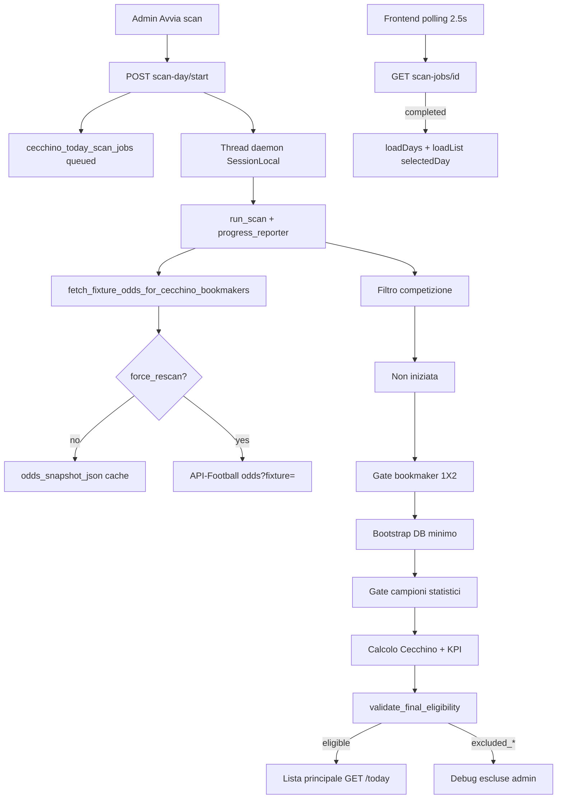

## Fix Fase 17 — selectedDay e job lifecycle

- **selectedDay:** init eseguito una sola volta al mount; `loadDays()` non sovrascrive la data scelta dall'utente.
- **Polling:** attach per `(job_id, scan_date)`; stop al cambio giorno; retry x3 senza reset data.
- **Stale:** `recover_stale_scan_jobs` su start/latest/status/days; job `queued`/`running` bloccati → `failed`.
- **Runner:** eccezione non gestita → `failed` + `errors_json`; progress aggiorna `updated_at` ad ogni commit.

## Fase 39 — Legenda formule Monitoraggio Segnali

- **UI:** accordion sotto Heatmap Segnale × Colonna in `/monitoraggio-segnali`.
- **Dati:** legenda statica frontend — nessuna chiamata API aggiuntiva.
- **Contenuto:** celle D39–G57, G48/G54, D60/E60 con formule Excel, testo parlante, target FT e regole W/L.
- **Verifica:** confronto diretto con tab CECCHINO di AutomazioneCecchino.xlsm.

## Fase 38 — Fix definitivo Scala 1X/X2

- **Root cause heatmap errata:** activation legacy `HOME+SCALA` / `AWAY+SCALA` ancora `is_current=true` + matrici DB non ricostruite da `force_remap`.
- **force_rebuild:** con `force_remap=true`, `_ensure_signals_matrix_on_row` sovrascrive sempre la matrice da quote finali.
- **Guardrail:** sync salta SCALA su HOME/AWAY; summary/list/export le escludono dalla query.
- **Diagnostics:** `legacy_wrong_scala_mapping_count` — se > 0, eseguire «Ricalcola mapping segnali».

## Fase 37 — Correzione mapping Scala segnali

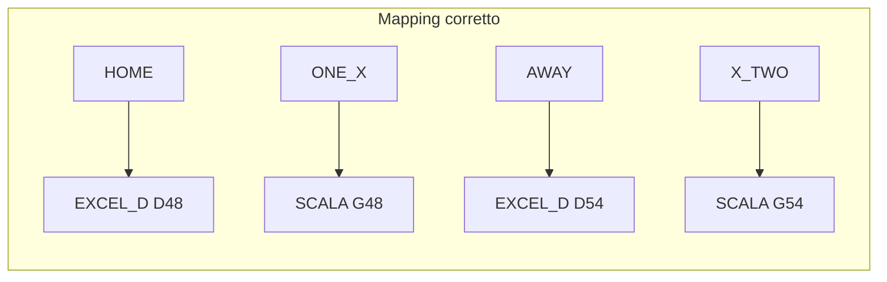

- **Fix matrice:** `build_signals_matrix` sposta `scala_1x`/`scala_x2` da righe `one`/`two` a `one_x`/`x_two`.
- **Legacy:** `remap_legacy_scala_activations_in_range` disattiva `HOME+SCALA` e `AWAY+SCALA` con reason dedicato.
- **Backfill:** `POST /admin/cecchino/signals/backfill` con `force_remap=true` — offline, zero API-Football.
- **UI:** pulsante «Ricalcola mapping segnali» su Monitoraggio Segnali.

## Fase 53 — xG storico automatico per fixture eleggibili

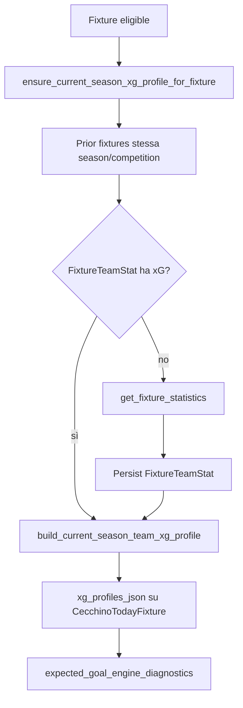

- **Hook automatici:** scan (`_persist_post_calc_snapshot`), recompute offline, revalidate-day, apertura dettaglio (lazy via diagnostics).
- **Idempotenza:** skip refetch se `profile_version`, `local_fixture_id` e `fixtures_checked` invariati.
- **Non blocca eleggibilità:** try/except su errori provider → warning `xg_provider_error` / `xg_api_rate_limited`.
- **Backfill manuale opzionale:** stesso endpoint Fase 52 con `force_refresh=true`.

## Fase 52 — xG storico current season per Expected Goal Engine

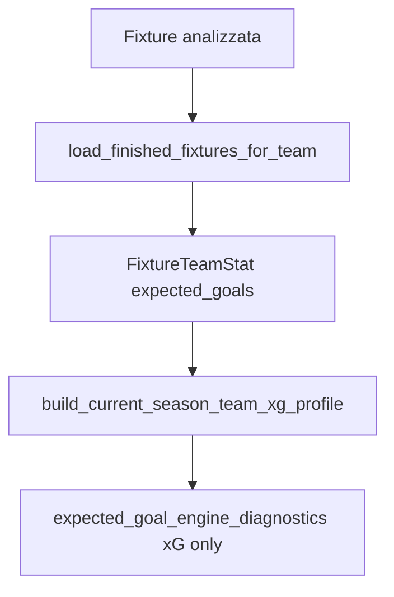

- **Anti-leakage:** media xG solo su partite prior stesso campionato/stagione; esclusa fixture corrente.
- **Path:** `statistics[type=expected_goals].value` da cache DB.
- **Backfill manuale:** `POST /admin/cecchino/fixtures/id/backfill-current-season-xg`.

## Fase 51 — API Raw Inspector per Expected Goal Engine

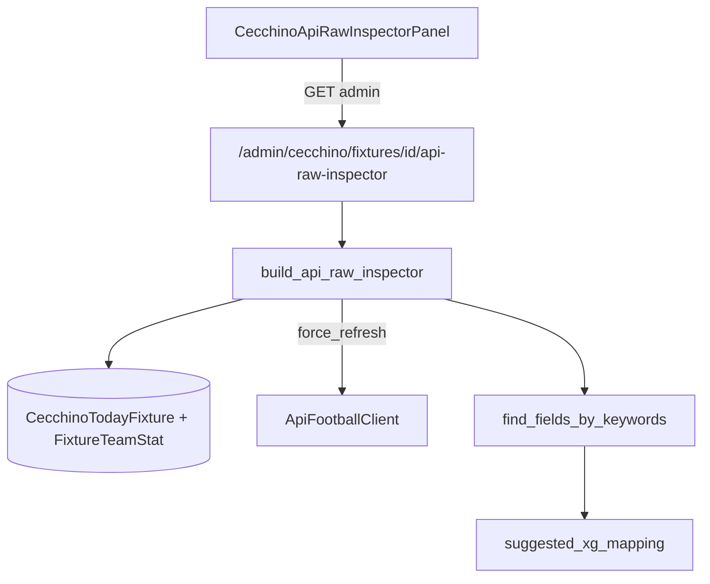

- **Manuale only:** non collegato a scan-day, recompute, revaluate, backtest.
- **Cache mode:** `force_refresh=false` legge solo DB/cache salvati.
- **Live mode:** `force_refresh=true` chiama endpoint provider selezionati (statistics, events, lineups, players, fixture details).
- **Output:** fonti controllate, match keyword, suggested xG mapping, JSON raw opzionale.

## Fase 50 — Expected Goal Engine Diagnostica Variabili

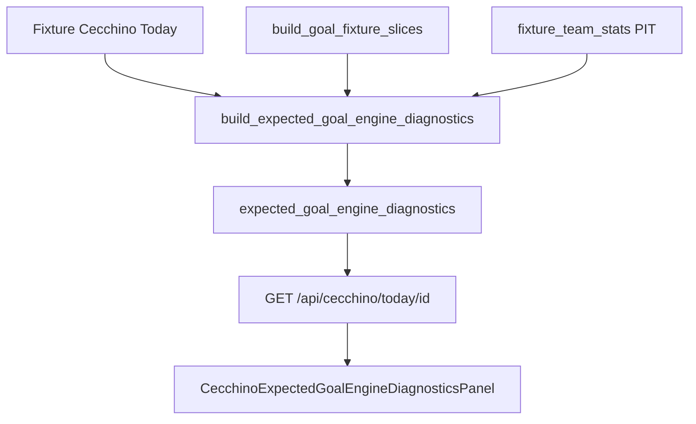

- **Audit only:** mappa 20 variabili, coverage e readiness; nessun output goal attesi.
- **Posizione UI:** dopo Intensità Goal, prima di ICM.

## Fase 49 — Intensità Goal v4 Goal Attesi

```mermaid
flowchart TD
  fixture[Fixture Cecchino Today] --> ctx[build_goal_market_contexts]
  ctx --> wl[weighted_lambda FT]
  wl --> eg[expected_goals_total]
  eg --> thr[soglie Over 0.5/1.5/2.5/3.5]
  eg --> pois[prob Over Poisson]
  thr --> class[final_class_key / final_label]
  class --> ui[CecchinoGoalIntensityAnalysisPanel v4]
```

- **v4:** classificazione su Goal Attesi Cecchino interni; soglie Over progressive.
- **Fonte:** `lambda_total` motore goal Poisson v2 (non xG API-Football).
- **UI:** badge v4 Goal Attesi, scala soglie Over, scala intensità goal.

## Fase 48 — Intensità Goal v3 OVER-only (sostituita da Fase 49)

```mermaid
flowchart TD
  slices[build_goal_fixture_slices] --> rawOver[raw_over_q44 OVER Q44]
  hist[fixtures PIT] --> dist[get_goal_intensity_over_baseline]
  dist --> pct[over_percentile rank]
  rawOver --> pct
  dist --> idx[over_index_vs_median]
  rawOver --> idx
  pct --> class[final_class_key / final_label]
  class --> ui[CecchinoGoalIntensityAnalysisPanel v3]
```

- **v3:** classificazione solo su percentile storico OVER Q44; UNDER deprecato.
- **Baseline:** distribuzione OVER-only (mediana + P20/P40/P60/P80); fallback league → country → global.
- **UI:** badge v3 OVER-only, scala percentile 20/40/60/80.

## Fase 47 — Intensità Goal v2 calibrata (sostituita da Fase 48)

```mermaid
flowchart TD
  raw[OVER/UNDER Q44 grezzi] --> norm[normalizzazione baseline mediana]
  hist[fixtures storiche PIT] --> baseline[get_goal_intensity_baselines]
  baseline --> norm
  norm --> ratio[Rapporto calibrato]
  norm --> delta[Delta calibrato]
  ratio --> class[classificazione finale]
```

- **v2:** classificazione su rapporto calibrato, non grezzo OVER/UNDER.
- **Baseline:** mediana con fallback league → country → global; cache in-process.
- **UI:** badge v2 calibrata, sezione grezzi + baseline.

## Fase 46 — Intensità Goal (Cecchino Today)

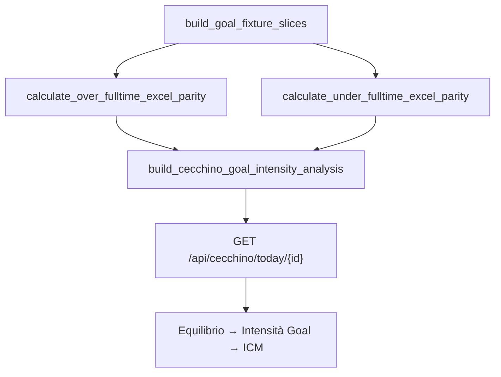

- **Modulo:** `cecchino_goal_intensity_analysis.py` — indipendente da Equilibrio e ICM.
- **Q44:** somma blocchi `home_away` + `totals` (non `final_odd` KPI Poisson v2).
- **Detail:** `goal_intensity_analysis` inserito tra `balance_analysis` e `icm_analysis`.

## Fase 45 — Aggiornamento formule segnali Cecchino

```mermaid
flowchart TD
  final[quote finali + prob Cecchino] --> dominance[compute_dominance_pp]
  dominance --> matrix[build_signals_matrix]
  matrix --> engine[cecchino_engine]
  matrix --> backfill[signal_backfill]
  matrix --> backtest[signal_model_backtest A-F]
  backfill --> sync[sync_cecchino_signal_activations]
  sync --> stable[/monitoraggio-segnali]
  sync --> lab[/monitoraggio-segnali-lab]
```

- **Formule aggiornate:** D48, D54, E51, G57, D60, E60 in `cecchino_signals_matrix.py`.
- **Dominanza:** da `cecchino_balance_analysis.compute_dominance_pp` (stessa scala Equilibrio); prob mancanti → NO sulle formule che la richiedono.
- **Rigenerazione storico:** «Rivaluta segnali», backfill `force_rebuild`/`force_remap`, «Ricalcola modelli A–F» — offline, zero API esterne.
- **UI:** legenda formule condivisa stabile + Lab (`cecchinoSignalFormulaLegend.ts`, `SignalsFormulaLegendAccordion`).

## Fase 44 — Monitoraggio Segnali Lab

```mermaid
flowchart LR
  api[cecchinoSignalsApi.ts] --> stable[/monitoraggio-segnali]
  api --> lab[/monitoraggio-segnali-lab]
  lab --> hook[useCecchinoSignalsLab]
  lab --> ui[components/cecchino-lab]
```

- **Route:** `/monitoraggio-segnali-lab`; sidebar **Segnali Lab** (icona flask).
- **Frontend only:** nessuna modifica backend; pagina stabile invariata.
- **UI Lab:** card modelli A–F, ribbon metriche, ECharts, heatmap con drawer, top ranking, tabella partite, toast Sonner.
- **Dipendenze:** `framer-motion`, `echarts`, `echarts-for-react`, `sonner`.

## Fase 43 — Backtest modelli pesi A-F

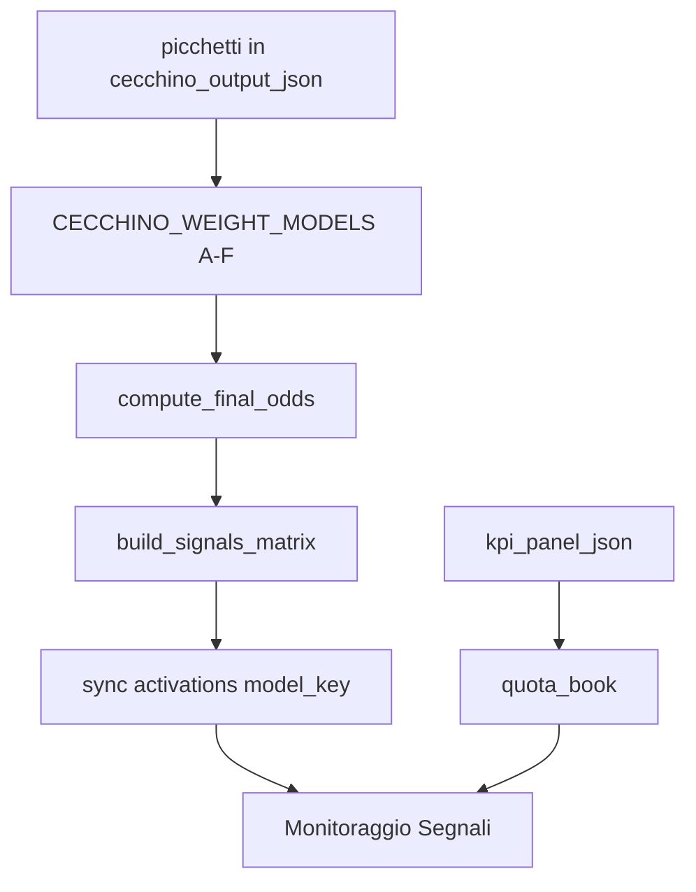

- **Modelli A–F:** backtest comparativo offline; ogni modello persiste activations con `model_key` distinto.
- **Endpoints:** `POST /signals/backtest-models`, `GET /signals/models-summary`; filtro `model_key` su summary/activations/export.
- **UI:** card cliccabili Confronto modelli pesi; pulsante «Ricalcola modelli A–F» (zero API-Football).
- **Live:** sync storico/live tagga modello F; Cecchino Today non cambia modello automaticamente.

## Fase 42 — Quota media prese e Quota Void

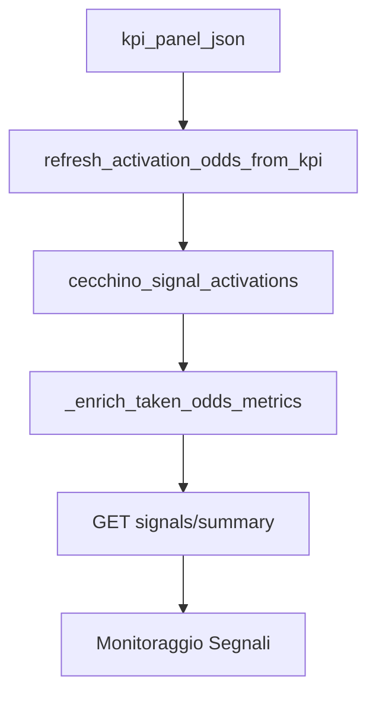

- **Quota media prese:** media quote book solo WON con quota; LOST esclusi.
- **Quota Void:** `1 / win_rate`; **Margine Void:** differenza vs quota prese; **Rendimento prese:** WR × quota prese − 1.
- **Revaluate:** `refresh_signal_odds=true` ripopola quote offline da KPI salvato.

## Fase 41 — Indice di Convergenza Match (ICM)

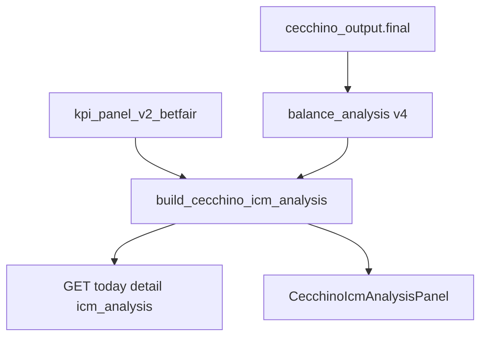

- **Formula:** narrative scoring su 5 pilastri (F36 20%, Dominanza 20%, Quota X 20%, Rating 25%, Vantaggio Prob. 15%).
- **Classificazione:** 0–100 con penalità ambiguità (gap tra narrativa 1ª e 2ª).
- **API:** `icm_analysis` in GET `/api/cecchino/today/{id}` e `kpi-debug-json`.
- **Ricalcolo:** derivato a read-time; `recompute_kpi=true` aggiorna ICM implicitamente.
- **Deprecato:** Delta Forza Match (Fase 36) rimosso da Today UI/API.

## Fase 36 — Delta Forza e Linearità Match (deprecata)

Sostituita da ICM (Fase 41). Modulo `cecchino_delta_force_analysis.py` mantenuto per legacy.

## Fase 35 — Sidebar Cecchino e metriche Monitoraggio Segnali

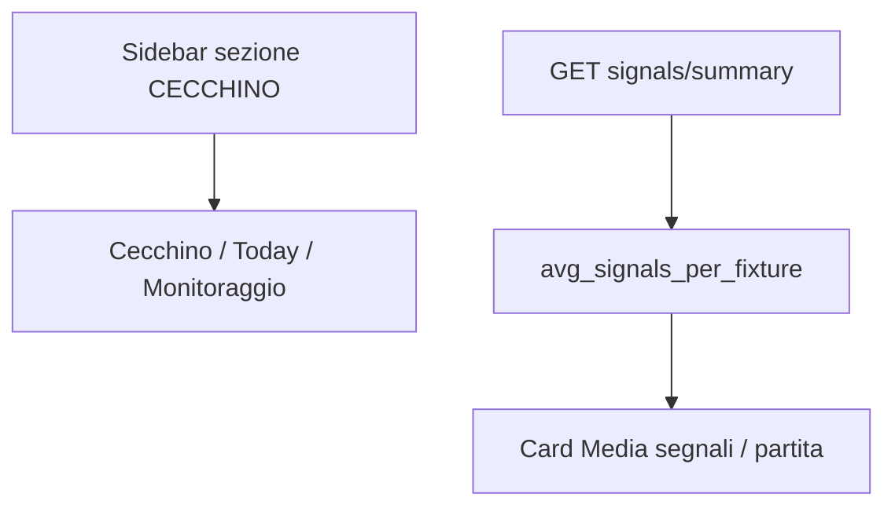

- **Sidebar:** `NAV_CECCHINO` in cima, voci rimosse da `NAV_MAIN`.
- **UI heatmap:** label `UNDER 2.5` / `OVER 2.5`; `signal_group` backend invariato.
- **Metrica:** `avg = activations / eligible_fixtures_count` (fallback `fixtures_with_signals_count`).

## Fase 34 — Mapping Under/Over su 2.5 FT

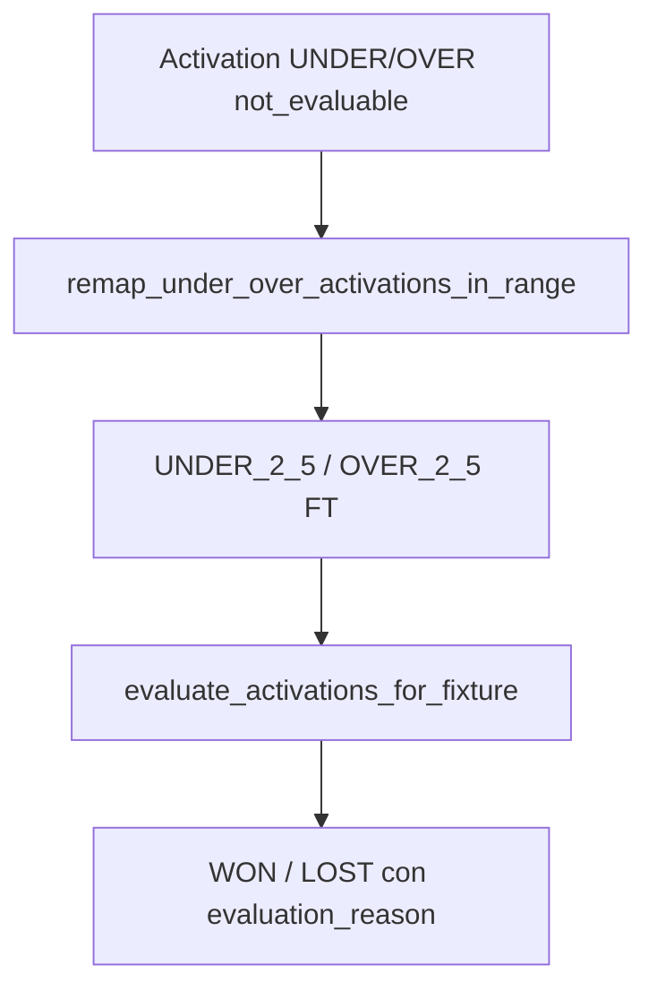

- **Mapping:** `UNDER_UNDER_PT` → Under 2.5 FT; `OVER_OVER_PT` → Over 2.5 FT.
- **Remap:** backfill e `POST revaluate` applicano target corretto prima della valutazione.
- **Sync:** aggiorna target su activation esistenti; valuta se `target_market_key` presente.

## Fase 33 — Backfill Monitoraggio Segnali

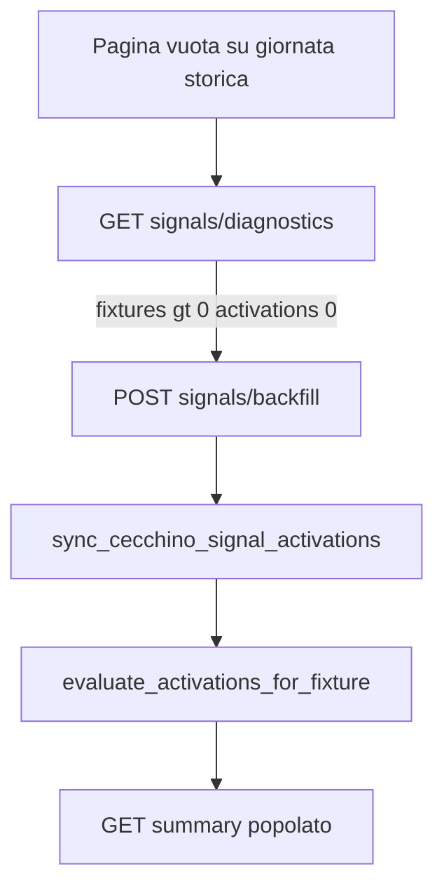

- **Backfill:** legge `cecchino_output_json.signals_matrix`; fallback ricalcolo offline da quote finali.
- **UI:** «Sincronizza segnali» + alert con CTA inline.
- **Scan:** `sync_signals_for_scan_date` post-commit.

## Fase 32 — Monitoraggio Segnali Cecchino

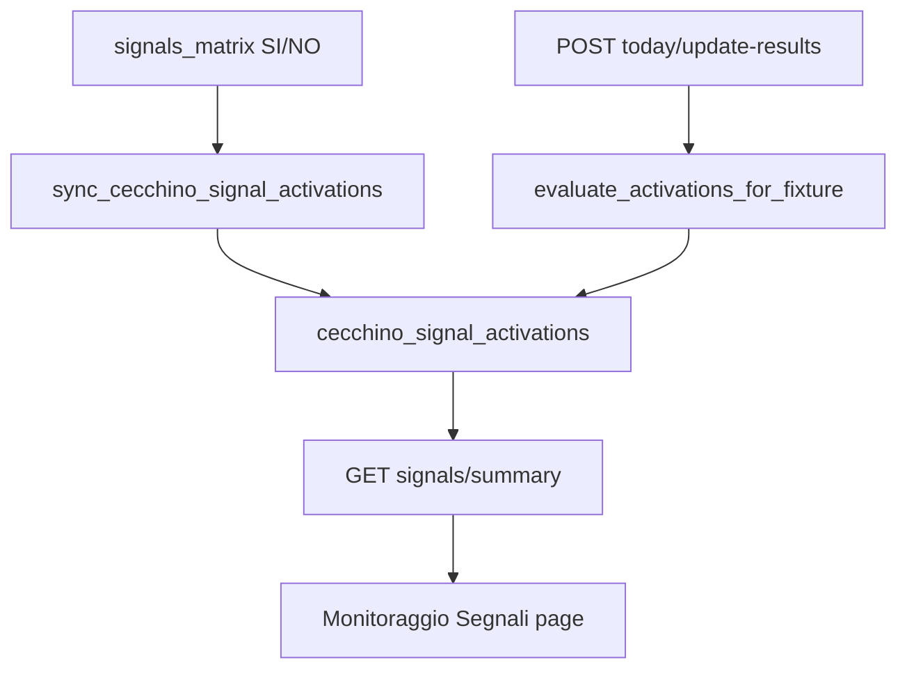

- **Sync hook:** upsert scan eleggibile + `get_today_fixture_detail`.
- **Idempotenza:** unique `(today_fixture_id, signal_group, source_column, COALESCE(target_market_key,''))`.
- **Success rate:** `won / (won + lost)` — esclude pending e not_evaluable.
- **Revaluate:** `POST /admin/cecchino/signals/revaluate` — solo DB.

## Fase 31 — Legenda operativa equilibrio

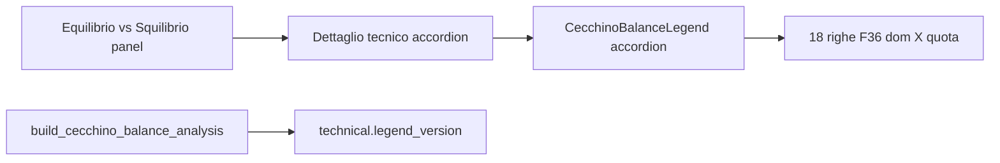

- **UI:** legenda statica frontend (`balanceOperationalLegend.ts`); non duplicata in API.
- **Label backend:** solo allineamento testi operativi; logica regole invariata.
- **legend_version:** `balance_operational_legend_v2_contextual_dominance`.

## Fase 30 — Dominanza contestualizzata

```mermaid
flowchart TD
  probs[prob_1 X prob_2] --> domCalc[dominanza invariata]
  probs --> bestSide[best_side HOME DRAW AWAY]
  bestSide -->|DRAW| reinforce[reinforces_balance]
  bestSide -->|HOME AWAY| lateral[weakens or confirms imbalance]
  domCalc --> domCtx[dominance_context]
  reinforce --> operational[operational reading]
  lateral --> operational
```

- **Falso equilibrio:** solo laterale (HOME/AWAY) con F36<0.75 e dom>10.
- **X dominante:** operational X forte / X molto forte, mai false_balance.
- **Gap 1/2 Prob:** `abs(prob_1 - prob_2)` in p.p.
- **Payload:** `cecchino_balance_analysis_v2`.

## Fase 29 — Equilibrio vs Squilibrio

```mermaid
flowchart LR
  final[cecchino_output.final] --> builder[build_cecchino_balance_analysis]
  builder --> detail[GET today detail balance_analysis]
  builder --> kpiJson[kpi-debug-json balance_analysis]
  detail --> ui[Equilibrio vs Squilibrio panel]
```

- **Input:** `quota_1/x/2` e `prob_1/x/2` da `cecchino_output.final` (solo Cecchino).
- **F36:** `abs(quota_2 - quota_1)` — score e classificazione equilibrio/squilibrio.
- **Dominanza:** max(prob) − seconda(prob) in punti percentuali.
- **Output:** lettura operativa, sintesi modello, dettaglio tecnico.
- **UI:** sezione sotto Debug Picchetti; 3 card + box operativo + accordion.

## Fase 40 — Nuovi pesi globali 1X2 e Under/Over

```mermaid
flowchart LR
  weights1X2[CECCHINO_1X2_WEIGHTS 30/30/20/20] --> engine[cecchino_engine 1X2]
  weightsGoal[CECCHINO_GOAL_MARKET_WEIGHTS 20/30/20/30] --> v2[goal_market_poisson_empirical_v2]
  engine --> output[cecchino_output_json]
  v2 --> output
  output --> kpi[cecchino_kpi_panel_v2_betfair]
  output --> signals[signals_matrix]
  recompute[POST admin/cecchino/recompute] --> engine
  recompute --> v2
```

- **Pesi 1X2:** totals 30%, home_away 30%, last6_totals 20%, last5_home_away 20%.
- **Pesi goal:** totals 20%, home_away 30%, last6_totals 20%, last5_home_away 30%.
- **Ricalcolo offline:** `POST /api/admin/cecchino/recompute` — no API-Football se `refresh_bookmaker_odds=false`.
- **UI:** pulsante «Ricalcola Cecchino con nuovi pesi» su Cecchino Today e Monitoraggio Segnali.
- **Invariato:** SOT v2.0/v2.1, Betfair-only, struttura KPI.

## Fase 28 — Nuovi pesi goal market (storico)

```mermaid
flowchart LR
  weights1X2[CECCHINO_1X2_WEIGHTS 25/20/35/20] --> engine[cecchino_engine 1X2]
  weightsGoal[CECCHINO_GOAL_MARKET_WEIGHTS 10/20/35/35] --> v2[goal_market_poisson_empirical_v2]
  v2 --> goalMarkets[goal_markets.final_odd]
  goalMarkets --> kpi[cecchino_kpi_panel_v2_betfair]
  v2 --> debug[Debug Picchetti goal tab]
```

- **Pesi goal (obsoleti post-Fase 40):** totals 10%, home_away 20%, last6_totals 35%, last5_home_away 35%.
- **Pesi 1X2 (obsoleti post-Fase 40):** 25/20/35/20.

## Fase 27 — Goal market Poisson + storico

```mermaid
flowchart LR
  dbFixtures[fixtures DB PIT] --> contexts[build_goal_market_contexts]
  contexts --> v2[goal_market_poisson_empirical_v2]
  contexts --> legacy[legacy_excel_parity]
  v2 --> goalMarkets[goal_markets.final_odd]
  legacy --> debug[Debug Picchetti v3]
  goalMarkets --> kpi[cecchino_kpi_panel_v2_betfair]
```

- **Formula KPI:** `goal_market_poisson_empirical_v2` — lambda + Poisson + hit-rate + blend 65/35.
- **Contesti:** totals (tutte le partite), home_away, last6_totals, last5_home_away.
- **Soglie distinte:** Over 1.5 ≠ Over 2.5; Under 2.5 ≠ Under 3.5 (per costruzione Poisson).
- **Legacy:** Excel parity solo in `legacy_excel_parity.enabled_for_kpi=false`.
- **Rescan:** fixture con goal_markets Fase 26 vanno riscansionate per v2.

## Fase 26 — Formule goal Over/Under

```mermaid
flowchart LR
  dbFixtures[fixtures DB PIT] --> slices[build_goal_fixture_slices]
  slices --> formulas[cecchino_goal_formulas]
  formulas --> goalMarkets[cecchino_output.goal_markets]
  goalMarkets --> kpi[build_cecchino_kpi_panel_v2_betfair]
  goalMarkets --> picchettiDbg[build_cecchino_picchetti_debug]
  goalMarkets --> kpiJson[cecchino_goal_odds_used]
```

- **Scan:** dopo calcolo 1X2, `goal_markets` aggiunto a `cecchino_output_json` e passato al KPI.
- **FT:** parità fogli OVER/UNDER Excel — media 3 blocchi con divisori 6/11/16 (Over) o 4/9/14 (Under).
- **PT:** solo fixture con `raw_json.score.halftime` valido; soglia minima 3 partite casa/fuori.
- **Dati insufficienti:** `quota_cecchino: null`, `status: insufficient_data` (no valori inventati).
- **Rescan:** fixture già scansionate senza `goal_markets` finché non si riscansiona la giornata.

## Fase 25 — Debug Picchetti Quota Cecchino

```mermaid
flowchart LR
  output[cecchino_output_json] --> debug[build_cecchino_picchetti_debug]
  kpi[kpi_panel_json] --> debug
  debug --> api[GET picchetti-debug]
  debug --> summary[picchetti_debug_summary in detail]
  api --> ui[Accordion Debug Picchetti UI]
```

- **Input:** `picchetti` + `final` già in `cecchino_output_json` (nessun ricalcolo da SOT).
- **1/X/2:** contributi `odd * weight` per totals/home_away/last6_totals/last5_home_away.
- **DC:** `1 / (prob_i + prob_j)` da quote finali Cecchino.
- **OU (pre-Fase 26):** solo `missing_formula` in debug; KPI mantiene `quota_cecchino: null`. Dalla Fase 26 vedi sezione sopra.
- **Coerenza:** confronto debug vs KPI con tolleranza 0.01.

## Fase 23 — Refresh quote Betfair singola fixture

```mermaid
flowchart TD
  btn[Aggiorna quote Betfair UI] --> post[POST refresh-betfair-odds]
  post --> budget[check_api_budget_before_scan]
  budget --> api["GET odds?fixture=X&bookmaker=3"]
  api --> snapshot[Aggiorna odds_snapshot_json + odds_meta]
  snapshot --> kpi[build_cecchino_kpi_panel_v2_betfair]
  kpi --> save[Salva kpi_panel_json]
  save --> ui[Aggiorna Pannello KPI + timestamp]
```

- **odds_meta:** impostato allo scan (`is_cached=true`) e al refresh live (`odds_source=api_live_refresh`).
- **Refresh:** `_fetch_betfair_only` — una sola chiamata API; opzionale `sync_today_bookmaker_odds` se `local_fixture_id`.
- **Export:** `betfair-markets-json` con `force=false` da snapshot o `force=true` con fetch live.
- **Confronto manuale:** `manual_comparison_note` nella risposta refresh/export per audit vs app Betfair.

## Fase 22 — Cleanup dettaglio e debug JSON KPI

- **UI dettaglio:** solo Header, KPI, Segnali, Note; niente card quote finali né dettaglio Betfair separato.
- **Card eleggibili:** layout 2 righe con PT/FT; colonna lista 35%.
- **Score:** `score_halftime_*` persistiti; payload list con `halftime`/`fulltime`.
- **Mapping strict:** `Match Winner` + `Double Chance` + provenance; validazione `validate_betfair_kpi_odds_mapping`.
- **Debug:** `GET /cecchino/today/{id}/kpi-debug-json` per audit quote Betfair usate nel KPI.

## Fase 21 — Fix KPI Betfair rows e quote book

- **Payload odds:** `build_betfair_payload_from_raw` su `odds_by_bookmaker[3]` durante scan; fallback snapshot → DB.
- **DC derivata:** `derive_double_chance_from_1x2` con prob `1/quota`; `book_source=derived_from_betfair_1x2`.
- **KPI righe:** `segno` + `label` su tutte le righe; normalize/rebuild in `get_today_fixture_detail`.
- **Layout UI:** griglia 32%/68%; SEGNO 12%; nessuno scroll orizzontale desktop.

## Fase 20 — KPI Betfair-only

- **Bookmaker gate:** solo Betfair (id 3) con 1X2 HOME/DRAW/AWAY; `bookmaker_mode=betfair_only` nel job summary.
- **Odds fetch:** `GET /odds?fixture=` + filtro id 3; fallback `bookmaker=3`; cache/negative cache solo su Betfair.
- **KPI v2:** `build_cecchino_kpi_panel_v2_betfair` — 9 colonne, 13 righe, rating 0-100; nessuna media bookmaker.
- **Dettaglio quote:** tabella Betfair-only con source `raw_betfair` / `derived_from_1x2` / `not_available`.
- **Debug link:** `/bookmakers?provider_fixture_id=…&bookmaker_ids=3`.

## Fix Fase 19 — gate progressivi e consumo API

- **Censimento:** tutte le fixture salvate come `discovered` dopo `GET fixtures?date=`.
- **Gate order:** competition → negative/positive odds cache → bookmaker 1X2 → league stats cache → stats → Cecchino.
- **API tracking:** `api_usage_events` su ogni `ApiFootballClient.get`; summary giornaliero admin.
- **Budget guard:** `API_FOOTBALL_DAILY_BUDGET=7500`, stop job se budget residuo < 500 o job > 1000 chiamate.
- **update-results:** date-level fetch; fallback per-id solo se assente nel payload giornaliero.

## Fix Fase 18 — progress_pct e finalizzazione

- **`progress_pct`:** `round(progress_current / progress_total * 100, 1)` ad ogni update; merge con stato job se step-only.
- **Fixture:** `finally` garantisce progress; log `CecchinoTodayJob job_id=... fixture=N/M`.
- **Completed:** thread imposta `status=completed`, `progress_pct=100`, contatori finali.
- **Stale aggressivo:** running senza progresso >5 min (`updated_at`) o job >30 min → `failed`.
- **Frontend:** `computeScanJobProgressPct` + barra width `${pct}%`.

## Flusso scan sincrono legacy (pre-Fase 16)

```mermaid
flowchart TD
  discovery[API-Football fixtures by date] --> compFilter[Filtro competizione]
  compFilter --> startedGate[Non iniziata]
  startedGate --> bmGate[Gate bookmaker 1X2]
  bmGate --> bootstrap[Bootstrap DB minimo]
  bootstrap --> statsGate[Gate campioni statistici]
  statsGate --> calc[Calcolo Cecchino + KPI]
  calc --> finalGate[validate_final_eligibility]
  finalGate -->|eligible| listMain[Lista principale GET /today]
  finalGate -->|excluded_*| debugExcluded[Debug escluse admin]
```

## Post-scan: rivalidazione

`POST /api/admin/cecchino/today/revalidate-day` rilegge gli snapshot JSON già salvati (`odds_snapshot`, `stats_snapshot`, `cecchino_output`, `kpi_panel`) e aggiorna `eligibility_status` senza chiamate API-Football.

Utile per riclassificare record marcati `eligible` prima dell’introduzione del gate finale.

## Bootstrap idempotente (Fase 12)

Durante scan-day, se lega/squadra/fixture esistono già nel DB:

- **League** — `get_or_create_league_by_api_id` riusa per `api_league_id`; INSERT solo in savepoint con recovery su race condition
- **Season / Competition / Team** — stesso pattern via `league_ingest_helpers.py`
- **Errore mapping** — fixture esclusa con `excluded_mapping_error`; scan non interrotto
- **Sessione DB** — savepoint per fixture + `recover_session_if_inactive()` evita PendingRollbackError

## Quote Over/Under (Fase 13–15)

- **Full time:** Over/Under 1.5/2.5/3.5 solo da `Goals Over/Under` bet_id=5 (Betfair in pipeline Today).
- **Primo tempo:** Over PT 0.5/1.5 solo da `Goals Over/Under First Half` (variante con trattino accettata).
- **Esclusi dal feed principale:** Goal Line, Result/Total Goals, Total Home/Away, RTG_H1 e mercati combo.
- **Scan-day** persiste 1X2/DC/OU/OU_FH; gate eleggibilità resta solo su 1X2.
- **Fase 20:** nessuna media bookmaker nel KPI Today; quote singole Betfair.

## Strategia fetch odds (Fase 16)

| Strategia | Quando |
|-----------|--------|
| `cached` | `force_rescan=false` e `odds_snapshot_json.raw_by_bookmaker_id` completo (Betfair 1X2) |
| `fixture_single_call` | `GET /odds?fixture=` con filtro bookmaker_id=3 |
| `fixture_single_call_with_bookmaker_fallback` | Single-call parziale → fallback `bookmaker=3` |
| `bookmaker_per_fixture` | Response vuota → `GET /odds?fixture=&bookmaker=3` |

Metriche in `result_summary_json`: `api_calls`, `odds_from_cache`, `odds_from_api`, `duration_seconds`.

## Fixture ID e debug JSON (Fase 14–15)

- Dettaglio Today espone `fixture_ids` e link a `/bookmakers?provider_fixture_id=...&bookmaker_ids=3`.
- Export JSON raw filtrato via `fixture-raw-odds` (copy/download in UI admin).
- Debug Over separato FT/FH con mercati scartati (`rejected_from_markets`).

## Lista vs debug

| Endpoint | Contenuto |
|----------|-----------|
| `GET /api/cecchino/today?date=` | Solo `eligibility_status=eligible` |
| `GET /api/admin/cecchino/today/excluded?date=` | Tutte le escluse con diagnostica |

## Garanzie out-of-scope

- Formule SOT v2.0/v2.1 non modificate
- `team_sot_predictions` non utilizzata da Cecchino Today
- Engine Cecchino (`cecchino_engine.py`) invariato — il gate consuma solo l’output
