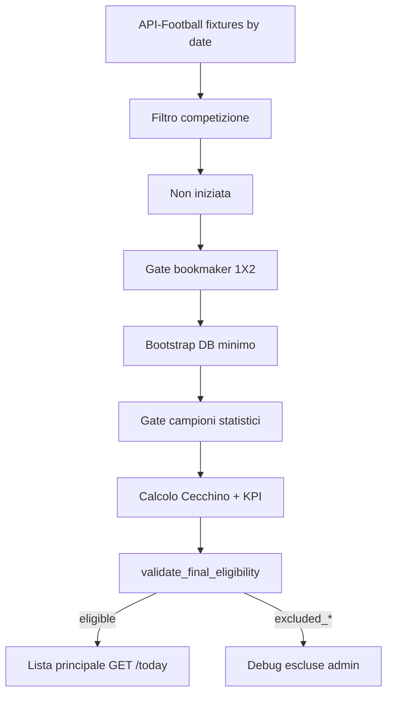

# SOT Predictor — Pipeline operativa Cecchino Today

## Flusso scan giornaliero

## Post-scan: rivalidazione

`POST /api/admin/cecchino/today/revalidate-day` rilegge gli snapshot JSON già salvati (`odds_snapshot`, `stats_snapshot`, `cecchino_output`, `kpi_panel`) e aggiorna `eligibility_status` senza chiamate API-Football.

Utile per riclassificare record marcati `eligible` prima dell’introduzione del gate finale.

## Bootstrap idempotente (Fase 12)

Durante scan-day, se lega/squadra/fixture esistono già nel DB:

- **League** — `get_or_create_league_by_api_id` riusa per `api_league_id`; INSERT solo in savepoint con recovery su race condition
- **Season / Competition / Team** — stesso pattern via `league_ingest_helpers.py`
- **Errore mapping** — fixture esclusa con `excluded_mapping_error`; scan non interrotto
- **Sessione DB** — savepoint per fixture + `recover_session_if_inactive()` evita PendingRollbackError

## Quote Over/Under (Fase 13)

- **API-Football** espone Over 1.5/2.5 nel mercato `Goals Over/Under` (bet id 5).
- **Scan-day** persiste OU oltre a 1X2/DC; gate eleggibilità resta solo su 1X2.
- **Media Over** calcolata solo da Bet365/Betfair/Pinnacle con quote presenti; mai media orphan senza dettaglio.

## Lista vs debug

| Endpoint | Contenuto |
|----------|-----------|
| `GET /api/cecchino/today?date=` | Solo `eligibility_status=eligible` |
| `GET /api/admin/cecchino/today/excluded?date=` | Tutte le escluse con diagnostica |

## Garanzie out-of-scope

- Formule SOT v2.0/v2.1 non modificate
- `team_sot_predictions` non utilizzata da Cecchino Today
- Engine Cecchino (`cecchino_engine.py`) invariato — il gate consuma solo l’output
